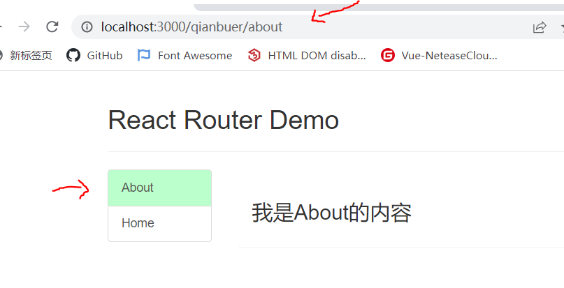
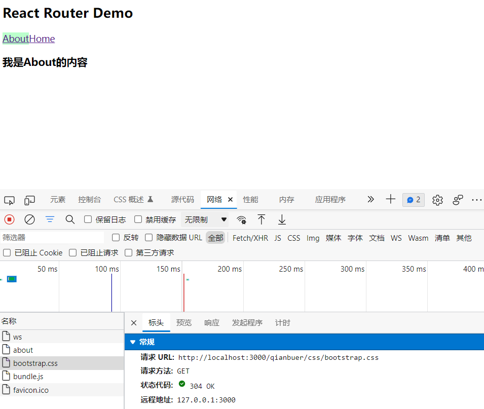

# 多级路由刷新后，样式丢失问题

多级路由：`/home/xxx/xxx`


## 多级路由**刷新前**界面：



---

## 点击刷新按钮后：（整个页面的样式都消失了）



## 原因

前置知识：

1）当我么访问`react`脚手架服务器，不存在的资源时，会默认返回`public`文件夹下的`index.html`文件

2）http://localhost:3000就是public文件夹


原因：当我们使用多级路由时，会将第一级路由（如图中的`/qianbuer`）也添加到请求路径中，自然就找不到对应的资源了，所以返回的就不是`CSS`文件而是`index.html`


## 解决办法

解决办法一：

修改`public/index.html`中引入`CSS`文件的方式：

```html
<link rel="stylesheet" href="./css/bootstrap.css">
<!-- 修改为 -->
<link rel="stylesheet" href="/css/bootstrap.css">
```


解决办法二：

还是修改`public/index.html`中引入`CSS`文件的方式：

```html
<link rel="stylesheet" href="./css/bootstrap.css">
<!-- 修改为 -->
<link rel="stylesheet" href="%PUBLIC_URL%/css/bootstrap.css">
```

`%PUBLIC_URL%`：就是代表`public`文件夹的绝对路径


解决办法三：

使用Hash路由，修改`src/index.js`中的`react-router-dom`，使用`<HashRouter>`

```jsx
import { HashRouter } from 'react-router-dom';
// 18最新写法
const root = ReactDOM.createRoot(document.getElementById('root'));
root.render(
	<HashRouter>
		<App></App>
	</HashRouter>
);
```

