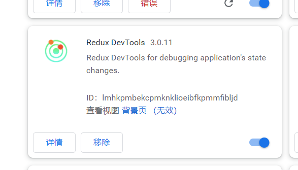
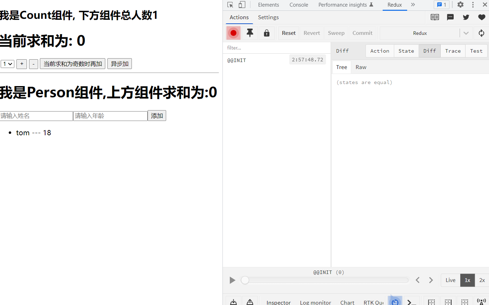

# Redux-DevTools

首先先要安装扩展插件儿：




第二步：

要在项目中安装`redux-devtools-extension`

```
 npm install redux-devtools-extension
```


第三步：修改一下项目中的`redux`的`store`

`store.js`：

```js
/*
  该文件专门用于暴露一个store对象，整个应用只有一个store
*/

// 引入createStore，专门用于创建redux最为核心的store
import { createStore, applyMiddleware, combineReducers } from 'redux';
// 引入redux-thunk用于支持异步action
import thunk from 'redux-thunk';

// 引入为Count组件服务的reducer
import countReducer from './reducers/count';
import personReducer from './reducers/person';

// 引入redux-devtools-extension
import { composeWithDevTools } from 'redux-devtools-extension';
/**
 * @param {object} 传入的对象就是redux保存的总状态对象
 *
 * 合并reducer，返回的是总状态对象
 */
const rootReducer = combineReducers({
	he: countReducer,
	rens: personReducer
});

// 修改函数调用，将createStore函数第二个参数改为composeWithDevTools()
// export default createStore(rootReducer, composeWithDevTools());

// 注意：如果createStore函数第二个参数有值，就作为参数传递进composeWithDevTools()
export default createStore(rootReducer, composeWithDevTools(applyMiddleware(thunk)));

```


第四步：就可以在开发者工具中打开`Redux`工具了




工具左侧：是`action.type`

工具右边：是可以查看一些`redux`中的`state`状态信息

下方有控制台，还有播放进度