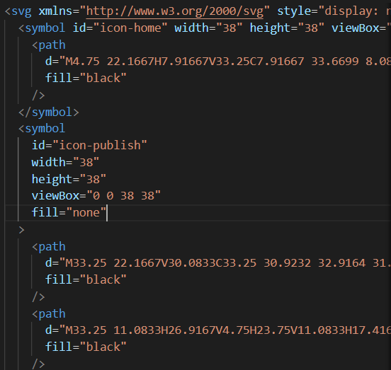

# 使用svg精灵图

svg精灵图是由一个一个的<symbol>标签形成的，每一个<symbol>标签就是一个svg图片，并且拥有一个id属性来标识图标。

例如下图：




这样我们可以封装一个组件，来使用这些精灵图

创建`components/TheIcon`:

```vue
<template>
	<svg>
		<use :href="`${sprite}#icon-${icon}`"></use>
	</svg>
</template>

<script setup>
// 使用动态属性时，不能直接写图片路径，需要使用import导入
import sprite from '../assets/icons/sprite.svg';
defineProps({
	icon: String
});
</script>

```

通过`use`标签引入精灵图路径，并用#指明图片名称（图片名称是组件外传递的）

使用:

```vue
<template>
<!--使用home图片-->
	<Icon icon="home"></Icon>
</template>
<script setup>
import './assets/base.css';
import Icon from './components/TheIcon.vue';
</script>
<style scoped></style>

```


