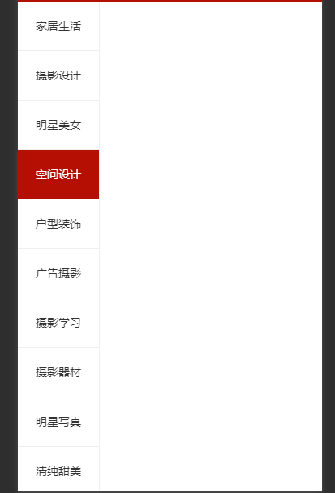

# uniapp

uni-app是一个使用vue.js开发所有前端应用的框架，开发者编写一套代码，可发布到IOS，Android，H5，以及各种小程序(微信、qq、支付宝)等多个平台。

## 一、项目目录介绍

`pages.json`文件用来对uni-app进行全局配置，决定页面文件的路径、窗口样式、原生的导航栏、底部的原生tabbar等。

`manifest.json`文件是应用的配置文件，用于指定应用的名称、图标、权限等。

`App.vue`是根组件，所有页面都是在`App.vue`下进行切换的，是页面入口文件，可以调用应用的生命周期函数。

`main.js`是项目的入口文件，主要作用是初始化`vue`实例并使用需要的插件。

`uni.scss`文件的用途是为了方便整体控制应用的风格。比如按钮的颜色、边框的风格。`uni.scss`文件里预设值了一批scss变量。

`unpackage`就是打包目录，这里有各个平台的打包文件。

`pages`所有页面存放目录

`static`静态资源目录

`components`组件存放目录

## 二、pages.json

pages.json中的globalStyle中放置的是全局的样式。

pages数组中的：

path：放页面是路径

style：放页面的样式

具体详情请见官网。


## 三、uni-app中的声明周期

### 应用的生命周期

`uni-app`，目录中App.vue中的生命周期函数

| 函数名   | 说明                                                  |
| -------- | :---------------------------------------------------- |
| onlaunch | 当`uni-app`初始化完成时触发(全局只触发一次)           |
| onShow   | 当`uni-app`启动时，或从后台(手机的后台)进入前台时显示 |
| onHide   | 当`uni-app`从前台进入后台(手机的后台)时               |
| onError  | 当`uni-app`报错时触发                                 |

### 页面的生命周期

`uni-app`，目录pages下的生命周期函数

| 函数名   | 说明                                                         |
| -------- | ------------------------------------------------------------ |
| onLoad   | 监听页面加载，其参数为上给页面传递的数据，参数类型为Object(用子页面传递) |
| onShow   | 监听页面显示。页面每次出现在屏幕上都触发，包括从下级页面点返回露出当前页面（会触发多次的） |
| onReady  | 监听页面初次渲染完成                                         |
| onHide   | 监听页面隐藏（可以触发多次的）                               |
| onUnload | 监听页面卸载                                                 |


## uni-app使用的小坑

### 一、在第一次使用hbuildx打开uni-app用微信小程序运行时

需要打开微信开发者工具的-->设置--->安全设置--->服务器端口打开

### 二、外部引入字体图标时

外部引入字体图标时，引入的字体库中的url全部要修改为`~@`开头的绝对路径。

例如:

```css
src: url('iconfont.ttf?t=1636514009735') format('truetype');

/*修改为*/
src: url('~@/static/fonts/iconfont.ttf?t=1636514009735') format('truetype');
```

### 三、页面触底函数使用

`onReachBottom()`是一个页面生命周期函数，一旦触底，可以在原有基础上添加新数据，形成不断的刷新效果（可以不断向下滚动）

### 四、当在函数中使用this时的问题

先确定以下this的指向，再使用，否则可能会有this指向问题，有时可以用箭头函数改写函数，让他向外查找this，有时则需要call，bind等函数修改this指向

### 五、条件注释，如果想要在不同平台显示不同内容

查看uni-app官网中的那个条件注释，写的很清晰奥(索实话，是真的牛皮)，直接一套代码实现跨端

### 六、利用navigator标签跳转到tabBar的页面

需要修改属性`open-type="switchTab"`，非tabBar页面可以不用加`open-type`属性

open-type的值：

* redirect：会直接关闭当前页面，然后跳转到指定页面
* switchTab：对应tabBar的页面

### 七、通过页面跳转拿参数(onload(options))

方式一:

```html
<navigator url="../detail/detail?id=80&...">跳转到详情页</navigator>
<!--参数跟在url后面 -->
```

方式二:

```js
goDetail() {
	uni.navigateTo({
		url:'../detail/detail?id=80&...'
	})
}
```

页面接受参数：

通过`onload`生命周期函数的形参`options`接受

```js
onload(options) {
  console.log(options);
}
```

### 八、uni-app的请求的封装

```js
const BASE_URL = "http://localhost:3000";
export const myRequest = (options) => {
    // 利用promise进行封装
	return new Promise((resolve, reject)=>{
		uni.request({
			url: BASE_URL + options.url,
			method: options.method || "GET", //默认为GET
			data: options.data || {}, //如果不传则为空对象
			success:(res)=>{//这里必须为箭头函数，否则会有小程序有问题
				if(res.data.code !== 200) {
					return uni.showToast({
						title: '获取数据失败'
					})
				}
				resolve(res);
			},
			fail: (err) => {
				uni.showToast({
					title: '请求接口失败'
				})
				reject(err);
			}
		})
	})
}

// 暴露出去的方法调用
// myRequest({
// 	url: "/banner",
// 	method: "post",
// 	data: ...
// })
```

最后在`main.js`入口文件中引入以下，挂载到`vue`的原型上就ok了

```js
import {myRequest} from './util/api.js'
Vue.prototype.$myRequest = myRequest;
```

### 九、下拉刷新的问题

首先：下拉刷新的监听是通过`onPullDownRefresh`生命周期函数监听的。

然后：如果在`onPullDownRefresh`重新加载数据，需要将原来数据初始化，并且重新调用数据请求函数

注意：这个重新调用，必须要写个计时器，要不会有问题

最后一个问题：再调用完毕`onPullDownRefresh`之后需要关闭下拉刷新的按钮，需要`uni.stopPullDownRefresh()`，主要就是这个api加到哪里，看下列代码

```js
		// 监听下拉刷新生命周期
		onPullDownRefresh() {
			console.log('下拉刷新');
			this.pageindex = 1;
			this.goods = [];
			this.flag = false;
			setTimeout(()=>{
				this.getGoodsList(()=>{
					uni.stopPullDownRefresh();
				})
			},1000)
		},
        //修改过后的getGoodsList
        methods: {
			// 获取商品列表数据
			async getGoodsList(callback) {//添加了一个回调形参
				const res = await this.$myRequest({
					url: '/api/getgoods?pageindex=' + this.pageindex
				})
				this.goods = [...this.goods, ...res.data.message];
                // 这里是关键，有这个回调就调用
				callback && callback();
			}
		}
```

### 十、一种动态绑定类的方法

如果想要实现这种侧边栏效果，可以写一个类`active`让类和每一项的索引值进行帮定，再动态修改。



先写一个类:

```css
.active {
    background-color: $shop-color;
    color: #fff;
}
```

因为左边的每一项肯定是用`v-for循环出来的`,实现左边的页面结构代码，

让active和index进行绑定

```html
<--！>创建一个数据再data中</--！>
active: 0

<view
:class="active===index? 'active': ''"
v-for="(item, index) in cates" :key="item.id"
@click="leftClickHandle(index)"
>{{item.title}}</view>
```

然后点击时，动态修改每一个active

```js
leftClickHandle(index) {
    this.active = index;
}
```

### 十一、过滤器的使用

过滤器一般都是用来初始化一下格式，用的最多的就是在处理时间上，先看代码

uni-app过滤器使用规则和vue2一样

```js
filters: {
			formatDate(date) {
				const nDate = new Date(date);
				const year = nDate.getFullYear();
				const month = (nDate.getMonth() + 1).toString().padStart(2, 0);
				const day = nDate.getDay().toString().padStart(2, 0);//长度不足2的字符串在前面补0
				console.log(year, month, day);
				return `${year}-${month}-${day}`;
			}
		}
```

这里面要注意的是：`padStart(参数一,参数二)`方法，该方法用来处理字符串。

参数一：满足字符串的长度

参数二：要填充的数字


### 十三、当显示的内容中有html标签时，可以利用uni-app的富文本组件

富文本组件：`<rich-text></rich-text>`

富文本组件可以自动解析html标签，在有些后端传递的内容中，可能会有html标签，可以利用富文本组件代替`<text></text>`普通的文本组件

例如以下代码：

```
<p>\r\n\t房企一季度销售业绩已经陆续公布，克而瑞研究中心统计数据显示，今年一季度，TOP20的房企仅6家实现业绩同比增长。\r\n</p>\r\n<p>\r\n\t<b>多家企业销售下滑</b> \r\n</p>\r\n<p>\r\n\t记者了解到，虽然恒大、融创一季度交出了不错的答卷，但是，万科等排名靠前的房企均出现销售下滑。其中万科公布前三个月销售金额为460.6亿元，同比去年的542.3亿元减少15%，而碧桂园公布，截至2015年3月31日止三个月，集团共实现合同销售金额约177.3亿元，同比下跌44.32%。\r\n</p>\r\n<p>\r\n\t<b>此外

以上代码<text></text>解析过后不会改变

但是通过<rich-text></rich-text>会将所有的html标签解析成对应的格式

```

## 上传发布

### 小程序上传发布

在manifest.json中配置小程序id

第一步：打开小程序官网，注册一个属于自己小程序

第二步：登录，点击我的中的开发-->开发设置-->里面有小程序id，并配置到自己的小程序里

第三步：如果要真正上线，还需要配置一个网上服务器包括域名...

第四步：需要把一些静态资源上传到服务器上

最后：在微信开发者工具中点击上传，然后登录到官网官网上提交审核

### H5的打包发行

直接在manifes.json配置一下下h5的配置

点击发行就ok了
