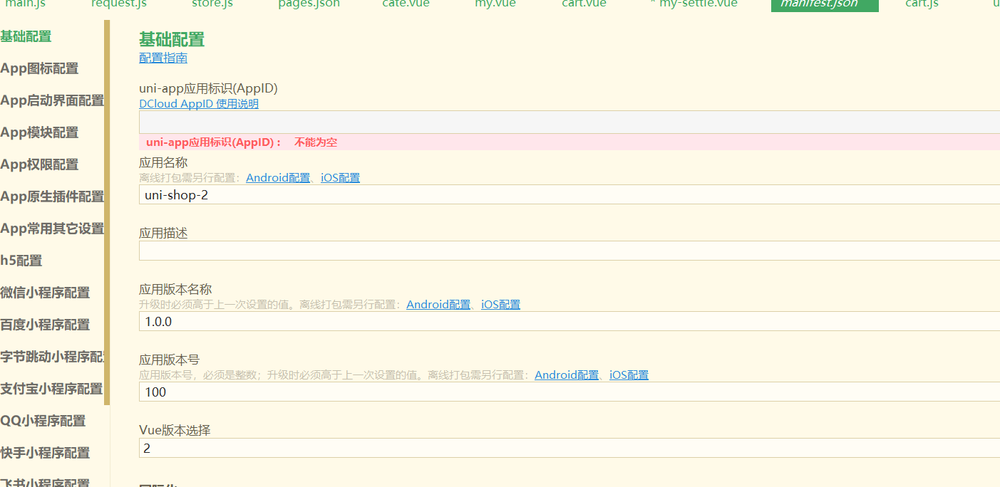
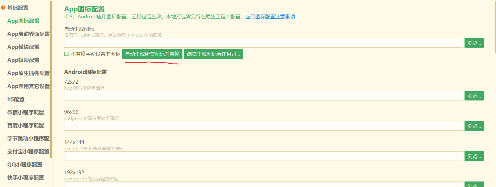
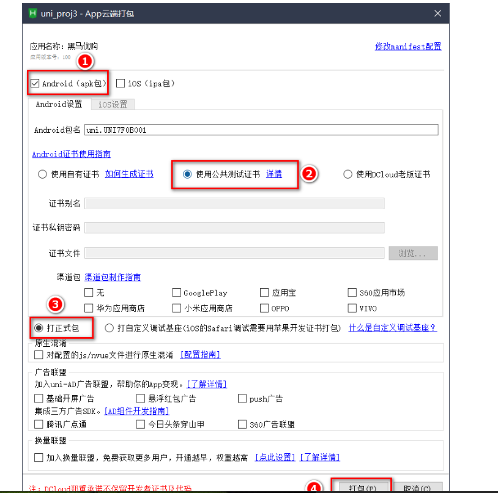
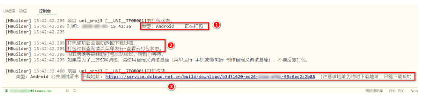

# 将uni-app项目发布为Android App的流程

第一步：

首先我们需要一个HBuilder的账号，如果没有注册一个。

然后在HBuilderX登录。

第二步：

打开项目根目录的`mainfest.json`配置文件，在**基础配置面板**中，获取uni-app应用标识，并填写应用名称。

第三步：

切换到**App图标配置面板**，点击浏览按钮，**选择合适的图片**之后，再点击**自动生成所有图标并替换**。

第四步：

点击HBuilderX上面菜单栏中的**发行**—>**原生App-云打包**

第五步：

在弹出面板中勾选：

1. Android包
2. 使用公共测试证书
3. 打正式包

最后点击：打包按钮

第六步：

在控制台查看打包进度。打包完成。点击连接，然后下载apk安装包文件即可。

