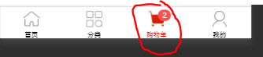

# 关于购物车右上角徽章显示问题


在一些有购物车的项目中，购物车右上角的徽章显示问题。

目的：点开tabbar对应的任何一个界面，都要能够将购物车的徽标加载出来。




所以我们需要在：首页，分类，购物车，我的，这4个界面任意一个界面加载时，都需要获取一下购物车的徽标数据。

由于需要在4个地方，同时使用一段代码（获取徽标的代码），我们可以将它封装为一个混入`mixins`，vue3就是composbales


示例：

封装混入:`@/mixins/tabbar-badge.js`

```js
import {mapGetters} from 'vuex'
export default {
  computed: {
    // 引入vuex中存入的badge数量
    ...mapGetters('m_cart', ['total'])
  },
  onShow() {
    // 在展示时调用设置徽章函数
    this.setBadge()
  },
  methods: {
    setBadge() {
      // 调用小程序自带的设置徽章函数
      uni.setTabBarBadge({
        index: 2,
        text: this.total + ''
      })
    }
  }
}
```


在4个tabbar界面都添加混入即可：

```js
// 4个tab页面都需要添加
import badgeMix from '@/mixins/tabbar-badge.js'
export default {
  mixins: [badgeMix],
  ....
}
```

