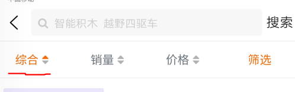

# 列表常规排序的实现思路

这里指的是像这个样子的排序。



我之前的思想：

是认为它至少有两个点击事件，正三角形上面，是一个点击图标，用来触发上三角的变化，下面的倒三角也有一个点击事件，来触发下面倒三角，从而实现升序和降序。

但是我这个思路问题很大。


合理的设计观念：

首先我们要记住，现在都是数据在驱动着页面，我们每一次点击其实都是在修改数据，数据改变，页面跟着改变。

核心观念：

```js
// 我们就只有一个点击事件
1.这里的业务思想是这样的，如果没有激活，点击一下变升序（点亮上三角）并且移除其他的激活项
2.如果是激活的，并且是升序，点击一下变降序
3.如果是激活的，切是降序，再点击一下变升序
我们就只有一个点击事件
```

就是只有一个点击事件，通过不同的点击次数来切换升序降序


## 具体代码：

```vue
<template>
  <view>

    <!-- 搜索内容区域 -->
    <!-- 排序|筛选 -->
    <view class="d-flex border-top border-bottom a-center j-around font-md" style="height: 100upx">
      <view v-for="(item, index) in screen.list" :key="index" class="flex-1 d-flex a-center j-center" @tap="changeScreen(index)">
        <text :class="screen.currentIndex === index? 'main-text-color': 'text-muted'">{{item.name}}</text>
        <!--这是两个图标的位置-->
        <view class="">
          <view class="iconfont icon-paixu-shengxu line-0" :class="item.status === 1 ? 'main-text-color': 'text-light-muted'" ></view>
          <view class="iconfont icon-paixu-jiangxu line-0" :class="item.status === 2 ? 'main-text-color': 'text-light-muted'"></view>
        </view>
      </view>
      <view class="flex-1 d-flex a-center j-center">
        <text @click="show=true" class="main-text-color">筛选</text>
      </view>
 
    </view>
    
    
  </view>
</template>

<script>
  export default {
    data() {
      return {
        screen: {// 筛选数据设计
          currentIndex: 0, // 指定那一项是激活的
          list: [
            // status: 1升序 2降序  0不选
            { name: '综合', status: 1},
            { name: '销量', status: 0},
            { name: '价格', status: 0}
          ]
        }
      };
    },
    methods: {
      /*
        点击排序的核心思想：
          1.这里的业务思想是这样的，如果没有激活，点击一下变升序
            并且移除其他的激活项
          2.如果是激活的，切是升序，点击一下变降序
          3.如果是激活的，切是降序，再点击一下变升序
        我们就只有一个点击事件
      */
      changeScreen(index) {
        // 先获取旧的激活index和激活item
        let oldIndex = this.screen.currentIndex;
        let oldItem = this.screen.list[oldIndex];
        // 再获取新的要激活item
        let newItem = this.screen.list[index];
        // 1.判断当前点击的tab是否已经激活
        if(oldIndex === index) { //已激活
          // 判断原来的状态，如果是1变为2如果是2变为1
          // 升序变降序，降序变升序
          oldItem.status = oldItem.status === 1 ? 2 : 1;
          return;
        }
        // 2.移除旧的激活状态   // 未激活
        oldItem.status = 0;
        // 3.增加新的激活状态
        this.screen.currentIndex = index;
        // 变成升序
        newItem.status= 1;
      },

    }
  }
</script>

<style lang="scss">

</style>

```

