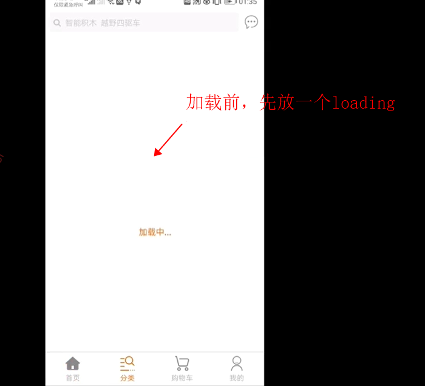

# uni开发APP首次加载页面白屏解决方案

问题：在程序加载时，第一次加载页面会有个几秒中白屏，原因是页面还在渲染，没有渲染完成

图片：


## 解决方案一

>来源：来自uni-app网易云课堂买的网课学习到的


>核心：就是，在加载时先做一个蒙版，在最外面，一进入先加载蒙版（蒙板是一个loading）然后等待整个页面加载完毕后（onReady()生命周期可以检测页面是否加载完成）,关闭蒙版。

效果：展示前先放一个loading唬住用户，让他认为还在加载




页面加载完成后：（onReady()函数执行后）


具体实现思路：

```vue
<template>
	<!-- 这里给整个view加了一个animate动画，让效果更好一点儿 -->
  <view class="animate__animated animate__fadeIn animate__faster d-flex border-top border-light-secondary" style="height: 100%;">
    
    <!-- 加载显示(蒙版) 注意，一定要放在主体内容最前面(渲染时从上往下开始的) -->
    <view v-if="beforeReady" class="position-fixed top-0 left-0 right-0 bottom-0 bg-white font-md d-flex a-center j-center main-text-color" style="z-index: 10000;">
      加载中...
    </view>
    
    <view>
  		<!-- 页面的主体内容 -->
  	</view>
  </view>
</template>

<script>
	export default {
    data() {
      return {
        beforeReady: true // 默认先展示蒙版
      }
    },
    onReady() {
      // onReady()生命周期，监听页面初次渲染完成。注意如果渲染速度快，会在页面进入动画完成前触发
      this.$nextTick(() => {
        this.beforeReady = false; // 页面挂载完成时关闭蒙版
      })
    }
  }
</script>
```


**封装成loading组件和mixin：**

>由于每个页面都要使用这个加载，我们可以考虑将loading封装起来，然后将js部分也封装成mixin即可简化使用，


>vue2是封装成mixins，vue3是composables


loading封装：

```vue
<template>
	<view class="position-fixed top-0 left-0 right-0 bottom-0 bg-white font-md d-flex a-center j-center main-text-color" style="z-index: 10000;">
      加载中...
    </view>
</template>
```


mixin：(loading.js)

```js
export default {
  data() {
    return {
      beforeReady: true,// 页面首次加载
    }
  },
  onReady() {
    this.$nextTick(()=>{
      setTimeout(() => {
        // 模拟加载（2s）
        this.beforeReady = false;
      }, 2000);
    })
  }
}
```

