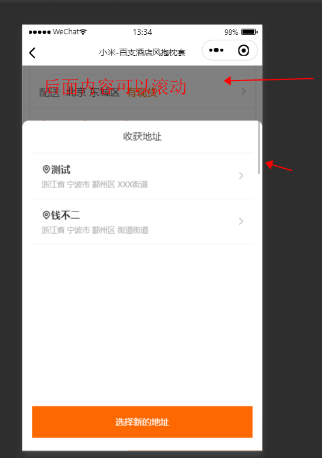

# 弹出模态框后，触摸并滚动屏幕（内容任然可以滚动）


有时候，自己分装的弹出框组件，发现弹出框弹出后，后面的内容仍然可以滚动，如下图




**解决方法一：**

直接取消蒙版和弹出框的触摸滚动事件`@touchmove`，来防止用户触摸滚动

示例：

```vue
<template>
  <!-- 弹出框 -->
  <view class="_popup" :class="toggleClass">
    <view @tap.stop="$emit('hide')" class="_mask" @touchmove.stop.prevent="tMove"></view>
    <!--这里给两个@touchmove绑定了俩空函数，用来取消事件-->
    <view class="_body" @touchmove.stop.prevent="tMove">
      <slot></slot>
    </view>
  </view>
</template>

<script>
  export default {
    props: {
      toggleClass: {
        type: String,
        default: 'none'
      }
    },
    data() {
      return {
      }
    },
    methods: {
      tMove(){} // 这个事件就是让用户触摸并移动时什么也不触发，防止弹出框弹出后任然可以滚动
    }
  }
</script>

<style>
._popup, ._mask {
  position: fixed;
  top: 0;
  width: 100%;
  height: 100%;
}
._popup {
  z-index: 2000;
  display: none;
}
._mask {
  z-index: 2002;
  background-color: rgba(0,0,0,0.5);
}

._popup ._body {
  position: fixed;
  z-index: 2003;
  bottom: -1035rpx;
  width: 100%;
  padding: 0 4%;
  height: 1035rpx;
  background-color: #fff;
  display: flex;
  flex-direction: column;
  border-radius: 10px 10px 0 0;
}

._popup.show { /*这个是指 _popup show同时出现在一个元素时*/
  display: block;
}
.show ._mask {
  animation: showMask .2s linear both;
}
.show ._body {
  animation: showBody .2s linear both;
}
._popup.hide {
  display: block;
}
/* 隐藏 */
.hide ._mask {
  animation: hideMask .2s linear both;
}
.hide ._body {
  animation: hideBody .2s linear both;
}
._popup.none {
  display: none;
}

/* 遮罩层展示隐藏动画 */
@keyframes showMask {
  0% {
    opacity: 0;
  }
  100% {
    opacity: 1;
  }
}
@keyframes hideMask {
  0% {
    opacity: 1;
  }
  100% {
    opacity: 0;
  }
}

/* 弹出框动画 */
@keyframes showBody {
  0% {
    transform: translateY(0);
  }
  
  100% {
    transform: translateY(-100%);
  }
}
@keyframes hideBody {
  0% {
    transform: translateY(-100%);
  }
  
  100% {
    transform: translateY(0);
  }
}
</style>
```

