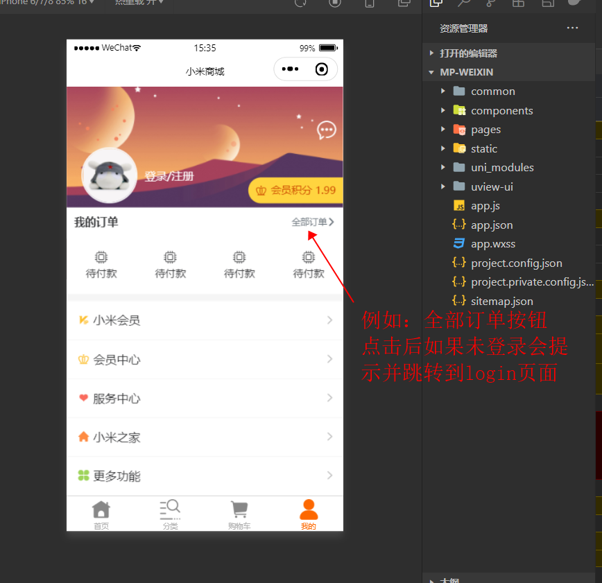

# uni-app中的权限跳转

在uni-app项目中奥，一般都会有一些地方需要拥有一些特定的权限才能进行跳转。例如：有一些页面**需要你登录过后才能进行跳转**




## 方案一：（结合`uni.navigateTo`自己写一个跳转方法）

uni项目中，基本上都是通过uni身上自带的方法进行跳转的，我们就可以自己写一个方法（类似于拦截器一样），先判断，再跳转


示例：

```js
// main.js
import Vue from 'vue';
import store from './store/index.js';
// 权限跳转
Vue.prototype.navigateTo = (options) => {
  // 这里权限标识只有一个是否登录
  if(store.state.user.loginStatus) {
    // 状态是登陆了的
    return uni.navigateTo(options)
    
    // 关键就在这里，这里我们可以自己添加想要的权限校验方法
  }
  // ----------------------------------------------
  
  
  // 如果为false是未登录
  uni.showToast({
    title: '请先登录',
    icon: 'none',
    mask: true
  })
  setTimeout(() => {
    uni.navigateTo({
      url: '/pages/login/login'
    })
  }, 1000)
}
```

