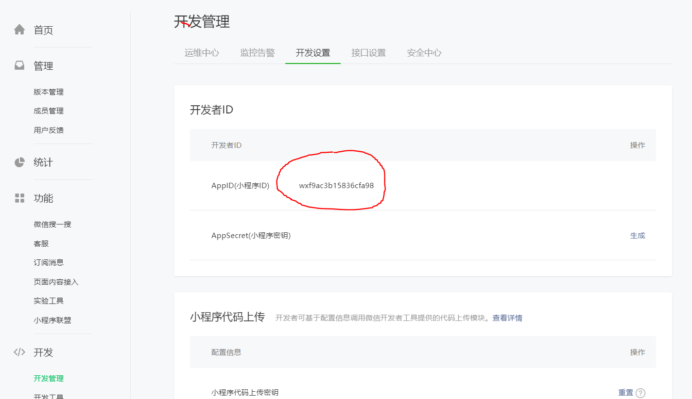
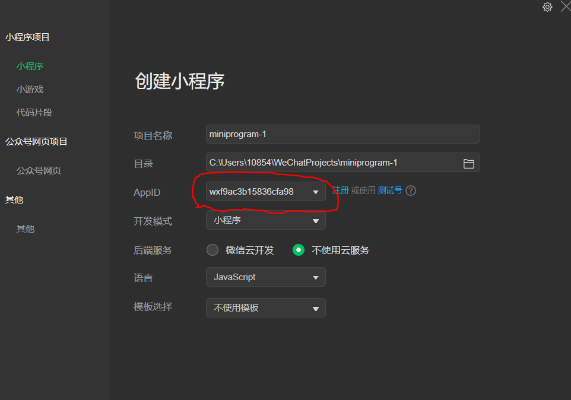

# 开发小程序的步骤

## 第一步：注册开发者账号

去微信公众平台进行注册

网址：https://mp.weixin.qq.com/

步骤：点击立即注册—>选择小程序—>填写响应信息并激活

目的：**获取小程序ID，用来创建开发项目**

## 第二步：安装小程序开发工具

**微信开发者工具**是官方推荐使用的小程序开发工具。

主要功能：

1. 快速创建小程序项目
2. 代码的查看和编辑
3. 对小程序功能进行调试
4. 小程序的浏览和发布

百度一搜，嘎嘎一下，欻欻一按，直接使用（建议安装稳定版）

## 最后一步：创建项目

>first:打开微信开发者工具并登录
>
>second：点击+号

