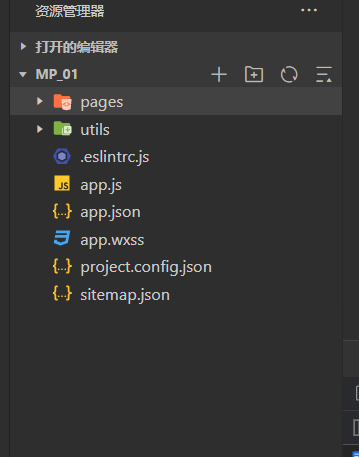
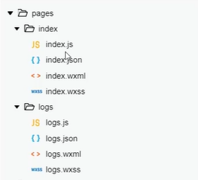
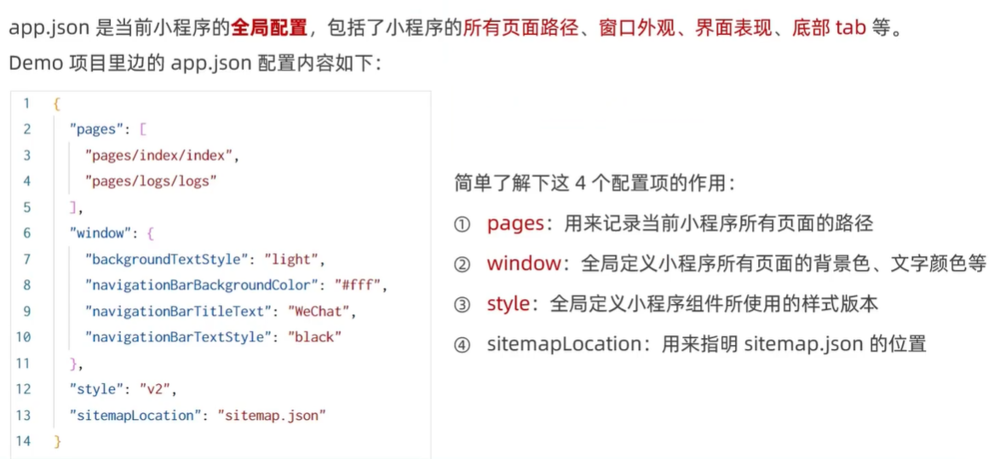

# 小程序项目结构组成

## pages：用来存放所有小程序的界面

小程序光放建议把所小程序的界面都存放在pages目录中，以单独的文件夹存在：

.js文件：页面脚本文件存放页面数据、事件处理函数等

.json文件：当前页面的配置文件、配置窗口外观、表现等

.wxml文件：页面的模板结构文件

.wxss文件：当前页面的样式文件

**一个小程序的页面是由以上4个文件合体组成的**

## json配置文件

JSON配置文件，可以对小程序项目进行不同级别的配置

### app.json：小程序项目的全局配置文件

app.json是当前小程序的全局配置，里面包括了小程序的所有**页面路径**、**窗口外观**、**界面表现**、**底部tab**等

### project.config.json：项目的配置文件

项目配置文件，用来记录我们对小程序开发工具所做的一些**个性化配置**（这个个性化设置，也可以在详细—>本地设置中自己勾选）

例如：appid呀，projectname呀等

### sitemap.json：用来配置小程序及其界面是否允许被微信索引

微信已经开放了小程序内搜索，效果类似于PC网页的SEO，sitemap.json：用来配置小程序及其界面是否允许被微信索引。

当开发者允许微信索引时，微信会通过爬虫的形式，为小程序的页面内容建立索引。当用户的搜索关键字和页面索引匹配成功的时候，小程序的页面将可能展示在搜索结果中。

### 每个页面的单独.json配置文件

小程序的每个页面，都可以使用`.json`文件来对本页面的窗口外观进行配置，**页面中的配置项会覆盖掉`app.json`的`window`中相同的配置项**

utils：用来存放工具性质的模块函数（例如：格式化事件的自定义模块）

app.js：小程序入口文件

app.wxss：小程序项目的全局样式文件

