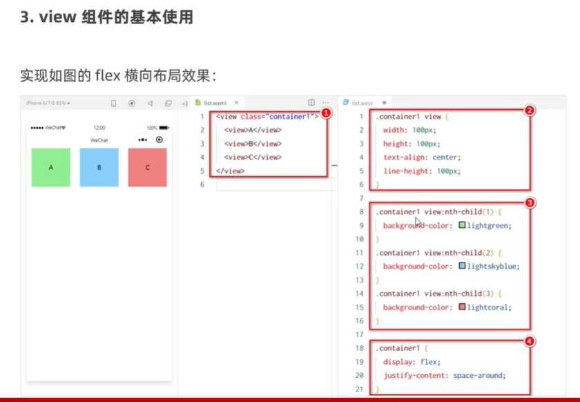

# 小程序的宿主环境-组件


## 视图类组件

### view

* 普通视图区域
* 类似于`HTML`中的`div`，是一个块级元素
* 常用来实现页面的布局效果

就把他当成普通的`div`组件来用就行了，css写法一样



### scroll-view

* 可滚动的视图区域
* 常用来实现滚动列表的效果

属性：

* scroll-y：允许纵向滚动
* scroll-x：语序横向滚动

注意：

使用竖向滚动时，必须给`scroll-view`有一个**固定高度**

使用横向滚动时，要给父元素添加`white-space: nowrap;`，给子元素添加：`display: inline-block;`

### swiper和swiper-item

* 轮播图的容器组件和轮播图的`item`组件


属性：


## 常用基础内容组件

### text

* 文本组件
* 类似于`HTML`中的`span`标签，是一个行内元素


属性：

1. selectable：可以实现长按选中文本（**只有text组件支持长按选中操作**）

```html
<text selectable>手机号：13209903517</text>
```


### rich-text

* 富文本组件
* 支持把`HTML`字符串渲染为`WXML`结构


属性：

1. nodes：可以将HTML字符串渲染成对应的`UI`结构（使用场景，后端传回一段HTML字符串）

```html
<rich-text nodes="<h1>咦嘻嘻</h1>"></rich-text>
```


## 其他常用组件

### button

* 按钮组件
* 功能比HTML中的button按钮丰富
* 通过open-type属性可以调用微信提供的各种功能（客服、转发、获取用户授权、获取用户信息等）


### image

* 图片组件
* image组件默认宽度为300px、高度为240px

属性：

1. mode：用来指定图片的裁剪和缩放模式，常用mode属性值如下：


### navigator

* 页面导航组件
* 类似于HTML中的a链接