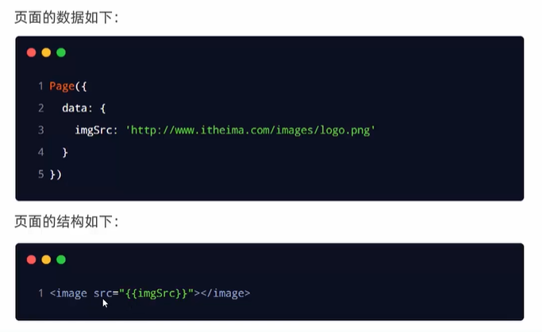

# 小程序数据DATA属性

基本使用方式和`vue`一致，不一致的是在属性绑定上。

## 数据声明

在pages文件夹下，找到对应页面的对应`.js`文件，在`data`中定义想要的数据。

示例：

```js
data: {
  info: 'Hello World'
},
```


## mustache语法

`{{}}`双花括号就是该语法，在`vue`中叫插值语法

## 数据绑定

在页面结构中`.wxml`，使用和`vue`同款的插值语法`{{}}`对`data`中的数据进行展示。

示例：

```html
<view>
{{info}}
</view>
```


## 动态绑定属性

注意：这里和`vue`不同，小程序中无论是绑定属性还是展示内容，都用的插值语法（mustache语法）




## 修改data中定义的值

通过调用`this.setData(dataObject)`方式，可以给页面data中的数据重新赋值：（有点儿像react中的`setState`）

示例：

```js
page({
  data: {
    count: 0
  },
  // 调用changeCount函数修改count值
  changeCount() {
		this.setData({
      count: this.data.count+1
    })
  }
})
```

