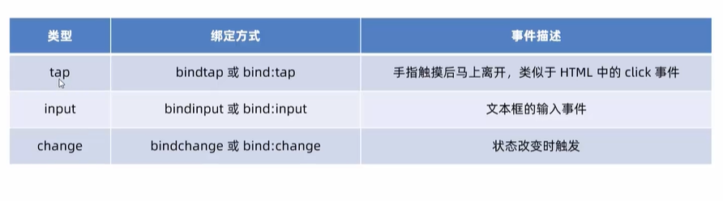
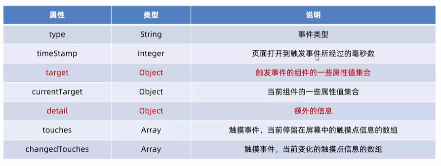

# 小程序的事件绑定


## 事件定义的位置

小程序需要绑定的事件也定义在对应页面的对应`.js`文件中

具体位置如下：

```js
// pages/list/list.js
Page({
  // 定义在和data同级的位置，使用了对象定义函数简写方式
    onTap(e) {
        console.log(e);
    },
    /**
     * 页面的初始数据
     */
    data: {
        info: 'Hello World',
        imgSrc: 'http://www.itheima.com/images/logo.png',
        randomNum: Math.random().toFixed(2)
    }
)}
```


**绑定通过bind关键字**


## 小程序中常用的事件




## 事件对象的属性列表

当事件回调被触发时，会受到一个事件对象`event`，它的详细属性如下标所示：（特别像`dom`对象）



`targe`t与`currentTarget`之间的区别：

`target`是触发该事件的源头组件(就是你点谁触发了事件，target就是谁)，而`currentTarget`是当前事件所绑定的组件。


## 事件传参

小程序中事件传参比较特殊，不能在绑定事件的同时为事件处理函数传递参数，例如以下代码就不会工作:

```html

<button type="primary" bindtap="changeCount(123)">按钮</button>
```

注意：小程序会把`changeCount(123)`整体当作一个事件名儿。


<strong style="font-size: 20px">传递参数可以通过：`data-*`自定义**属性**传参，其中*代表的是参数名字</strong>

示例：

```html
<button type="primary" bindtap="changeCount" data-info="{{2}}">按钮</button>
```

注意：传递时的类型，注意`mustache`语法

之后：

* `info`会被解析为参数的名字
* 数值2会被解析为参数的值


<strong style="font-size: 20px">接收参数：通过`event.target.dataset.参数名儿`可以获得具体参数的值。</strong>

示例：

```js
Page({
    changeCount(e) {
        // 一个包含所有参数的对象
        console.log(e.target.dataset);
        // info形参的值
        console.log(e.target.dataset.info);
    }
})
```


### bindtap

就是相当于HTML中的onclick事件，因为手机不是只能点嘛，所以叫`bindtap`


### bindinput

`bindinput`事件，可以监听`input`框的输入，输入的内容存储在`event.detail.value`（这个有点特殊奥)

