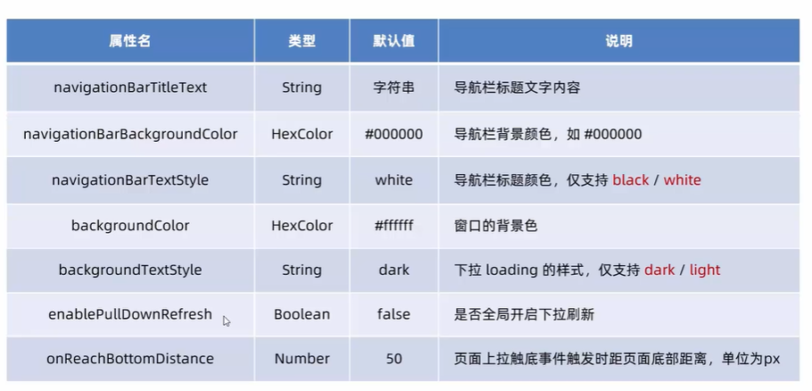
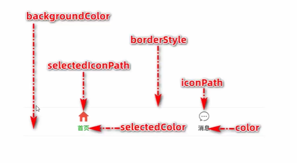
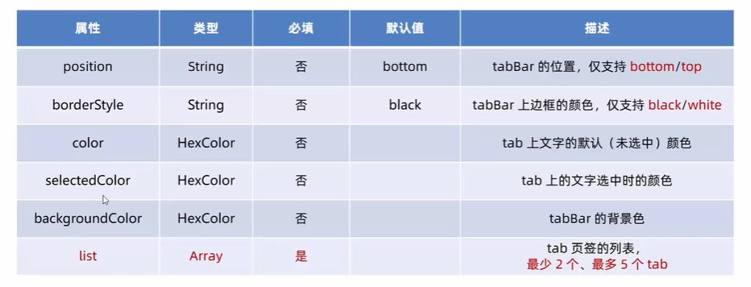
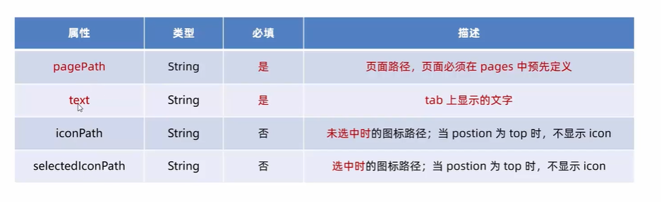

# 小程序全局配置文件(`app.json`)

常用配置项：

1）`pages`

* 记录当前小程序所有页面存放路径

2）`window`

* 全局设置小程序窗口所有外观

3）`tabBar`

* 设置小程序底部`tabBar`效果

4）`style`

* 是否启用新版的组件样式


## `window`常用配置项



注意：`navigationBarBackgroundColor`不支持`red`,`green`这种文本，只能使用`#ffffff`这类的


`"onReachBottomDistance"`:一般和无线加载列表功能有关 


## `tabBar`常用配置项

`tabBar`一般分为：

* 底部的
* 顶部的

注意：

1. `tabBar`中配置至少2个最多5个的tab页签
2. 渲染顶部`tabBar`时，不会显示对应的`icon`，只能显示文本


**`tabBar`的6个组成部分**:



* `backgroundColor`：`tabBar`背景色
* `selectedIconPath`：选中时图片路径
* `selectedStyle`：tabBar上边框颜色
* `iconPath`：未选中时图片路径
* `selectedColor`：tab上文字选中时的颜色
* `color`：tab上文字未选中时的颜色


**`tabBar`节点配置项**



---

然后注意：list下的没个tab配置项如下图所示：



还要注意：**`tabBar`的图片路径必须放在`pages`属性的前几个，否则就不会显示。**

示例：

```json
{
  "pages": [
    /*注意前两个*/
    "pages/home/home",
    "pages/index/index",
    "pages/list/list",
    "pages/logs/logs",
    "pages/user/user"
  ],
  "window": {
    "backgroundTextStyle": "light",
    "navigationBarBackgroundColor": "#2b4b6b",
    "navigationBarTitleText": "钱不二",
    "navigationBarTextStyle": "white",
    "enablePullDownRefresh": true
  },
  "tabBar": {
    /*注意这里*/
    "list": [
      {
        "pagePath": "pages/index/index",
        "text": "index",
        "iconPath": "/images/cart.png",
        "selectedIconPath": "/images/cart-active.png"
      },
      {
        "pagePath": "pages/home/home",
        "text": "home",
        "iconPath": "/images/home.png",
        "selectedIconPath": "/images/home-active.png"
      }
    ]
  },
  "style": "v2",
  "sitemapLocation": "sitemap.json",
  "lazyCodeLoading": "requiredComponents"
}
```


