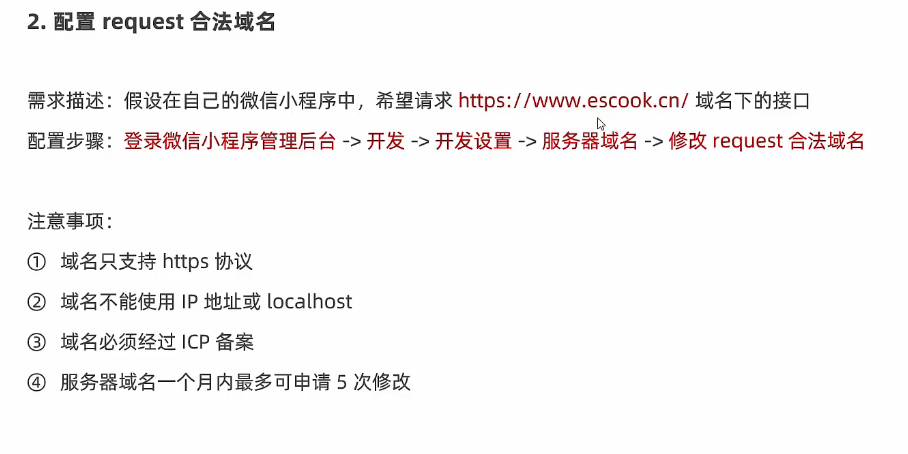

# 小程序的网络请求

## 一：小程序中网络请求的限制

出于安全性方面的考虑，小程序官方对数据接口的请求由以下两个限制：

1. 只能请求HTTPS类型的接口
2. 必须将接口的域名添加到信任列表中


### 配置合法域名的具体操作




## 发起GET请求

调用微信小程序提供的`wx.request()`方法可以发起GET数据请求。

示例：

```js
wx.request({
  url: 'https://www.escook.cn/api/get',
  method: 'GET',
  data:{
    name: '张三',
    age: 20
  },
  // 成功的回调
  success: (res) => {
    console.log(res.data);
  },
  complete:() => {
    // 无论失败还是成功都会调用这个回调
    /*一般都会在这里面做一些操作，例如隐藏loading呀，控制节流阀呀，调用传入的回调呀*/
  }
})
```


## 发起POST请求

一样调用`wx.request()`方法

示例：

```js
wx.request({
  url: 'https://www.escook.cn/api/post',
  method: 'POST',
  data: {
    name:'李四',
    age: 33
  },
  success:(res) => {
    console.log('post', res.data);
  },
  complete:() => {
    // 无论失败还是成功都会调用这个回调
    /*一般都会在这里面做一些操作，例如隐藏loading呀，控制节流阀呀，调用传入的回调呀*/
  }
})
```


## 跳过request合法域名校验

如果后端程序员仅仅提供了`http`协议接口、暂时没有提供`https`协议的接口。

此时为了不耽误开发进度，我们可以在微信开发者工具中，临时开启`[开发环境不校验请求域名、TLS版本及HTTPS证书]`选项，跳过request合法域名的校验

注意：**跳过request合法域名校验的选项，权限只能在开发和调试阶段使用！！！**


## 小程序中关于跨域和Ajax的说明

小程序中是没有跨域这个问题的，跨域问题只存在于浏览器的web开发之中。


Ajax技术的核心是依赖于浏览器的`XMLHttpRequest`对象，小程序的宿主环境是微信客户端，所以不能叫**发起Ajax请求**，而是叫发起**网络数据请求**