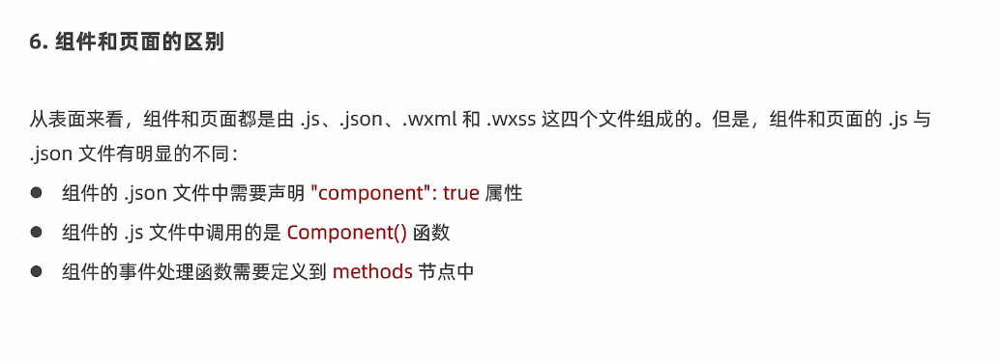
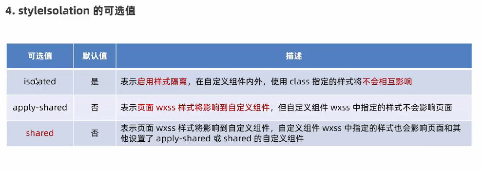
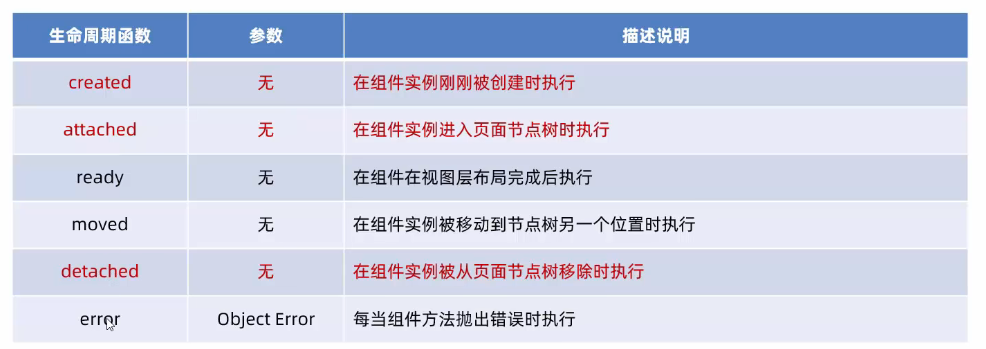
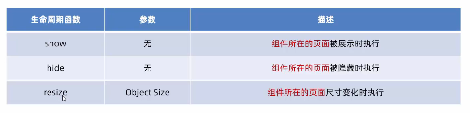
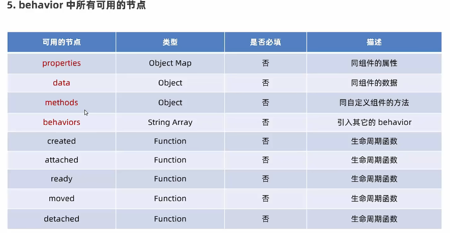

# 小程序自定义组件(重要)

## 创建组件

1. 项目根目录下，创建components->test文件夹
2. 在新建的test文件夹上，右键点击**新建Component**
3. 键入组件的名称后回车，会自动生产组件对应的4个文件，后缀名为`.js`、`.json`、`.wxml`、`.wxss`


## 组件引入

也是分为两种：局部引入和全局引入


### 局部引入

在页面的`.json`配置文件中，引入组件。

键名儿：是组件的名称

键值儿：是组件的路径

示例：

```json
{
  "usingComponents": {
    "my-test1":"/components/test/test"
  }
}
// 使用
// <my-test1></my-test1>
```


### 全局引入

在`app.json`的全局配置文件中引用组件的方式，是“全局引用”。

示例：

```json
{
  // 和"window"平级
  "usingComponents": {
    "my-test1":"/components/test/test"
  }
}

// 之后，全局都能使用
```


## 小程序中组件与页面的区别




## 组件样式隔离

默认情况下，自定义组件的样式只对当前组件生效，不会影响到组件之外的UI结构。

**注意点：**

1. `app.wxss`的全局样式对组件无效
2. 只有class选择器会有样式隔离效果，**属性，标签，id选择器都不受样式隔离影响**（在组件，和组件引入的页面中，最好都使用class选择器）


## 修改组件的样式隔离选项

默认情况下，自定义组件的样式隔离特性，能够防止组件内外样式互相干扰的问题。

但是，如果我们有时想要在**外界能够控制组件内部的样式**，可以通过`styleIsolation`修改组件的样式隔离选项。



两种使用方式如下：

```js
// 第一种:在组件的.js文件中添加options，并修改styleIsolation(常用)
Component({
  options: {
    // 默认是isolated
    styleIsolation: 'apply-shared'
  }
}
          
// 第二种： 在组件的.json文件中新增如下配置（不常用）
{
	"styleIsolation": "isolated"
}
```


## 组件身上的数据、方法、属性

### data数据

在小程序中，用于组件模板渲染的**私有数据**，定义在data节点之中。

```js
// components/test/test.js
Component({
  /**
   * 组件的初始数据
   */
  data: {
    count: 0
  }
})

```


### methods方法

在小程序中，事件处理函数和自定义方法需要定义到methods节点中。

示例：

```js
// components/test/test.js
Component({
  /**
   * 组件的初始数据
   */
  data: {
    count: 0
  },

  /**
   * 组件的方法列表
   */
  methods: {
    addCount() {// 自定义事件处理函数
      this.setData({
        count: this.data.count+1
      })
      this._showCount();
    },
    _showCount() {// 自定义方法建议 _ 开头（就是不会绑定到页面上的函数）
      wx.showToast({
        title: `count的值为：${this.data.count}`,
        icon:'none'
      })
    }
  }
})

// 在组件的.wxml使用
<button bindtap="addCount">点我+1</button>
```


### properties属性

在小程序组件中，properties是组件的对外属性，**用来接收外界传递到组件中的数据**

示例：

```js
// components/test/test.js
Component({
  options: {
    styleIsolation: 'apply-shared'
  },
  /**
   * 组件的属性列表
   */
  properties: {
    max: {// 完整定义属性方式
      type:Number,//类型
      value: 10//属性默认值
    },
    min: Number //简化定义属性
  }
})

// 属性传递
<my-test1 max="10" min="0"></my-test1>
```


## 小程序中data和properties的区别

在小程序的组件中，**properties属性和data数据的用法相同**，它们都是**可读可写**的（和vue不一样哦(●ˇ∀ˇ●)）

它俩都是存储在同一个对象身上的。

只不过：

* data更倾向于去**存储组件的私有数据**
* properties更倾向于**存储外界传递到组件中的数据**


**由于data和properties本质上没有区别，所以properties的属性也能用于页面渲染，并且还能够通过`setData`进行修改**

示例：

```js
// components/test/test.js
Component({
  options: {
    styleIsolation: 'apply-shared'
  },
  /**
   * 组件的属性列表
   */
  properties: {
    max: {// 完整定义属性方式
      type:Number,//类型
      value: 10//属性默认值
    }
  },
  /**
   * 组件的方法列表
   */
  methods: {
    addCount() {// 自定义函数
      if(this.data.count >= this.properties.max) return;
      this.setData({
        count: this.data.count+1
      })
      // 让max加1
      this.setData({
        max:this.properties.max+1
      })
    }
  }
})

```


## 数据监听器

作用类似于vue中的watch侦听器，在小程序组件中的基本语法如下：

```js
// 组件的.js文件
Component({
  observers: {
    // 监听简单类型
    '字段A, 字段B': function(字段A的新值, 字段B的新值) {
      // 具体操作
    }
  }
)}
```


### 监听对象属性的变化

数据监听器支持监听对象中的**单个或者多个属性**的变化，示例：

```js
Component({
  observers: {
    '对象.属性A, 对象.属性B': function(属性A的新值, 属性B的新值) {
      
      // 触发此监听器的3中情况：
      /*
      	1.为属性A赋值时，使用setData设置this.data.对象.属性A 时触发
      	2.为属性B赋值时，使用setData设置this.data.对象.属性B 时触发
      	3.直接为对象赋值，使用setData设置this.data.对象时触发
      */
      
      // do something...
    }
  }
})
```


**监听对象身上的所有属性，可以通过`**`通配符来监听对象身上所有的属性**

示例：

```js
observers: {
  'rgb.r, rgb.g, rgb.b': function(r, g, b) {
    this.setData({
      fullColor: `${r},${g},${b}`
    })
  }
}

// 改造--> 使用通配符**
  observers: {
    // 注意使用通配符后，函数接收到的是一个对象
    'rgb.**': function(obj) {
      this.setData({
        fullColor: `${obj.r}, ${obj.g}, ${obj.b}`
      })
    }
  },
```


## 纯数据字段(优化)

概念：纯数据字段指的是，那些不用于界面渲染的data字段。

应用场景：例如有些情况下，**某些data中的字段既不会展示在界面上，也不会传递给其他组件，只在组件内部使用**。带有这种特性的data字段适合被设置为纯数据字段。


优势：有助于提示页面更新的性能


### 使用规则

在Component构造器的options节点中，指定pureDataPattern为一个正则表达式，字段名符合这个正则表达式的字段将成为纯数据字段。

示例：

```js
// components/test3/test3.js
Component({
  options: {
    // 指定所有以_开头的数据字段为纯数据字段
    pureDataPattern: /^_/
  },
  /**
   * 组件的初始数据
   */
  data: {
    a: true, // 普通数据字段
    _b: true, //纯数据字段
  }
})
```


## 组件的声明周期(重要)

小程序组件可用的全部生命周期如下表所示：



小程序组件中，最重要的生命周期函数有3个，分别是**created、attached、detached**。

1）组件实例**刚刚被创建好时**，**created生命周期**函数被触发

* 此时还不能调用`setData`
* 通常在这个生命周期函数中，只应该用于给组件的this添加一些自定义属性字段


2）在组件**完成初始化完毕、进入页面节点树后**，**attached生命周期函数**被触发

* 此时，`this.data`已被初始化完毕
* 这个生命周期很有用，绝大多数初始化的工作都可以在这个时机进行（例如发起请求获取数据）


3）在组件**离开页面节点树后**（被销毁），**detached生命周期**会被触发

* 退出一个页面时，会触发页面内每个自定义组件的detached生命周期函数
* 此时适合做一些清理性质的工作


### 定义组件生命周期

生命周期方法可以直接定义在 `Component` 构造器的第一级参数中。

自小程序基础库版本 [2.2.3](https://developers.weixin.qq.com/miniprogram/dev/framework/compatibility.html) 起，组件的的生命周期也可以在 `lifetimes` 字段内进行声明（**这是推荐的方式，其优先级最高**）。

实例：

```js
// components/test3/test3.js
Component({
	...,
  lifetimes: {
    created: function() {
      console.log('created');
    },
    attached: function() {
      console.log('attached');
    }
  }
})

```


### 组件所在的页面的生命周期

官网概念：还有一些特殊的生命周期，**它们并非与组件有很强的关联，但有时组件需要获知，以便组件内部处理**。这样的生命周期称为“组件所在页面的生命周期”，在 `pageLifetimes` 定义段中定义。

有时候，自定义组件的行为依赖于页面状态的变化，此时就需要用到组件所在页面的生命周期。


组件所在页面的生命周期有3个:



示例：

**需要用到`pageLifetimes`节点**

```js
Component({
  pageLifetimes: {
    show: function() {
      // 页面被展示
    },
    hide: function() {
      // 页面被隐藏
    },
    resize: function(size) {
      // 页面尺寸变化
    }
  }
})
```


## 插槽（slot）

在自定义组件的`wxml`结构中，可以提供一个<slot>节点，用于承载组件使用者提供的`wxml`结构。

**和vue中的插槽功能差不多，使用方式也差不多。**


### 单个插槽

在小程序中，默认每个自定义组件中只允许使用一个<slot>进行占位，这种个数上的限制叫做单个插槽。

示例：

```html
<!--components/test4/test4.wxml-->
<view>
  <view>这里是组件test4</view>
  <slot></slot>
</view>

<!--使用组件-->
<my-test4>
  <view>这个是slot内容</view>
</my-test4>
```


### 启用多个插槽

小程序自定义组件中，需要使用多个<slot>插槽时，可以在组件`.js`文件中，通过如下方式进行启用。

示例代码如下：

```js
// components/test4/test4.js
Component({
  options: {
    // 启用多个插槽
    multipleSlots: true
  }
})

```


### 多个插槽的具体使用

和vue的具名插槽类似，需要给<slot>标签添加一个name属性

使用组件时，需要给标签内容中添加一个slot属性，来指明每个对应的插槽。

示例：

```html
<my-test4>
    <!-- 这部分内容将被放置在组件 <slot name="before"> 的位置上 -->
    <view slot="before">这里是插入到组件slot name="before"中的内容</view>
    <!-- 这部分内容将被放置在组件 <slot name="after"> 的位置上 -->
    <view slot="after">这里是插入到组件slot name="after"中的内容</view>
</my-test4>


<!--组件中内容-->
<!--components/test4/test4.wxml-->
<view>
  <slot name="before"></slot>
  <view>这里是组件的内部细节</view>
  <slot name="after"></slot>
</view>

```


## 小程序的behaviors

behaviors是小程序中，用于**实现组件间代码共享的特性**，类似`vue2`中的`mixins`，`vue3`中的`composables`


每个behavior都可以包含一组属性、数据、生命周期函数和发那个发。组件引用它时，它的属性、数据和方法都会被合并到组件中。

注意：behavior中还能引入别的behavior（套娃了属于是）

**behavior上常用的节点：**



### 创建behavior

调用`Behavoir()`方法即可创建一个共享的behavior实例对象，供所有组件使用

示例：

```js
// 调用Behavior
module.exports = Behavior({
  // 私有数据
  data: {
    username: 'zs'
  },
  // 属性节点
  properties: {

  },
  // 事件处理函数和自定义方法
  methods:{},
  ...
})
```


### 导入并使用behavior

在组件中，使用`require()`方法导入需要的behavior，挂在后即可访问behavior中的数据或方法。

示例：

```js
// 引入behavior
const myBehavior = require('../../behavior/my-behavior')
Component({
  // 将自定义的behavior挂载到组件上
  behaviors:[myBehavior]
})


// 模板上能直接使用，behavior上定义的data
<view>{{username}}</view>
```


### behavior中出现同名字段的情况

组件和它引用的behavior可以包含同名的字段，此时有下面3条同名时的处理规则：


官网：[behaviors | 微信开放文档 (qq.com)](https://developers.weixin.qq.com/miniprogram/dev/framework/custom-component/behaviors.html#同名字段的覆盖和组合规则)