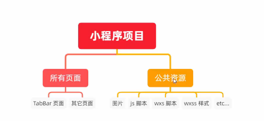
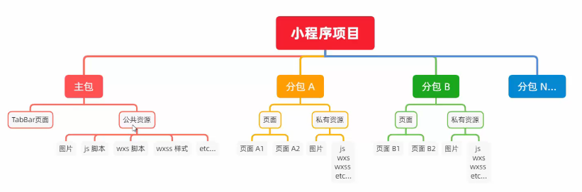
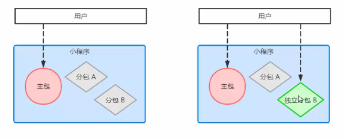
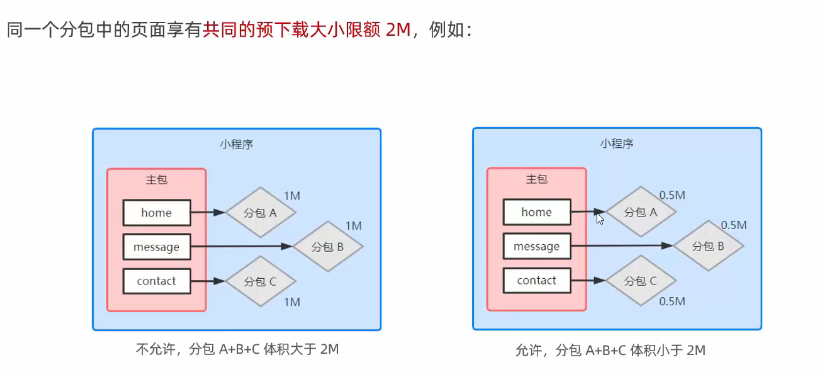

# 小程序中的分包

分包概念：分包是指把一个完整的小程序项目，**按照需求划分为不同的子包**，在构建时打包成不同的分包，用户在使用时可以**按需加载**

官方文档：https://developers.weixin.qq.com/miniprogram/dev/framework/subpackages/basic.html

分包的优势：

1. 可以**优化小程序首次启动的下载时间**
2. 在多团队共同开发时可以更好的解耦协作


## 分包前项目的构成

分包前，小程序项目中所有的页面和资源都被打包到了一起，导致整个项目体积过大，影响小程序首次启动的下载时间。




## 分包后项目构成

分包后，小程序项目**由1个主包**+**多个分包**构成：

* 主包：一般包括项目的启动页面或者`TabBar`页面、以及所有分包都需要用到的一些公共资源
* 分包：只包含和当前分包有关的页面和私有资源




## 分包的加载规则

1. 小程序启动时，**默认会下载主包并启动主包内页面**
   * tabBar页面需要放到主包中
2. 当用户进入到某个页面时，客户端会把对应的分包下载下来，下载完成后再进行展示
   * 非tabBar页面可以按照功能的不同，划分为不同的分包之后，按需进行下载


## 分包的体积限制

目前小程序分包大小有以下限制：

- 整个小程序所有分包大小不超过 20M（主包+所有分包）
- 单个分包/主包大小不能超过 2M


## 使用分包

设置时，直接在`app.json`中配置 `subpackages`就能够自动帮我们创建好对应的分包了。

假设支持分包的小程序目录结构如下：

```text
├── app.js
├── app.json
├── app.wxss
├── packageA 
│   └── pages
│       ├── cat
│       └── dog
├── packageB
│   └── pages
│       ├── apple
│       └── banana
├── pages
│   ├── index
│   └── logs
└── utils
```

**开发者通过在 app.json `subpackages` 字段声明项目分包结构：**

```json
{	
  // 主包的所有页面
  "pages":[
    "pages/index",
    "pages/logs"
  ],
  "subpackages": [
    { // 第一个分包
      "root": "packageA", // 第一个分包的根目录
      "pages": [ // 当前分包下，所有页面的相对存放路径
        "pages/cat",
        "pages/dog"
      ]
    }, {
      // 第二个分包
      "root": "packageB", // 第二个分包的根目录
      "name": "pack2",
      "pages": [ // 当前分包下，所有页面的相对存放路径
        "pages/apple",
        "pages/banana"
      ]
    }
  ]
}
```


`subpackages`的配置项：

| 字段        | 类型        | 说明                                                         |
| :---------- | :---------- | :----------------------------------------------------------- |
| root        | String      | 分包根目录                                                   |
| name        | String      | 分包别名，[分包预下载](https://developers.weixin.qq.com/miniprogram/dev/framework/subpackages/preload.html)时可以使用 |
| pages       | StringArray | 分包页面路径，相对于分包根目录                               |
| independent | Boolean     | 分包是否是[独立分包](https://developers.weixin.qq.com/miniprogram/dev/framework/subpackages/independent.html) |

### 打包原则

- 声明 `subpackages` 后，将按 `subpackages` 配置路径进行打包，`subpackages` 配置路径外的目录将被打包到主包中
- 主包也可以有自己的 pages，即最外层的 pages 字段。
- `subpackage` 的根目录不能是另外一个 `subpackage` 内的子目录
- `tabBar` 页面必须在主包内

### 引用原则

- `packageA` 无法 require `packageB` JS 文件，但可以 require 主包、`packageA` 内的 JS 文件；使用 [分包异步化](https://developers.weixin.qq.com/miniprogram/dev/framework/subpackages/async.html) 时不受此条限制
- `packageA` 无法 import `packageB` 的 template，但可以 require 主包、`packageA` 内的 template
- `packageA` 无法使用 `packageB` 的资源，但可以使用主包、`packageA` 内的资源

1. 主包无法引用分包内的私有资源
2. 分包之间不能互相引用
3. 分包可以引用主包内的公有资源


## 独立分包

独立分包是小程序中一种特殊类型的分包，可以独立于主包和其他分包运行。从独立分包中页面进入小程序时，不需要下载主包。当用户进入普通分包或主包内页面时，主包才会被下载。




**独立分包和普通分包的区别**：

最主要区别：**就是是否需要依赖于主包进行运行**。


**独立分包的应用场景**：

开发者可以按需，将一些具有功能独立性的页面配置到独立分包中。原因如下：

1. 当小程序从普通分包的页面启动时，需要首先下载主包
2. 而独立分包不依赖于主包即可运行，可以很大程度上提出分包页面的启动速度。

注意：一个小程序可以有多个独立分包


**开启独立分包**：

在`subpackages`配置项中，将`independent`字段设置为true即可。


### 独立分包的引用原则

**独立分包和普通分包以及主包之间，是相互隔绝的**，不能够相互引用彼此的资源！例如：

1. 主包无法引用独立分包的私有资源
2. 独立分包不能相互引用私有资源
3. 独立分包于普通分包之间，也不能相互引用
4. 特别注意：**独立分包不能引入主包资源**


## 分包预下载（优化）

开发者可以通过配置，在进入小程序某个页面时，由框架自动预下载可能需要的分包，提升进入后续分包页面时的启动速度。对于[独立分包](https://developers.weixin.qq.com/miniprogram/dev/framework/subpackages/independent.html)，也可以预下载主包。


**配置方法：**

预下载分包行为在进入某个页面时触发，通过在 `app.json` 增加 `preloadRule` 配置来控制。

示例：

```json
{
  "preloadRule": { // 分包预下载规则
    "pages/concat.concat": { // 触发分包预下载的页面路径
      // network: 在指定网络下预下载，可选值为：
      /*	all: 不限网络
          wifi: 仅 wifi 下预下载
      */
      "network": "all",
      
      // package：进入页面后预下载分包的 root 或 name。__APP__ 表示主包。
      "packages": ["pkgA"]
    }
  }
}
```

### 分包预下载限制

同一个分包中的页面享有共同的预下载大小限额 2M，限额会在工具中打包时校验。

如，页面 A 和 B 都在同一个分包中，A 中预下载总大小 0.5M 的分包，B中最多只能预下载总大小 1.5M 的分包。

