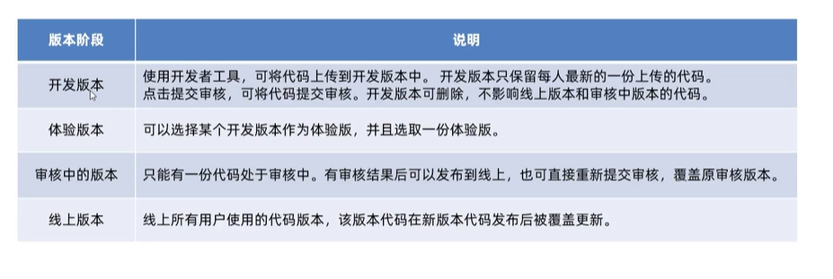
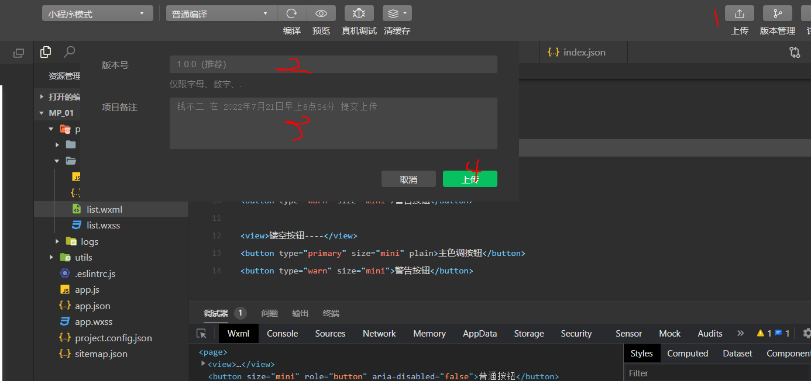

# 小程序发布过程

## 小程序版本

## 发布上线整体步骤

上传代码->提交审核->发布

### 上传代码

1. 点击开发者工具栏顶部的**上传**按钮
2. 填写**版本号**以及**项目备注**

之后可以在小程序后台管理官网，管理->版本管理->开发版本

### 提交审核

为什么要审核？为了保证小程序质量，以及符合相关的规范，小程序发布是需要经过腾讯官方进行审核、

审核方式：在开发版本列表中，点击**提交审核**，按照页面填写相关信息即可。

### 发布

当审核通过之后，管理员微信会收到小程序审核通过通知，之后再点击发布，之后所有小程序用户都可使用。

# 小程序码的推广

## 总共步骤

登录小程序官方管理后台->设置->基本设置->基本信息->小程序码以及线下物料下载

# 小程序运营数据

查看小程序运营数据的两种方式：

1. 在小程序后台查看

登录小程序管理后台->点击侧边栏**统计**->点击相应的tab可以查看到相关数据

2. 通过小程序数据助手查看

打开微信->搜索小程序数据助手->点击小程序或扫描小程序码