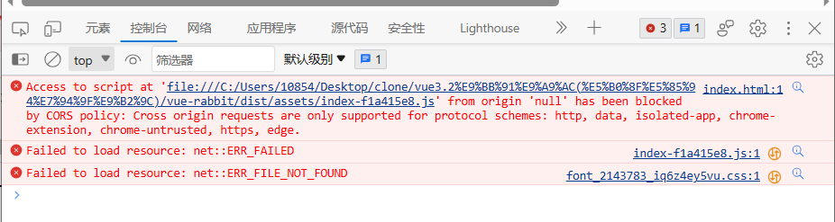

# vite打包后，本地无法运行dist中的html文件


当你在运行完`npm run build`时候，你可能会信心慢慢的打开`dist`文件夹中的`index.html`。诶~结果发现运行不了，并报下面这种错误：




报错的原因：其实里面也写明白了，就是跨域了，上面这段话的意思就是：跨源请求仅支持协议方案：http、data、chrome、chrome-extension、chrom-untrusted、https。

vite使用的是在`script`标签中加一个属性`type="module"`的方式来引入js文件，在js文件中可以用`impor...from...`这种写法，但是这种方式是叫做`file`协议，不属于上面支持的哪几种协议。


## 解决方式

解决方式有很多种：

1. 本地运行不了直接上服务器即可
2. 我们可以本地自己开一个服务器让他跑


这里我们选择第二种：**方便一点**

>第一步：安装`http-server`是一个很小的开启本地服务器的库

```
npm install http-server -g

// 建议全局安装，以后使用起来也比较方便
```

>第二部：进入dist目录，直接运行

```
http-server -c-1 

// 后面这个-c-1是禁用掉缓存的意思，具体其他配置，可以去npm 官网搜 http-server
```


>最后随便点一个url打开即可