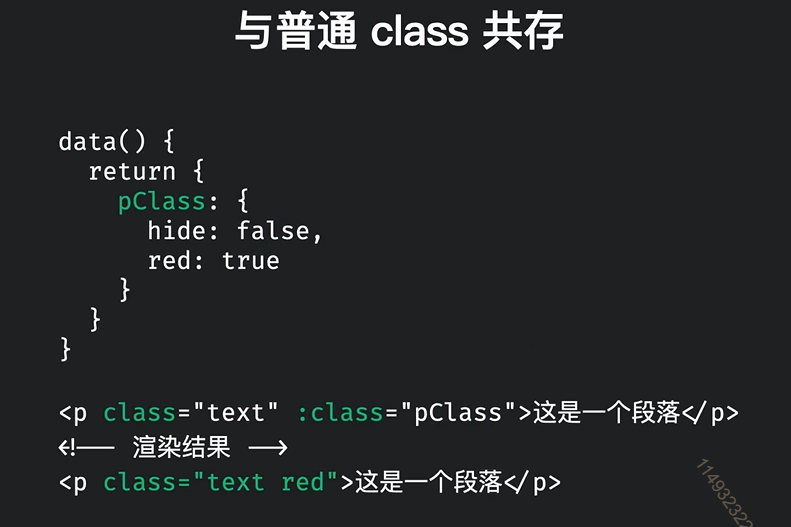
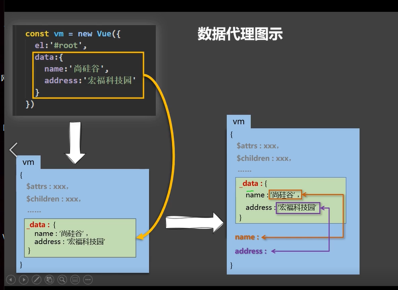
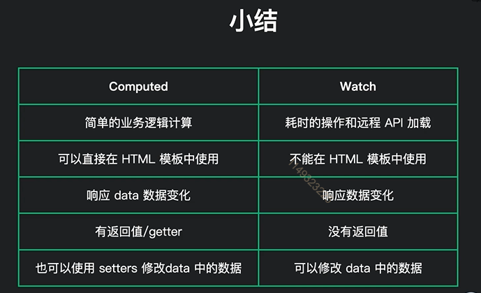

# VUE核心

一套用于构建用户界面的渐进式JavaScript框架。

渐进式：vue可以自底向上逐层的应用（从简单到复杂）

特点：

1. 采用组件化模式，提高代码复用率、且让代码更好维护。

2. 声明式编码，让编码人员无序直接使用操作DOM，提高开发效率。

3. 使用虚拟DOM + 优秀的Diff算法，尽量服用DOM节点。

   

## 初识vue：

1. 想让Vue工作，就必须创建一个Vue实例，且要传入一个配置对象
2. root容器里的代码依然符合html规范，只不过混入了一些特殊的Vue语法
3. root容器里的代码被称为Vue模板
4. Vue实例和容器时一一对应的
5. 真实开发中只有一个实例，实例要配合组件一起使用
6. {{xxx}} xxx中写的时js表达式，且xxx可以自动读取到data中的所有属性
7. 一旦data中的数据发送改变，那么页面中用到改数据的地方也会自动更新

## vue语法

### 插值语法

插值语法往往指定标签体内容

```vue
<div>标签体</div>
<div>{{xxx}}</div>//xxx为js表达式，可以读取到data中的所有属性
```

语法：{{表达式}}

### 指令语法

用于解析标签（包括：标签属性、标签体内容、绑定事件....）

1）v-bind可以简写为：(一个冒号)

v-bind：单向的数据绑定

```vue
<a v-bind:href="xxx">点我去百度噢</a>
//xxx同样也是js表达式

//简写版
<a :href="xxx">点我去百度噢</a>
```

2）v-model:value="参数"可以简写为v-model=

3）v-on:事件名(参数)可以简写为@事件名(参数)

函数传参问题：

```javascript
//如果不传参数
<button v-on:click="showInfo">点我提示信息</button>

//showInfo函数会有一个自带的event参数
```

```javascript
//如果传入参数
<button v-on:click="showInfo(要传参数,$event)">点我提示信息</button>

//如果要传入参数，还想要传入event参数 必须在后面小括号中写上$event
```

v-on用来绑定事件

```javascript
<button v-on:click="showInfo">点我提示信息</button>

//简写版
<button @click="showInfo">点我提示信息</button>


const vm = new Vue({
    el: '#root',

    // 放数据
    data: {
        name: '钱不二',
    },
    // 需要绑定的事件函数需要丢到methods中
    methods: {
        showInfo(event){
            // console.log(this);//此处this是vm
            alert("同学您好");
        }
    }
})
```


## 条件渲染

1）v-if

写法：

1. v-if="表达式"
2. v-else-if="表达式"
3. v-else

适用于：切换频率较低的场景。

特点：不展示的DOM元素直接被移除

注意：v-if可以和v-else-if、v-else一起使用，但要求解构不能被"打断"(就是连续的)

```vue
<!-- v-if和v-else-if和v-else 与常规语言的if...else if...else一致 -->
<div v-if="n === 1">Angular</div>
<div v-else-if="n === 2">React</div>
<div v-else-if="n === 3">Vue</div>
<div v-else>嘿嘿嘿</div>
//是连续在一起的 中间不能有别的东西


<!-- template只能和v-if配合使用 -->
<template v-if="n === 1">
    <h2>哈哈</h2>
    <h2>嘿嘿</h2>
    <h2>吼吼</h2>    
</template>
// template不会影响结构
```


2）v-show

写法：v-show="表达式"

适用于：切换频率较高的场景

特点：不展示的DOM未被移除，仅仅是使用样式隐藏掉（display: none）

3）备注：

使用v-if时，元素可能无法获取到，而使用v-show一定可以获取到

```vue
<!-- 使用v-show做条件渲染 -->
<h1 v-show="false">欢迎回来{{name}}</h1>
<h1 v-show="1 === 1">欢迎回来{{name}}</h1>
```

## Vue中的循环 v-for

**要避免v-for和v-if在一起使用（就是不要放在同一个标签上）**

在vue处理指令v-for有更高的优先级，所以在一起使用时，有时会造成性能上的浪费(每次渲染都是先循环，然后再进行判断的)

解决方式：

```vue
<!-- 错误格式-->
<div id="app">
    <p v-if="isShow" v-for="item in list">
        {{ item.name }}
    </p>
</div>

<!-- 转换为外面套一个标签，一般是template，应为template页面渲染不会生成dom节点 -->
<div id="app">
    <template v-if="isShow">
        <p v-for="item in list">{{item.name}}</p>
    </template>
</div>
```


v-for指令：

1. 用于展示列表数据
2. 语法：v-for="(item,index) in xxx" :key="yyy"

xxx 指遍历谁，item是每一项，index是一个索引值

yyy是必须加上的一个标识

3. 可遍历：数组、对象、字符串(几乎不用)、指定次数(几乎不用)

```vue
<body>
    <div id="root">
        <!-- 遍历数组(用的最多) -->
        <ul>
            <!-- v-for写法一 -->
            <li v-for="p in persons" :key="p.id">
                {{p.name}}-{{p.age}}
            </li>
            <!-- v-for写法二 -->
            <li v-for="(p,index) in persons" :key="index">
                {{p.name}}-{{p.age}}
            </li>
        </ul>

        <!-- 遍历对象(用的第二多) -->
        <ul>
            <li v-for="(value,key) in car" :key="key">
                {{key}}--{{value}}
            </li>
        </ul>

        <!-- 遍历字符串（几乎不用） -->
        <ul>
            <li v-for="(char,index) in str" :key="index">
                {{char}}--{{index}}
            </li>
        </ul>
        
        <!-- 遍历指定次数(几乎不用) -->
        <ul>
            <li v-for="(number,index) in 5" :key="index">
                {{number}}--{{index}}
            </li>
        </ul>        
    </div>
    <script>
    Vue.config.productionTip = false; //设置为 false 以阻止 vue 在启动时生成生产提示。   
    const vm = new Vue({
        el: '#root',
        data: {
            persons: [
                {id: '001', name:'张三', age: 18},
                {id: '002', name:'李四', age: 19},
                {id: '003', name:'王五', age: 20}
            ],

            car: {
                name: '奥迪',
                price: '70万',
                color: '黑色'
            },
            
            str: '钱不二'
        }
    })
    // console.log(vm);
    </script>
</body>
```

### Vue循环中key的内部原理

1）虚拟DOM中key的作用：

key是虚拟DOM对象的标识，当数据发生变化时，Vue会根据【新数据】生成【新的虚拟DOM】虽有Vue进行【新虚拟DOM】与【旧虚拟DOM】的差异比较，比较规则如下：

2）对比规则：

（1）旧的虚拟DOM中找到了与新虚拟DOM相同的key：

1. 若虚拟DOM中内容没变，直接使用之前的真实DOM
2. 若DOM中内容改变，则生成新的真实DOM，随后替换掉页面之前的真实DOM

（2）旧的虚拟DOM中没找到与新虚拟DOM相同的key：

​	直接创建新的真实DOM，随后渲染到页面


3）用index作为key可能会引发的问题

1. 若对数据进行：逆序添加、逆序删除等破坏顺序的操作，则会产生没有必要的真实DOM更新，页面虽然问题，但是**降低效率**
2. 如果结构中还有输入类DOM：直接会产生错误的DOM更新 ==>页面都会有问题

4）开发中如何选择key？

1. 最好使用每一条数据的唯一标识为key，比如id、手机号、学号等等唯一标识
2. 如果不存在对数据顺序打乱的操作，仅用于页面渲染展示，也可以用index作为key

注意：**能用id等唯一标识，就不用index**


## 自定义属性

**首先，html允许用户自定义属性，以"data-"开头的即为自定义属性。**

vue中添加自定义属性：

```vue
<a :data-categoryName="c1.categoryName" refs="myA">{{c2.categoryName}}</a>
```

**vue中获取自定义属性名和属性值**：

方式一：通过event.target中的dataset属性获取属性名及属性值

```
getAttribute(event) {
 console.log(event.target.dataset);
}
```

方式二：通过refs获取，需要添加一个属性refs

```
this.$refs.myA.dataset
```


**注意只有火狐和chrome中有datase属性**


## Vue中绑定样式

1）class样式

写法=>    :class='xxx' xxx可以是字符串，数组，对象

​	字符串写法适用于：类名不确定，要动态获取

​	对象写法适用于：要绑定多个样式，个数不确定，名字也不确定

​	数组写法适用于：要绑定多个样式，个数确定，名字也确定，但要动态切换样式

```vue
<style>
    .basic {
        width: 400px;
        height: 200px;
        border: 1px solid #000;
    }
    .happy {
        background-color: red;
    }
    .sad {
        background-color: gray;
    }
    .normal {
        background-color: #fff;
    }
    .q1 {
        font-size: 20px;
        font-weight: bold;
    }
    .q2 {
        color: blue;
    }
    .q3 {
        border-radius: 10px;
    }
</style>

<!-- 绑定class样式 -- 字符串写法  适用于样式的类名不确定，需要动态指定 -->
    <div class="basic" :class='mood' @click="changeMood" >{{name}}</div>
    <br> <br>

    <!-- 绑定class样式--- 数组写法，适用于要绑定的样式个数不确定、名字也不确定 :class="classArr"-->
    <div class="basic" :class='classArr' @click="changeMood" >{{name}}</div>
    <br> <br>

    <!-- 绑定class样式--- 对象写法，适用于个数确定，名字也确定，需要动态切换，属性名为class名儿，属性值控制着class是否添加 -->
	<!-- :class="{cur: boolean}" 当boolean为true，就添加cur类名，否则不添加 -->
    <div class="basic" :class='classObj' @click="changeMood" >{{name}}</div>

    <br> <br>
    <!-- 绑定style样式--- 对象写法 -->
	 <!-- :style="{display: boolean ? 'block' : 'none'}" -->
    <div class="basic" :style="styleObj" >{{name}}</div>

    <!-- 绑定style样式--- 数组写法 -->
    <div class="basic" :style="styleArr" >{{name}}</div>

<script>
const vm = new Vue({
    el: '#root',
    data: {
        name: '钱不二',
        mood:'normal',
				/*这里q1，q2，q3对应的是style标签中的类名儿*/
        classArr: ['q1', 'q2', 'q3'],

        classObj: {
            q1: false,
            q2: false
        },

        styleObj: {
            fontSize: '40px',
        },
        
        styleArr: [
            {
                fontSize: '50px'
            }
        ]
    },
    methods: {
        changeMood(){
            const arr = ['happy', 'sad', 'normal'];
            const index = Math.floor(Math.random()*3);
            this.mood = arr[index];
        }
    },
})
</script>
```


动态`class`和普通`class`共存：




2）style样式

​	**:style="{fontSize: xxx}"其中xxx是动态值**

示例：

```vue
<image :src="floor.product_list[0].image_src" mode="widthFix" :style="{width: floor.product_list[0].image_width + 'rpx'}"></image>

<!--这里的值是从后端获取的数据中拿到的哦-->
```


​	:style="[a,b]"其中a、b是样式对象

​	:style="xxx"配合计算属性一起使用

示例：

```vue
<div :style="font">
  我是字体大小
</div>

....
<script>
data() {
	return {
		size: 16;
	}
}
computed: {
	font() {
		return {
			fontSize: this.size+'px';
		}
	}
}
</script>
```


## 指定el与data的两种写法

### el的两种写法

写法一：

```vue
new Vue({
	el: "#root",
    data: {
    name: '钱不二'
    }
})
```

写法二：挂载写法

```vue
const v = new Vue({

    data: {
    name: '钱不二'
    }
})
v.$mount('#root');
```

### data的两种写法

写法一：对象式

```vue
new Vue({
	el: "#root",
    data: {
    name: '钱不二'
    }
})
```

写法二：函数式

```vue
data:function(){
	return{
		name:'钱不二'
	}
}
```


一个重要的原则：

**由Vue所管理的函数，一定不要写成箭头函数，一旦写成箭头函数this就不是指向Vue了**


## Vue由2种数据绑定方式

**每当数据改变了，Vue就会重新将模板解析一遍**

1）单向绑定（v-bind可以简写为：）数据只能从data流向页面

2）双向绑定（v-model）：数据不仅能从data流向页面，也能从页面流向data

备注：

1. 双向绑定一般用于表单类元素上如（input，select等）
2. v-model:value可以简写为v-model

## 事件的基本使用

1）使用v-on：xxx或者@xxx 绑定事件，其中xxx是事件名

2）事件的回调需要配置在methods对象中，最终会在vm上

3）methods中配置的函数，不要使用箭头函数！否则this不在是vm了

4）methods中配置的函数，都是Vue所管理的函数，this是指向vm或者组件实例对象

5）**@click="demo"和@click="demo($event)"效果一致，但是后者可以传递参数**

示例：

```js
const app = Vue.createApp({
  data() {},
  computed{},
  methods: {
  	toggleAnswer() {
      console.log('123')
    }                    
 	}                        
})
```


**为事件绑定多个函数**

一个事件可以同时绑定多个函数，用逗号分开即可。

注意：函数必须使用调用方式，就是一定要加上`()`即使不传参数

示例：

```vue
<button @click="handle1(), handle2('参数1')">
  按钮
</button>

...
methods: {
	handle1() {},
	handle2(msg) {}
}
```


## $event

`$event`表示当前触发的是什么事件(鼠标事件？键盘事件等等)，

`$event.target`则是事件触发的目标，就是直接获取当前元素的`dom`，有了当前元素的`dom`那不就能干的事情就非常多了！（例如获取类名呀，name呀，style呀，等等）

获取`$event`方法

```js
//如果传入参数
<button v-on:click="showInfo(要传参数,$event)">点我提示信息</button>

//如果要传入参数，还想要传入event参数 必须在后面小括号中写上$event
```


### 事件修饰符

1. prevent：可以阻止默认事件（常用）
2. stop：阻止事件冒泡（常用）
3. once：事件只触发一次（常用）
4. capture：使用事件的捕获模式
5. self：只有event.target是当前操作的元素时才触发事件
6. passive：事件的默认行为立即执行，无需等待事件回调执行完毕

**事件修饰符可以连着写**

例如：

@click.prevent.stop（就是先阻止了默认事件，然后阻止了冒泡）

```vue
//prevent取消默认事件
<a href="http://www.baidu.com" @click.prevent="showInfo">点我提示信息</a>
```

### Vue中常用的按键别名：

1）vue提供的别名按键

回车 => enter

```vue
//当按下enter才会触发事件
<input type="text" placeholder="按下回车提示输入" @keyup.enter="showInfo">
```

删除 => delete（捕获”删除“和”退格“键）

退出 =>esc

空格 => space

换行 => tab（特殊，必须配合keydown）

上 => up

下 => down

左 => left

右 => right

2）Vue未提供的别名的按键，可以使用按键原始的key值去绑定，但是要注意转为Kebab-case(短线命名)例如：切换大小写CapsLock 要写成 caps-lock

3）系统修饰键(用法特殊)：ctrl、alt、shift、meta

1. 配合**keyup**使用：按下修饰键的同时，再按下其他键，事件才会触发
2. 配合**keydown**使用，正常的触发事件

4）也可以通过keyCode的值去指定具体按键(不推荐)

5）Vue.config.keyCodes.自定义键名 = 键码，可以去定制案件别名

**按键别名和事件修饰符一样也可以连着写**

```javascript
//按下ctrl+y键才触发
<input type="text" placeholder="按下ctrl+y输出提示" @keyup.ctrl.y="showInfo">
```


v-on:事件名(参数)可以简写为@事件名(参数)

函数传参问题：

```javascript
//如果不传参数
<button v-on:click="showInfo">点我提示信息</button>

//showInfo函数会有一个自带的event参数
```

```javascript
//如果传入参数
<button v-on:click="showInfo(要传参数,$event)">点我提示信息</button>

//如果要传入参数，还想要传入event参数 必须在后面小括号中写上$event
```

v-on用来绑定事件

```javascript
<button v-on:click="showInfo">点我提示信息</button>

//简写版
<button @click="showInfo">点我提示信息</button>


const vm = new Vue({
    el: '#root',

    // 放数据
    data: {
        name: '钱不二',
    },
    // 需要绑定的事件函数需要丢到methods中
    methods: {
        showInfo(event){
            // console.log(this);//此处this是vm
            alert("同学您好");
        }
    }
})
```


## 数据代理

数据代理：通过一个对象代理对另一个对象中属性的操作(读/写)

1) Vue中的数据代理：通过vm对象来代理data对象中属性的操纵（读、写）

2）对象代理的好处：更加方便操作data中的数据

3）基本原理：

* 通过Object.defineProperty()把data对象中的属性添加到vm上
* 为每一个添加到vm上的属性都绑定一个getter/setter
* 在getter/setter内部去操作（读/写）data中对应的属性



## 计算属性

计算属性：**适合根据data中的属性，做一些复杂的计算，如数组过滤，筛选等，并且需要复用**。

计算属性：

1）定义：要用的属性不存在，要通过**已有的属性**(data中的属性)计算而来

2）原理：底层借助了Object.defineProperty()方法的getter和setter

3）**get什么时候执行？**

1. 初次读取时会允许一次
2. 当**依赖的数据**发生改变之后会被再次调用

4）优势：

与methods实现相比，**内部有缓存机制（能够复用）**，效率更高，调试方便（利用vue开发者工具可以清除看到computed属性）

5）**备注**：

1. 计算属性最终会出现在vm上，直接读取使用即可。
2. 如果计算属性要被修改，必须通过set函数去响应修改，且set中要引起计算时所依赖的数据发生改变

**计算属性的简写：**

```javascript
const vm = new Vue({
    el: '#root',
    data(){
        return {
          firstName: '张',
          lastName: '三'
        }
    },
    computed: {
        // 完全体，fullname就是可访问的属性
        fullName: {
            get() {
                console.log('get被调用');
                return this._data.firstName + '-' + this._data.lastName;
            },
            set(value) {//监测修改，value是修改之后的值
                console.log(value)
            }
        }
        
        
        //简写版本
        // 当确定计算属性只读取不修改时才能用简写
        // 这个函数 包含了fullName属性和get函数
        fullName(){
            console.log('get被调用');
            return this._data.firstName + '-' + this._data.lastName;
        }
    }
})
```

**计算属性使用v-model进行绑定**：

注意：computed的简写形式，是无法进行双向绑定的，绑定后会报错，但是通过**完全体方式**，是可以进行双向绑定的

核心：使用`get`和`set`

```vue
<template>
	<input v-model="count" />
	<div>
    计算属性: {{count}}
  </div>
</template>
<script>
	export default {
    data(){
        return {
          a:1
        }
    },
    computed: {
        // 完全体，fullname就是可访问的属性
        count: {
            get() {
                return a+1;
            },
            set(value) {//监测修改，value是修改之后的值
              	// 检测修改，一修改，我们就计算属性依赖的值，从而会计算属性也会改变
              	return this.a = value;
            }
        }
    }
  }
</script>
```


## 计算属性注意点(从接口请求数据)

注意：如果计算的计算依赖，是从接口中请求过来的数据（第一时间：还没有这个数据）**这时，一定要先判断一下数据是否存在，再去使用**。否则就会报错

示例：

```vue
<template>
	<div>
    ...
  </div>
</template>

<script>
	export default {
    data() {
      return {
				list: []        
      }
    },
    computed() {
      listItem() {
        return list.item[0]; // 注意此时list.item暂时还没有，这样写就会报错，因为undefined[0]肯定是会报错的
        
        // 正确写法 要用if判断一下
        if(list.item) {
          return list.item[0];
        }
      }
    },
    created() {
      this._init(); // 请求数据
    },
    methods: {
      _init() {
        this.$request('....').them(res => {
          this.list = res.data;
        })
      }
    }
  }
</script>
```


## 监视属性

功能：一般可以去完成一些开销比较大的动作，如定时器，API请求等耗时工作

1）当监视的属性变化时，回调函数自动调用，进行相关操作

2）监视的属性必须存在，才能监视

3）监视的两种写法：

1. 在new Vue时传入watch配置
2. 通过vm.$watch监视

```javascript
// 监视方法一
watch: {
    isHot: {
        // handler什么时候调用？当isHot发生改变后调用
        handler(newValue, oldValue) {
            console.log("isHot被修改了",newValue,oldValue);
        }
    }
}

// 监视方法二
vm.$watch('isHot',{
    handler(newValue, oldValue) {
        console.log("isHot被修改了",newValue,oldValue);
    }
})
```


### 立即执行

watch默认情况下，第一次的初始化，不会进行监视，如果需要进行监视需要配置。

配置：immediate配置项为true

```js
watch: {
    isHot: {
			handler(xxx) {
        xxxx
      },
      // 关键在这个配置项，第一次初始化时也会监听
      immediate: true
    }
}
```


### 深度监视

1）Vue中的watch默认不检测对象内部值的改变(一层)。

2）配置deep: true可以检测对象内部值的改变(多层)。

注意：

1. Vue自身可以监视对象内部值的改变，但是Vue提供的watch默认不可以！
2. 使用watch时更具数据的结构，决定是否要开启深度监视（deep: true）

```javascript
// 监视多级结构中的所有属性的变化
numbers: {
    deep: true,
    handler(newValue, oldValue) {
        console.log("numbers中的内容被修改了",newValue,oldValue);
    }
}
```

### 监视简写

当配置监视时只有handler函数时可以简写

```javascript
watch: {
    // 当配置项中只有handler时，就能简写，而且注意，函数名要和监听的属性名一致
    isHot(newValue, oldValue) {
        console.log("isHot被修改了",newValue,oldValue);
    }
}
```


```javascript
// 完整写法
vm.$watch('isHot',{
    // immediate:true,初始化立即执行
    // deep:true,深度监视
    // handler什么时候调用？当isHot发生改变后调用
    handler(newValue, oldValue) {
        console.log("isHot被修改了",newValue,oldValue);
    }
})

// 简写
vm.$watch('isHot',function(newValue, oldValue) {
    console.log("isHot被修改了",newValue,oldValue);
})
```


### 监听对象中的某个属性

写法：

```js
watch: {
  "search.name": {
    handler() {
      
    }
  }
}
```


### 监听`vuex`的值

注意，watch的功能非常强大，它是支持监听vuex的值的

示例：

```vue
<template>
...
</template>
<script>
  import {mapState} from 'vuex';
  export default {
    computed: {
      ...mapState('user', ['userInfo'])
    },
    watch: {
      userInfo(newValue, oldValue) {
        xxx
      },
      'userInfo.id': { // 监听某一个属性
        handler(new, old) {
          xxxx
        }
      }
    }
  }
</script>
```


## 计算属性与监视属性之间的区别

1）computed能完成的功能，watch都能完成

2）watch能完成的功能，computed不一定能完成例如：watch可以进行异步编程

3）computed通常不修改data属性，并且可以像data一样使用计算属性，但是watch是直接修改data属性，并且没有返回值

**两个重要的原则：**

1. 所被Vue管理的函数，最好写成普通函数，这样this的指向才是vm或者组件实例对象
2. 所有不被Vue所管理的函数（定时器函数，ajax回调函数，promise等）最好写成箭头函数，这样this的指向才能是vm或者组件实例对象。




## 计算属性和methods的区别

他俩基本没啥可比性，与其拿来比较，不如结合起来使用，watch中可以访问methods的方法，我们可以将watch中复杂的逻辑抽离成函数，再由watch调用


## Vue监视数据的原理

1）Vue会监视data中所有层次的数据。

2）如何监测对象中的数据？

通过setter实现监视，且要在new Vue时就传入要监测的数据。

1. 对象中后追加的属性，Vue默认不做响应式处理
2. 如需给后添加的属性做响应式，请使用以下API：
   * Vue.set(target, propertyName/index, value)
   * vm.$set(target, propertyName/index, value)

3）如何监测数组中的数据？

通过包裹数组更新元素的方法实现，本质就是做了两件事儿：

1. 调用原生对应的方法对数组进行更新
2. 重新解析模板，进而更新页面

4）在Vue修改**数组**中的某个元素一定要用以下方法：

1. 使用这些API:push()、pop()、shift()、unshift()、splice()、sort()、reverse()
2. Vue.set()或者vm.$set()

**特别注意：**Vue.set()和vm.$set()不能给vm或者vm的根数据（data上）添加属性！！！

### Vue.set或vm.$set()

在Vue修改**数组**中的某个元素一定要用以下方法：

1. 使用这些API:push()、pop()、shift()、unshift()、splice()、sort()、reverse()
2. Vue.set()或者vm.$set()

**特别注意：**Vue.set()和vm.$set()不能给vm或者vm的根数据（data上）添加属性！！！

### 如需给后添加的属性做响应式，请使用以下API：

添加：

* Vue.set(target, propertyName/index, value)
* vm.$set(target, propertyName/index, value)

删除：

* vm.$delete(target, propertyName/index, value)
* Vue.delete(target, propertyName/index, value)


## 收集表单数据

1）若：`<input type="text"/>`则v-model收集的是value值，用户输入的就是value值

2）若：`<input type="radio"/>`，则v-model收集的是value的值，且要给标签配置value值

3）若`<input type="checkbox"/>`

1. 没有配置input的value属性，那么默认收集的就是checked(勾选or未勾选，是布尔值)
2. 配置input的value值：
   1. v-model的初始值是非数组，那么默认收集的就是checked(勾选or未勾选，是布尔值)
   2. v-model的初始值是数组，那么收集的就是value组成的数组

**备注：**v-model的三个修饰符：

1. v-model.lazy：失去焦点后再收集数据
2. v-model.number：输入的字符串转换为有效的数字(一般配合type="number"一起使用)
3. v-model.trim：输入首尾空格过滤


4）下拉框时

```html
<select v-model="n">
    <option :value="1">1</option>
    <option :value="2">2</option>
    <option :value="3">3</option>
</select>
// 下拉框选中一个就会将value值传给n，v-model双向绑定
```


## 过滤器

定义：对要显示的数据进行特定格式化后再显示（适用于一些简单逻辑处理）。

语法：

注册：

1. 全局注册：Vue.filter(name,callback)
2. 局部注册：new Vue({filters:{ }})，这个是注册再vue对象中

使用：

1. {{xxx | 过滤器名}}
2. v-bind:属性="xxx | 过滤器名"(使用较少)

备注：

1）过滤器也可以接收额外参数、多个过滤器可以串连

2）并没有改变原本的数据，是产生新的对应数据

## 自定义指令

自定义指令总结：

一、定义语法：

(1)局部指令：

```vue
//方法一
// 指令比较复杂时候用方法一
new Vue({
	directives:{
		指令名:{配置对象}
	}
})

//方法二
new Vue({
	directives:{
		指令名:回调函数
	}
})
```

(2)全局指令：

```
//方法一
Vue.directive(指令名, 配置对象);
Vue.directive('big', {});
//方法二
Vue.directive(指令名, 回调函数)
Vue.directive('min', ()=>{})
```

使用：

```
定义自定义指令：
Vue.directive(permission, {...});

<div v-permission="xxx" ></div>
```

二、**配置对象**中常用的三个回调：

1）bind：指令与元素绑定时调用。

2）inserted：指令所在的元素被插入页面时调用

3）update：指令所在的模板结构被重新解构时调用

```js
Vue.directive("permission", {
  // inserted当元素被插入到dom节点时调用
  /*  
    el:当前指令绑定元素
    binding：当前指令绑定的值
  */
  inserted(el, binding) {
    // console.log(el);
    // console.log(binding);
    // console.log(router.currentRoute);
    // 得到自定义指定绑定的值 （add）
    const action = binding.value.action;
    // 得到自定义指令绑定的值(disabled)
    const effect = binding.value.effect;
    // 判断，当前的路由所对应的组件中，判断用户是否具备action的权限
    if (router.currentRoute.meta.indexOf(action) == -1) {
      // 当在meta元数据中找不到这个参数时
      if (effect === "disabled") {
        // 将按钮进行禁用操作
        el.disabled = true;
        // 这个是element-ui禁用时特定的类，需要加上
        el.classList.add("is-disabled");
      } else {
        // 如果不禁用，那就直接将这个按钮删除
        // 找到当前节点的父节点，然后删除当前元素（我杀我自己）
        el.parentNode.removeChild(el);
      }
    }
  }
});
```


三、备注：

1. 指令定义时不加v，但是使用时要加v-
2. 指令名如果是多个单词，要使用kebab-case命名方式(就是中间加-，big-number)，不要使用camelCase方式


## 生命周期

从：`app.mount()`开始 ===>到`app.unmount()`结束

1. 生命又名：生命周期回调函数、生命周期函数、**生命周期钩子**
2. 是啥？**是Vue在关键时刻帮我们调用的一些特殊名称的函数**
3. 生命周期函数的名字不可更改，但是函数具体的内容是程序员根据需求编写的
4. 生命周期的this指向vm或者组件实例对象

### 常用的生命周期钩子

0）created: 最早可以访问this的生命周期钩子，

1）mounted：启动定时器、绑定自定义事件、订阅消息等【初始化操作】、**DOM节点已经挂载，可以修改和访问DOM**

2）beforeDestroy：清除定时器、解绑自定义事件、取消订阅消息等【收尾工作】

关于销毁Vue实例：

1. 销毁后凭借Vue开发者工具看不到任何信息。
2. 销毁后自定义事件会失效，但原生DOM事件依然有效
3. 一般不会在beforeDestroy中操作数据，因为即使操作数据了，也不会再触发更新流程了


### 为啥会选择在created，beforeMount，mounted这三个声明周期中进行异步请求呢？

因为，这三个声明周期时，data已经被创建了，我们可以往上面丢数据了，当然更推荐在created中赋值咯，应为可以最早的拿到数据呗，减少等待时间

