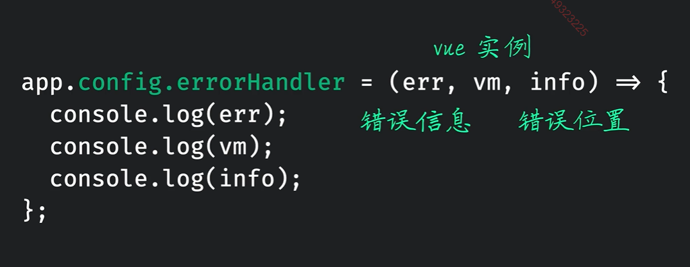
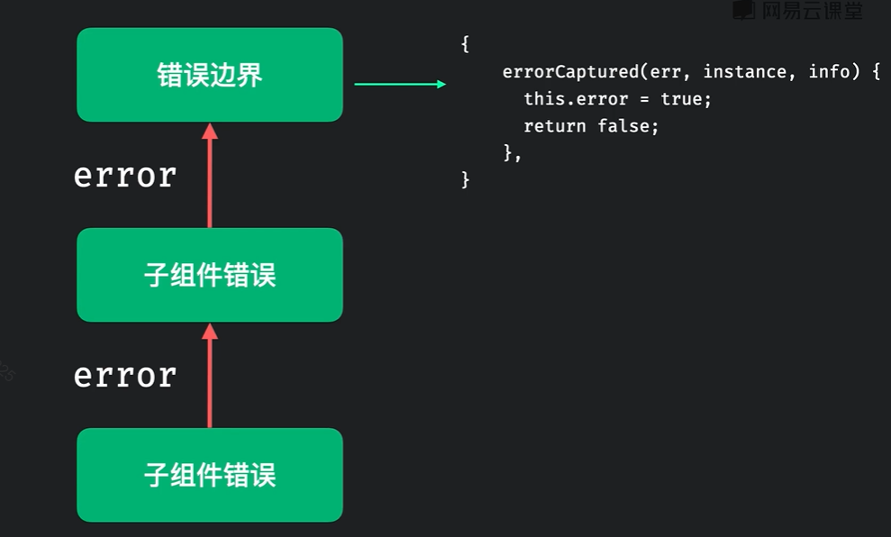
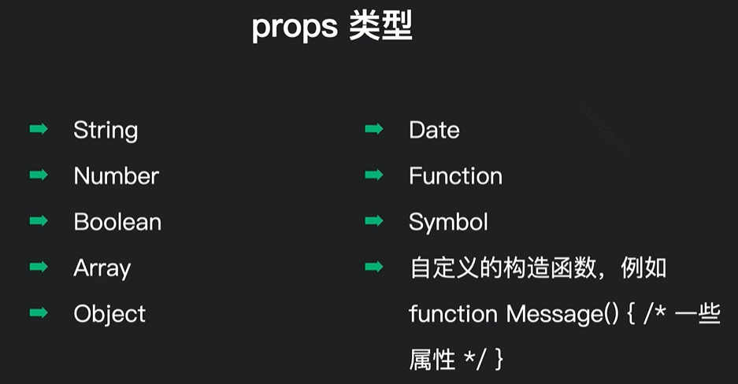
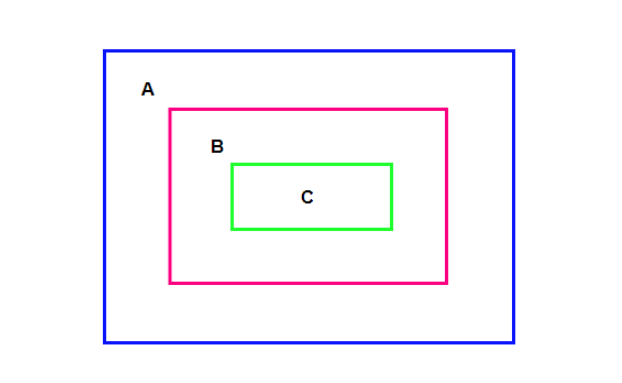
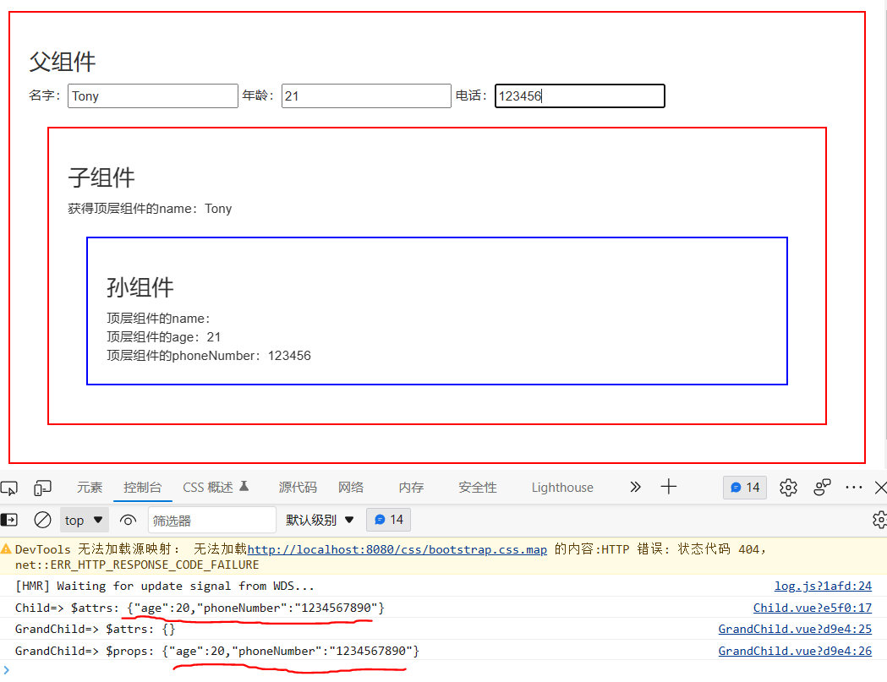
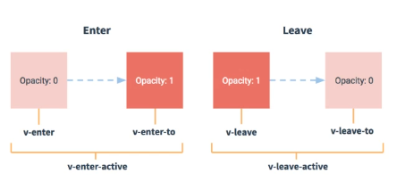
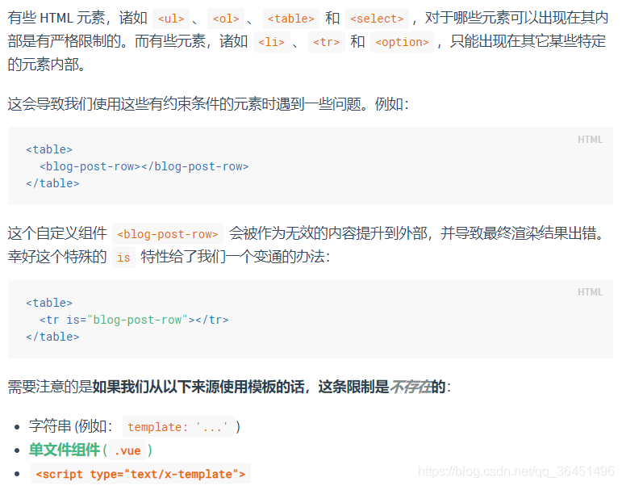
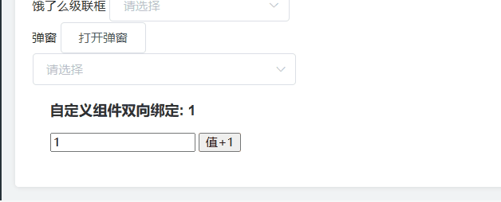

# Vue组件（重要思想）

定义：实现应用中**局部**功能**代码**和**资源**的**集合**。

作用：复用编码，简化项目编码，提高允许效率


模块化：当应用中的js都已模块来编写，那么这个应用就是模块化的应用。

组件化：当应用中的功能都是多组件的方式来编写，那么这个应用就是一个组件化应用。

## Vue使用组件的三大步骤

一、定义组件（创建组件）

二、注册组件

三、使用组件（写组件标签）

### 一：如何定义一个组件？

使用Vue.extend(options)创建，其中options和new Vue(options)时传入的那个options几乎一样，但是有一点点儿区别：

1. el不要写，为什么？----最终所有的组件都要经过一个vm的管理，由vm中的el决定服务于那个容器。
2. data必须写成函数，为什么？----避免组件被复用时，数据存在引用关系。

备注：使用template可以配置组件结构。

### 二：如何注册组件？

第一步：先引入组件

import 组件名 from './components/xxx';

第二部注册组件：

1）局部注册：考new Vue的时候写上components选项

```
components: {组件名}//局部注册组件名没有引号
```


2）全局注册：在main.js中Vue.component('组件名','组件')

```js
...
import Vue from 'vue';
import 组件 from '@...';
Vue.component('组件名','组件');
```

之后全局都可以使用辣！

### 三、编写组件标签：

<组件名></组件名>


## 关于组件名的几个注意点

1）关于组件名：

一个单词组成：

1. 第一种写法(首字母小写)：school
2. 第二种写法(首字母大写)：School

多个单词组成：

1. 第一种(kebab-case)：my-school
2. 第二种(CamelCase): MySchool(需要Vue脚手架)

备注：

（1）组件名尽可能回避HTML中已有的元素名称，例如a，h2，H2都不行

（2）可以使用name配置对象指定组件在开发者工具中呈现的名字。


2）关于组件标签：

第一种写法：<school></school>

第二种写法：<school />

备注：不使用脚手架时，<school />会导致后续组件不能渲染。


3）一个简写方式：

const school = Vue.extend(options)可以简写为：

const school = options


## 关于VueComponent

1）school组件本质是一个名为VueComponent的构造函数，且不是程序员定义的，时Vue.extend生成的。


2）我们只需要写<school />或者<school></school>，Vue解析时会帮我们创建school组件的实例对象，即帮我们执行：new VueComponent(options)


3）**特别注意**：**每次调用Vue.extend，返回的都是一个全新的VueComponent！！！**


4）关于this的指向：

（1）组件配置中：

data函数、methods中的函数、watch中的函数、computed中的函数，它们的this均是【VueComponent实例对象】

（2）new Vue(options)配置中：

data函数、methods中的函数、watch中的函数、computed中的函数，它们的this均是【Vue实例对象】


5）VueComponent的实例对象，以后简称vc（也可以称为组件实例对象），Vue的实例对象，以后成vm


## Vue与VueComponent的关系（重要）

1）一个重要关系：

```vue
VueComponent.prototype.__proto__ === Vue.prototype
```

2）为什么要有这个关系？

为了让组件实例对象(vc)能访问到Vue原型上的属性、方法。


## 组件异步加载(重要)

组件异步加载，只有在挂载组件后，组件的代码才会被加载进来，有时候能够提升一定的首屏加载事件

核心：`defineAsyncComponent`函数，和`es6`的动态引入`import`

使用：

```vue
<script>
  import {defineAsyncComponent} from 'vue';
  // 原版导入
	//import Home from './components/Home.vue';
  
  // 异步加载
  const Home = defineAsyncComponent(()=> import('./components/Home.vue'))
</script>
```


## vue应用的错误处理

进行错误处理后，控制台就不会出现红色报错了

错误处理有两种：

1. 全局错误处理
2. 错误边界

### 全局错误处理

使用全局错误处理函数



示例：

```js
app.config.errorHandler = (err, vm, info) => {
  console.log(err);
  console.log(vm);
  console.log(info);
}
```

### 局部错误处理(错误边界)

首先解释一下错误边界，`vue`中也是子组件只要报错，就会像事件冒泡一样一路报错，直接到根组件`App.vue`中，但是只要我们设置了错误边界，错误就会被封住，不会向上传递，进而影响整个项目的运行。



注意：`return false`时，才会阻止错误传播。

使用：`errorCaptured(err, instance,info)`函数，接收参数和上面全局的一致

一般都是在父组件中使用`errorCaptured`来控制子组件的错误边界


## 传递数据

### 组件的自定义事件（子给父）emits和on

原则：**给谁帮的事件，就找谁触发**

**事件绑在子组件上，事件的回调是在父组件上，所以才能进行父子之间的数据传递**

1）一种组件间通信方式，适用于：子组件 ===>父组件。

2）使用场景：A是父组件，B是子组件，B想给A传递数据，那么就要在A中给B绑定自定义事件（事件的回调在父组件A中）

3）绑定自定义组件：

1. 第一种方式：在父组件:

   ```vue
   //Demo是子组件，things是自定义事件
   //方式一
   <Demo @things="text" />
   //方式二
   <Demo v-on:things="text" />
   ```

   ```vue
   方式三
   <Demo ref="demo" />
   ......
   mounted() {
   	this.$ref.demo.$on('things',this.test)
   }
   ```

若想要自定义事件只触发一次，可以使用`once`修饰符或者`$once`方法。


4）触发事件：在子组件中`this.$emit('things',数据)`数据可以是多个

5）解绑自定义事件：

```js
// 只能解绑1个事件
this.$off('atqianbuer');

// 解绑多个自定义事件
this.$off(['atqianbuer','demo']);

// 解绑所有自定义事件
this.$off();
```

6）让组件上也可以绑定原生DOM事件，需要使用`native`修饰符。

7）注意：通过`this.$ref.xxx.$on('things',回调)`绑定自定义事件时，回调要么配置在父元素的methods中，要么用箭头函数，否则this指向会有问题。

**ref属性（重要，拿来获取元素的）**

1）被用来给元素或者子组件注册引用信息（id的替代者）

2）应用在html标签上获取的是真实DOM元素，**应用在组件标签上获取的是组件实例对象**

3）使用方式：

打标识：<h1 ref="xxx">...</h1>或者<School ref="xxx"></School>

获取：**this.$refs.xxx 获取到的是标签或者组件实例对象**

#### 自定义事件中的$event

$event在原生事件中时，我们都是用来获取当前节点元素的，但是在自定义事件中，它的作用比较特殊。

作用：**如果想要接受组件传递过来的值，同时，父组件本身也想要传递参数，这个时候就需要用到$event**

子组件传值：

```js
export default {
  methods: {
    customEvent() {
      this.$emit(custom-event, value)
    }
  }
}
```


父组件定义事件

```vue
<template>
	<div>
    <my-item v-for="(item, index) in list" @custom-event="customEvent(index, $event)"></my-item>
    <!--我们自己要传递index，同时还想要子组件的传递的内容 -->
  </div>
</template>

<script>
	export default {
    methods: {
      customEvent(index, e) {
        console.log(index,e);
        // index是本身自己传递的值
        // e是子组件传递过来的值
      }
    }
  }
</script>
```


### 配置项emits（接收事件）

emits和props配置项功能几乎差不多，不过emits接收的是函数。

语法：

```js
// 子组件接收
export default {
  props: ['id','link'],
  emits: ['deletePost']
}

// 父组件绑定监听事件
<Item @deletePost="handlerDelete">
```

模板中触发事件：

```vue
<template>
<!--触发事件通过$-->
	<button @click="$emit('deletePost', id)">
    删除
  </button>
</template>
```

methods或者其他事件中触发：

```vue
<script>
	export default {
    methods: {
      handleClick() {
        this.$emit('deletePost', this.id);
      }
    }
  }
</script>
```


### 事件emits与属性props的设计方式

`vue`中设计的非常巧妙，遵循props属性向下（父->子），而事件反过来向上传递(子->父)

### 配置项props

**单行数据流模式：**数据只能由一方传递给另一方，就像props，数据只能从父组件传递到子组件，子组件不允许修改。父组件中的props刷新，子组件也跟着刷新。

功能：让组件接收外部传过来的数据

**父组件向子组件传值**

1）传递数据：

`<demo name="xxx">`或者动态属性`<demo :name="xxx">`

2）接收数据：

第一种方式（只接收）：

`props:['name']`

第二种方式（限制类型）：

`props:{name: String}`

**多种类型：`props:{name: [String,Number]}`**

第三种方式（限制类型、限制必要性、限制默认值、自定义验证器）：

```js
props: {

	name: {

		type: Number,//类型

		required: true,//必要性
		
		default: 10// 默认值
		/*
			如果type是一个Array或Object，default必须写成函数形式，如果type是Function，default也必须是一个函数，并且本身就是默认值
			default() {
				return 数组或者对象
			}
		*/
    
    // 校验器返回一个布尔值，如果是false会抛出一个警告的
    validator(value) {
      
      return value > 0 // 自定义验证器
    }
	}

}
```

备注：**props是只读的**，Vue底层会监测你对props的修改，如果进行了修改，就会发出警告，若业务需求确实需要修改，那么请赋值props的内容到data中一份，然后去修改data中的数据。

### props的简写

首先，必须是动态传递的`props`，如果传递的属性动态属性值和组件接收时的值是一样的可以使用`v-bind="对象名"`来简写

示例：

```vue
<template>
	<!--<MessageItem :name="message.name" :msg="message.msg" :time="message.time"></MessageItem>-->

<!--props简写操作-->
<MessageItem v-bind="message"></MessageItem>
</template>
<script>
import MessageItem from './components/MessageItem.vue';
export default {
	components: { MessageItem },
	data() {
		return {
			message: {
				name: '张三',
				msg: '我是李四',
				time: '10点'
			}
		};
	}
};
</script>

```

`MessageItem.vue`组件内容:

```vue
<template>
	<div>
		<p>{{ name }}</p>
		<p>{{ msg }}</p>
		<p>{{ time }}</p>
	</div>
</template>

<script>
export default {
  // 注意这里接收的参数，和上面组件传递的对象属性名一致，就可以触发简写
	props: ['name', 'msg', 'time']
};
</script>
<style>
div {
	border: 1px solid #000;
}
</style>

```


### props的类型

props中可以限制的类型：




### 未定义的props传递

例如现在这种常见，给组件传递了`props`属性，但是组件中没有用`props:[xxx]`来接收，那么传递进来的`props`去哪里了呢？

答案：**会自动加在组件`<template>`标签内最外层的元素上**，当然通过`this.$attrs`也可以访问到

函数或者生命周期想要访问：一般都是生命周期或者函数想要访问时通过`this.$attrs`

常见使用：就是给组件传递class或id等情况

如果要阻止这种情况发生：配置项填入`inheritAttrs:false`

示例：

```vue
<!--给Item组件传递一个class的props-->
<Item class='myclass'></Item>

// item组件内容
<template>
<!--默认直接传到这里-->
	<div class='myclass'>
    自动将class属性和属性内容传递到最外层标签辣
  </div>
</template>
<script>
	export default {
    // 没有定义props: [],也就是没有接收
    // 如果不想有这种情况发生：这里填入inheritAttrs:false
  }
</script>
```


### 子组件props的响应机制

首先：由于单向数据流模式的限制，子组件是不能修改传递进来的`props`的，如果我们想要传递进来的`props`可以修改该怎么办呢？

方法：**子组件自身在data或者computed中维护数据**，默认值等于传入的`props`属性，在`<template>`模板中，绑定`data`中维护的数据即可。


示例：

```vue
<template>
	<span>现在的页数是:{{currentPage}}</span>
	<button @click="change">
    点我加1
  </button>
</template>
<script>
	export default {
    props:['defaultCurrentPage'],
    data() {
      return {
        currentPage: this.defaultCurrentPage
      }
    },
    methods:{
      change() {
        this.currentPage+=1;
      }
  	}
  }
</script>
```


### props是否可以传递函数（）

**可以，但是我们不用**

首先，props也是可以传递函数的，但是这样会导致子组件依赖于父组件，一旦父组件没有传递`props`那么直接就会报错。

但是通过自定义事件`emits与on`就不会有这个问题，即使父组件没有传递，也不会报错。


### 同步更新父子组件内容`.sync`很重要

子组件来更新父组件的data值时，我们都会使用on、emit方式来让子组件触发父组件的方法来修改父组件的值。

**这个方法可以帮助我们简化很多代码，所以说还是很重要的**

示例：

父组件:

```vue
<template>
	<!--注意必须要用update事件，才能进行简写-->
	<children @update:title="vale => title = val"
</template>

<script>
	export default {
		data() {
      return {
        title: '我是title'
      }
    }
  }
</script>
```

子组件：

```vue
<script>
	export default {
    methods: {
			fn() {
        this.$emit('update:title', newTitle)
      }
    }
  }
</script>
```

**上面这种写法，就是一种普通的on绑定事件，emit来触发事件，上面这种写法可以用.sync来进行简写**

`.sync`简写父组件

```vue
<template>
	<!--注意必须要用update事件，才能进行简写，后面那个是绑定对象中的值-->
	<!-- 注意.sync前面的这个名称不一定和后面一直，只要和update:title一样就可以 -->
	<children :title.sync="title" :selected.sync="label.selected"></children>

	<!-- 写法2 -->
	<children :name1.sync="title" :name2.sync="label.selected"></children>
</template>

<script>
	export default {
		data() {
      return {
        title: '我是title'，
        label: {
        	selected: 0
      	}
      }
    }
  }
</script>
```

子组件写法不变，emit必须是**update:改变属性**

```vue
<script>
	export default {
    methods: {
			fn(newVal) {
        // 注意这里必须要这样写update后面的值，是父组件上.sync前面的那个值
        this.$emit('update:title', newTitle);
        
        this.$emit('update:selected', newVal);
        
        
        // 写法二：
        // 核心保持update后的值和.sync前的值一致即可
        this.$emit('update:name1', newTitle);
        this.$emit('update:name2', newVal);
      }
    }
  }
</script>
```


## 子孙组件传值


### $attrs与$listeners(在扩展组件时和好用）

子孙组件（父-->孙，孙-->父）的传值可以使用`$attrs`和`$listeners`

`$attrs`：用于父组件隔代向孙组件传值。

`$listeners`：用于孙组件隔代向父组件传值。

当然，这两个也可以同时使用，达到父组件和孙组件双向传值的目的。

`Vue2.4` 中，引入了`attrs` 和`listeners` ， 新增了 `inheritAttrs` 选项。

    $attrs：包含了父作用域中没有被 prop 接收的所有属性（不包含class 和 style 属性）。可以通过 v-bind="$attrs" 直接将这些属性传入内部组件。
    
    $listeners：包含所有父组件中的 v-on 事件监听器 (不包含 .native 修饰器的) ，可以通过 v-on="$listeners" 传入内部组件。
    
    inheritAttrs为true：继承除props之外的所有属性；inheritAttrs为false：只继承class属性


例如：现在有这么一个情况



现在有一个嵌套组件：A->B, B->C

想让A给C传递数据的方式：

1. Vuex，Vuex在这种多层级组件中传递数据非常好用，唯一缺点就是如果要传递的数据很少，使用起来很麻烦，其他到没什么缺点了
2. 全局事件总线event bus，原理类似vuex，使用特别简单。bus适合碰到组件跨级兄弟组件等无明显依赖关系的消息传递，原生app开发中经常用到，但是缺点是bus破坏了代码的链式调用，大量的滥用将导致逻辑的分散，出现问题后很难定位，降低了代码可读性。
3. 让B来做中转组件，A传给B，B再传给C，这是最容易想到的方案，但是如果嵌套的组件过多，需要传递的事件和属性较多，会导致代码繁琐，代码维护困难。
4. 使用$attrs，和$listeners，其实这种方式和上面的3是差不多的，也是需要B来做中转的
5. Provide/Inject来传递，问题在于该方式传递的数据不是响应式的。


**实例：父组件隔代传值给孙组件**

代码：

**`Parent.vue`（父组件（顶层组件））**

```vue

<template>
  <div class="outer">
    <h3>父组件</h3>
 
    名字：<input v-model="name">
    年龄：<input v-model.number="age" type="number">
    电话：<input v-model="phoneNumber">
 
    <child :name="name" :age="age" :phoneNumber="phoneNumber"></child>
  </div>
</template>
 
<script>
import Child from "./Child";
export default {
  name: 'Parent',
  components: {Child},
  data() {
    return {
      name: 'Tony',
      age: 20,
      phoneNumber: '1234567890'
    }
  }
}
</script>
 
<style scoped>
.outer {
  margin: 20px;
  border: 2px solid red;
  padding: 20px;
}
</style>

```


**`Child.vue`（子组件（中间组件））**

子组件作为父组件和孙组件的传递中介，在儿子组件中给孙子组件添加v-bind="$attrs"，这样孙子组件才能接收到数据。

```vue

<template>
  <div class="outer">
    <h3>子组件</h3>
    <div>获得顶层组件的name：{{name}}</div>
    
    <!--这里要用v-bind帮一下，让孙组件获得父组件传递来的参数-->
    <grand-child v-bind="$attrs"></grand-child>
  </div>
</template>
 
<script>
import GrandChild from "./GrandChild";
export default {
  components: {GrandChild},
  props: ['name'],
  created() {
    console.log('Child=> $attrs: ' + JSON.stringify(this.$attrs));
  }
}
</script>
 
<style scoped>
.outer {
  margin: 20px;
  border: 2px solid blue;
  padding: 20px;
}
</style>

```


**GrandChild.vue（孙组件（最底层组件））**

孙组件使用props接收从父组件传递过来的数据。（也可以在created时接收数据）

```vue

<template>
  <div class="outer">
    <h3>孙组件</h3>
    <div>顶层组件的name：{{name}}</div>
    <div>顶层组件的age：{{age}}</div>
    <div>顶层组件的phoneNumber：{{phoneNumber}}</div>
  </div>
</template>
<script>
export default {
  name: "GrandChild",
  props: {
    name: {
      type: String
    },
    age: {
      type: Number
    },
    phoneNumber: {
      type: String
    }
  },
  created() {
    // this.parentAge = this.age;  //也可以这样取值
    console.log('GrandChild=> $attrs: ' + JSON.stringify(this.$attrs));
  }
 
}
</script>
 
<style scoped>
.outer {
  margin: 20px;
  border: 2px solid green;
  padding: 20px;
}
</style>
```




可以看到：

子组件的`$attrs`中包含了所有**除了本组件props之外**的父组件属性。

孙组件无法获取到未被子组件`props`接收的属性：`name`

孙组件可以获取到未被子组件props接收的属性：age，phoneNumber


**$listeners**

**示例：孙组件隔代传值给父组件**

**`Parent.vue`（父组件（顶层组件））**

```vue

<template>
  <div class="outer">
    <h3>父组件</h3>
    <div>myData:{{ myData }}</div>
    <child @changeData="changeMyData"></child>
  </div>
</template>
<script>
import Child from "./Child";
export default {
  name: 'Parent',
  components: {Child},
  data() {
    return {
      myData: 100
    };
  },
  methods: {
    changeMyData(val) {
      this.myData = val;
    }
  }
}
</script>
 
<style scoped>
.outer {
  margin: 20px;
  border: 2px solid red;
  padding: 20px;
}
</style>

```

**`Child.vue`（子组件（中间组件））**

​    子组件作为父组件和孙组件的传递中介，在儿子组件中给孙子组件添加v-on="$listeners"，这样父组件才能接收到孙组件的数据。

```vue
<template>
  <div class="outer">
    <h3>子组件</h3>
    <grand-child v-on="$listeners"></grand-child>
  </div>
</template>
<script>
import GrandChild from "./GrandChild";
export default {
  components: {GrandChild}
}
</script>
 
<style scoped>
.outer {
  margin: 20px;
  border: 2px solid blue;
  padding: 20px;
}
</style>
```


**`GrandChild.vue`（孙组件（最底层组件））**

```vue
<template>
  <div class="outer">
    <h3>孙组件</h3>
    <input v-model="data1" @input="edit"/>
  </div>
</template>
<script>
export default {
  name: "GrandChild",
  data() {
    return {
      data1: 200,
    }
  },
  methods: {
    edit() {
      // 发送事件(孙组件就能触发父组件帮给子组件的时间啦)
      this.$emit("changeData", this.data1);
    }
  }
}
</script>
 
<style scoped>
.outer {
  margin: 20px;
  border: 2px solid green;
  padding: 20px;
}
</style>

```


#### $attrs和$listeners的实际应用

应用一：封装组件

element-ui开发的后台项目中，大量使用到了el-table和el-pagination做分页数据展示，所以我封装一个自定义组件page-table

**错误写法：**

**page-table组件：**

```vue
<template>
  <div class="page-table">
    <div class="wrapper">
      <el-table
          ref="elTable"
          :data="tableData">
        <slot/>
      </el-table>
      <div style="margin-top: 16px;overflow: hidden">
        <el-pagination
            class="page"
            :current-page="currentPage"
            layout="total, prev, pager, next, jumper"
            :total="total"
            @current-change="handleCurrentChange"/>
      </div>
    </div>
  </div>
</template>

```

这样封装的副作用：**引用page-table组件的地方无法使用el-table的属性和事件。**


解决方案：我们可以利用`$attrs`和`$listeners`在用到el-table的地方用v-on和v-bind绑定一下，这样使用`page-table`的地方可使用所有el-table自己自带的属性和事件。

**正确封装：**

```vue

<template>
  <div class="page-table">
    <div class="wrapper">
      
      <!-- 注意这里的v-bind和v-on可以直接让未定义的props和emits穿透进来 -->
      <el-table
          ref="elTable"
          v-bind="$attrs"
          v-on="$listeners"
          :data="tableData">
        <slot/>
      </el-table>
      <div style="margin-top: 16px;overflow: hidden">
        <el-pagination
            class="page"
            :current-page="currentPage"
            layout="total, prev, pager, next, jumper"
            :total="total"
            @current-change="handleCurrentChange"/>
      </div>
    </div>
  </div>
</template>

```


#### $attrs和$listeners应用二(简化增强方法)

在对一些UI组件库进行二次封装时，传统的增强一个UI组件自身的方法，一般为下面这些步骤

1. 父组件中传递相关方法
2. 在子组件中对方法进行增强
3. 再传递给UI组件


示例：

>要求：现在我们二次封装一个my-cascader组件，要求二次封装el-cascader组件，增强一下el-cascader自带的change事件(注意：默认change事件只会返回一个数组)，我们的组件要求change事件的参数返回一个用逗号拼接的字符串xxx,xxx

**传统封装方式**

`my-cascader`组件调用

```vue
<template>
	<div>
    <my-cascader @change="change"></my-cascader>
  </div>
</template>

<script>
	export default {
		data() {
      return {
        options2: [
          {
            value: 1,
            label: '选项一',
            children: [
              {
                value: 'shejiyuanze',
                label: '设计原则'
              }
            ]
          }
				]
      }
    },
    methods: {
      change(val) {
        console.log('change事件被调用', val);
      }
    }
  }
</script>
```


`my-cascader`组件分装

```vue
<template>
	
	<el-cascader v-bind="$attrs" v-on="$listeners" @change="inhenceChange">
  
  </el-cascader>

</template>

<script>
	export default {
    data() {
      return {
        
      }
    },
    methods: {
      inhenceChange(value) {
        if(value instanceof Array ) {
          let result = value.join(',');
          this.$emit('change', result);
        }
        return this.$emit('change', value);
      }
    }
  }
</script>
```


***


**如果用$listeners来简化的写法**

>注意：调用`my-cascader`是一致的，这里只展示一下`my-cascader`封装的不同


`my-cascader`通过$listeners简化的封装

```vue
<template>
	
	<el-cascader v-bind="$attrs" v-on="customListeners">
  
  </el-cascader>

</template>

<script>
	export default {
    data() {
      return {
        
      }
    },
    computed: {
      customListeners() {
        let vm = this;
        // 用浅拷贝，将最后的含有change函数的对象拷贝进$listeners再将$listeners拷贝进一个新对象中并返回
        return Object.assign({},vm.$listeners,{
          /*
          	这里我做一下讲解：其实这里真正绑定到el-cascader的change事件，是下面这个change，我们可以在这个change事件中做各种增强
          */ 
          change(value) {
            vm.inhenceChange(value);
          }
        })
      }
    }
    methods: {
      inhenceChange(value) {
        if(value instanceof Array ) {
          let result = value.join(',');
          this.$emit('change', result);
        }
        return this.$emit('change', value);
      }
    }
  }
</script>
```


## 深层次组件传递属性(Provide/Inject)

现在有一个小问题出现了！当组件发生的多层次的嵌套，那么如何从最外层组件给最内层的组件**快速传递数据呢**？肯定不会用props一层一层的传递吧？这也太慢了。

就和react中的Context很像。


这时候我们就需要provide与inject了：

最外层组件配置`provide`配置项，内层属性想要接收的组件中，配置`inject`配置项即可

示例：

```vue
<!--最外层组件-->
<template>
	<Item></Item>
</template>
<script>
	export default {
    provide: {
      // 传递name属性
      name: '我是name'
    }
  }
</script>

<!--item组件-->
<template>
	<children></children>
</template>

<!--children接收数据 -->
<template>
	<p>
    {{name}}
  </p>
</template>
<script>
	export default {
    // 这里直接接收name属性
    inject: ['name']
  }
</script>
```

### provide/inject使用data中的属性

provide中想要访问data中的属性时，需要将provide定义成一个**函数,并返回一个对象**

示例：

```vue
<script>
	export default {
    data() {
			return {
        name: '我是name'
      }
    },
    // 注意这里，不能在写成对象型式了
    provide() {
      return{
         name: this.name;
      }
    }
  }
</script>
```

注意：这里provide不是响应式的，data属性更新后，provide中传递的值也不会改变。(vue3提供的响应式API后面解决了这个问题)


## 任意组件通讯

### 全局事件总线（乱传）(重要的一匹)

1）一种组件间通信方式，适用于**任意组件间通信**

2）安装全局事件总线：

方式一：

```vue
new Vue({
	......
	beforeCreate() {
		//安装全局事件总线，$bus就是当前应用的vm
		Vue.prototype.$bus = this;
	}
})
```

方式二：

```js
// 创建一个event-bus.js
import Vue from 'vue';
export const EventBus = new Vue();

// 使用组件中引入
import {EventBus} from '../event-bus.js'

// A组件去通知B组件
// A组件
send() {
  EventBus.$emit('aMsg', '来自A组件的信息');
}

// B组件
mounted() {
	EventBus.$on('aMsg',(msg) => {
    console.log(msg);
})
}
```


3）使用事件总线

1. 接收数据：A组件想接收数据，则在A中定义给$bus绑定的自定义事件，**事件的回调留在A组件自身**

   ```vue
   methods() {
   	demo(data){.....}
   }
   .....
   mounted() {
   	this.$bus.$on('xxx',this.demo);
   }
   ```

2. 提供数据：`this.$bus.$emit('xxx',数据)`

4）最好在`beforeDestory`钩子中，用$off去解绑当前组件所用到的事件。

### 消息订阅与发布（pubsub）

1）一种组件间通信的方式，适用于任意组件间通信

（先安装一个消息订阅于发布的库：我用的npm i pubsub-js）

2）使用步骤：

1. 安装pubsub：`npm i pubsub-js`

2. 引入：`import pubsub from 'pubsub-js';`

3. 接收数据：A组件想接收数据，则在A中订阅消息，**订阅的回调留在A组件自身**

   ```javascript
   methods() {
   	demo(_,参数...){...}
   //因为第一个参数是消息名会传过来，所以拿_占个位置
   }
   ...
   mounted() {
   	this.pid = pubsub.subscribe('xxx',this.demo);
   // xxx是消息名
       // 回调中第一个参数必传是消息名，没啥用，在回调函数中写一个_来接收
   }
   ```

4. 提供数据：`pubsub.publish('xxx'，数据)//xxx是上面订阅的消息名`

5. 最好在beforeDestroy钩子中用

   ```vue
   beforeDestroy() {
       // 取消订阅
       pubsub.unsubscribe(this.pubId);
   }
   ```

   

## 配置项mixin（混入）（已经不推荐使用嘞）

功能：可以把多个组件共用的配置提取成一个混入对象

使用方式：

第一步：分析文件，定义混合

创建一个混合文件，并定义

向外暴露:

```js
const XxxMixin = {
   data(){...},
   methods:{...}
}
export default XxxMixin;
```


第二步：使用混入

1. 全局混入：`Vue.mixin(xxx)`
2. 局部混入：`mixins:[xxx]`（配置对象）

示例：

```vue
<script>
  // 局部引入，
	import XxxMixin from '../Mixins/XxxMixin.js'
  export default {
    // 使用定义好的配置项
    mixins: ['XxxMixin']
  }
</script>
```

全局：

```js
// 自定义一个通用属性配置，并用computed简化操作
app.mixin({
	setTitle: '我的 Vue 应用'
  computed:{
    setTitle() {
      return this.$options.setTitle;
    }
	}
})

// 在组件中访问
this.$options.setTitle
```


注意：使用`Mixin`后，组件自身身上的配置对象会和`Mixin`中的进行合并，如果有重复的，**组件的会覆盖mixin的**

**如果是同名的生命周期钩子！会先执行mixin的再执行组件自身的**


## 插件儿

功能：用于增强Vue

本质：包含install方法的一个对象，install的第一个参数是Vue（构造方法）,后续参数是插件使用者可以传递的数据。

定义插件：

```js
对象.install = function (Vue, options) {

​	//1. 添加全局过滤器

​	Vue.filter(....);

​	//2.添加全局指令

​	Vue.directive(....)

​	//3.配置全局混入

​	Vue.mixin(.....)

​	//4.添加实例方法

​	Vue.prototype.$myMethod = function (){...}

}
```


使用：

```js
import Vue from 'vue';
import plugIn from 'xxx';
Vue.use(plugIn);
```


## scoped样式

作用：让样式再局部生效，防止冲突。

写法：<style scoped></style>


## nextTick

Vue有时候会有个执行顺序的问题，Vue一般会把一整个函数或者代码段执行完毕之后，再去重新解析加载模板，有些操作必须在模板加载后才能触发，就需要nextTick方法

1）语法：`this.$nextTick(回调函数)`

```js
//有时候不需要传值，就用一个_替代了
this.$nextTick(_ => {
	this.$refs.saveTagInput.$refs.input.focus();
});
```

2）作用：在下次DOM更新结束后执行其指定的回调（就是当页面元素重新渲染之后，在调用回调）。

3）什么时候使用？当数据改变后，要基于更新后的新DOM进行某些操作时，要在nextTick所指定的回调中进行,例如获取input的焦点

## Vue封装的过渡与动画

1）作用：在插入、更新或者移动DOM元素时，在合适的时候给元素添加样式类名。

2）图示：



3）写法

（1）准备好样式

元素进入时的样式：

* v-enter：进入的起点
* v-enter-active：进入过程中
* v-enter-to：进入的终点

元素离开时的样式：

* v-leave：离开的起点
* v-leave-active：离开过程中
* v-leave-to：离开的终点

（2）使用`<transition>`包裹要过渡的元素，并配置name属性：

```html
<transition name="hello">
	<h1 v-show="isShow">你好啊！</h1>
</transition>
```

（3）备注：若有多个元素需要过渡，则需要使用：`<transition-group>`,并且每个元素都要指定`key`值


## 插槽slot

1）作用：让父组件可以向子组件指定位置插入HTML结构，也是一种组件间通信方式父组件 ===>子组件。

**这个就和react的children能传递组件一样特别像**

2）分类：默认插槽、具名插槽、作用域插槽

3）使用方式：

### （1）默认插槽

```vue
使用组件时：
	<Category>
		<div>html结构</div>
	</Category>

定义组件时：
	<template>
		//定义插槽 上面的div结构会填到slot中
		<slot>插槽默认内容</slot>
	</template>
```

### （2）具名插槽：

```vue
使用组件时
	<Category>
    <!--注意这里还能简写v-solt可以简写为#  -->
		<template v-slot:header>
			<div>html结构1</div>
		</template>
		<!--<template #header>
			<div>html结构1</div>
		</template> -->
		<template v-slot:footer>
			<div>html结构2</div>
		</template>
	</Category>
	
定义组件时：
	<template>
		//定义插槽加上name属性 上面的div结构会根据名称填到slot中
		
		<slot name="header">插槽默1认内容</slot> <!--注意这的默认内容，如果没有传递插槽，就会使用默认的内容-->
		<slot name="footer">插槽2默认内容</slot>		
	</template>
```

注意点：**注意使用具名插槽时，在使用时，是写在template标签上的**


>无论是，默认插槽，还是具名插槽，他们的作用域都是父组件(既调用或使用组件的位置)，这意味着，他们是无法访问子组件数据的只能访问父组件的数据
>
>但是有些情况，我们想要在父组件中利用插槽来访问子组件数据，这里就需要下面的作用域插槽了


### （3）作用域插槽：（比较麻烦的）很重要

1)理解：数据在组件自身(**指子组件**)，**但是根据数据生成的结构需要组件的使用者决定(指父组件)。**

示例：

```vue
<!-- <MyComponent> 的模板 -->
<div>
  <slot :text="greetingMessage" :count="1"></slot>
</div>
```

当需要接收插槽 props 时，默认插槽和具名插槽的使用方式有一些小区别。下面我们将先展示默认插槽如何接受 props，通过子组件标签上的 `v-slot` 指令，直接接收到了一个插槽 props 对象：

```vue
<MyComponent v-slot="slotProps">
  <!-- 注意：接受的时候还能结构{text, cound} 可以理解为函数 -->
  {{ slotProps.text }} {{ slotProps.count }}
</MyComponent>
```


>可以简单理解，给<slot>标签传递了props，然后再去使用


**具名的作用域插槽**

具名作用域插槽的工作方式也是类似的，插槽 props 可以作为 `v-slot` 指令的值被访问到：`v-slot:name="slotProps"`。当使用缩写时是这样：

```vue
<MyComponent>
  <template #header="headerProps">
    {{ headerProps }}
  </template>

  <template #default="defaultProps">
    {{ defaultProps }}
  </template>

  <template #footer="footerProps">
    {{ footerProps }}
  </template>
</MyComponent>

<!-- 未缩写版本 -->
<MyComponent>
  <template v-slot:header="headerProps">
    {{ headerProps }}
  </template>

  <template v-slot:default="defaultProps">
    {{ defaultProps }}
  </template>

  <template v-slot:footer="footerProps">
    {{ footerProps }}
  </template>
</MyComponent>
```

向具名插槽中传入 props：

```vue
<slot name="header" message="hello"></slot>
```


注意：插槽上的 `name` 是一个 Vue 特别保留的 attribute，不会作为 props 传递给插槽。因此最终 `headerProps` 的结果是 `{ message: 'hello' }`。


### 插槽组件传递数据

使用场景：数据是在组件自身维护的，但是页面是在父元素中，想要即将页面解构通过`slot`传递过去，这时候我们就可以用这个技术。

>可以理解为slot的props

在子组件的<slot>中将数据暴露出去，在父组件中要传递的标签包裹<template>并用`v-solt:xx`进行接收

直接上代码：

```vue
<!--父组件-->
<template>
	<div>
		<ContactList>
			<!-- 由于我们只传递了一个参数,所以写default -->
			<template v-slot:default="props">
				<p>{{ props.contact.name }}</p>
				<p>{{ props.contact.phone }}</p>
			</template>
		</ContactList>

    <ContactList>
			<!--传递多个就要写其他名字了 -->
			<template v-slot:default="props">
				<!-- 模板 -->
			</template>
      <template v-slot:otherSlot="otherProps">
				<!-- 模板 -->
			</template>
		</ContactList>
	</div>
</template>


<!--子组件-->
<template>
	<ul>
		<li v-for="contact in contacts" :key="contact.id">
			<!-- 这里将contact暴露出去 -->
			<slot :contact="contact"></slot>
		</li>
	</ul>
</template>
<script>
export default {
	data() {
		return {
			contacts: [
				{
					id: 1,
					name: '钱不二',
					phone: 13209903517
				},
				{
					id: 2,
					name: '钱儿',
					phone: '没有电话'
				}
			]
		};
	}
};
</script>

```


## 动态组件(is)

什么时候要用到`is`属性呢，

**第一种**：当解析`DOM`模板时，有一些元素内部，不能够使用自定义标签，或者自定义标签内不能放某些特殊的标签，这时就需要`is`来替代一下。

**官网原文如下**




**第二种**：动态组件的实现，在同一个标签中，希望能够切换组件

**官网介绍**(注意里面的组件名为`<Component>`)


**动态的切换`is`绑定的组件可以实现，动态组件**

### 动态组件切换后数据丢失问题(keepAlive解决)

问题：每次重新切换组件时，组件都是重新创建并销毁，所以每次我们在组件中输入的值，在切换之后都会被清除。

解决办法：在有`is`属性的组件`<Component>`外层套上`<KeepAlive>`组件，让组件缓存起来，切换时重新利用。

示例：

```vue
<KeepAlive>
  <Component :is="currentForm">
  </Component>
</KeepAlive>
```


## 关于自定义组件的双向绑定v-model(重要)

原理：

首先，我们知道，**`vue`中原生`v-model`指令其实就是绑定了一个变量+绑定了一个方法实现的**

示例：

```vue
<!--这里我们拿input标签举例-->
<input type="text" v-model="val"/>

<!--转换成普通的绑定是绑定了一个值，和一个函数-->
<input type="text" :value="val" @input="input" />
```

所以说：自定义组件绑定`v-model`时呢，也是在本质上绑定一个**变量+一个方法(要理解props和$emits)**，这里需要介绍一个不常用的属性`model`


**model属性简介：**

>**允许一个自定义组件在使用 v-model 时定制 prop 和 event**。默认情况下**，一个组件上的 v-model 会把 value 用作 prop 且把 input 用作 event**，但是一些输入类型比如单选框和复选框按钮可能想使用 value prop 来达到不同的目的。使用 model 选项可以回避这些情况产生的冲突。
>
>----本段摘自vue官网
>
>自己补充：所以在使用时，需要在props中声明：`value`，并且需要用`$emit`去触发`input`事，这样一个完整的v-model就基本实现了


自定义组件`model`使用示例:

```js
model: {
    prop: 'myValue', // 默认是value
    event: 'myInput', // 默认是input
}
```


这里来简单看一下默认情况下的示例：

**子组件封装：**

```vue
<template>
	<!-- 讲解一下这里:value的作用，:value的作用是当在父组件修改v-model的值时，改组件也会跟着改变，真正的双向绑定 -->
	<input type="text" :value="value" @input="changeValue" />
</template>

<script>
export default {
	// 默认写法
	// model: {
	// 	prop: 'value', // 默认是value
	// 	event: 'input' // 默认是input  
	// },
	props: {
		value: {} // 注意这个value的props是必须要声明的，具体类型是外面的双向绑定的值的类型
	},
	data() {
		return {};
	},
	methods: {
		changeValue($event) {
			this.$emit('input', $event.target.value); // 注意这里必须要触发一个input事件，并且要将改变的值传递出去**只能有一个参数**
		}
	}
};
</script>

```


**父组件中使用：**

```vue
<template>
  <div style="margin: 20px;">
    <h3>自定义组件双向绑定: {{ customModelValue }}</h3>

    <custom-model v-model="customModelValue"></custom-model>
	
    <button @click="customModelValue += 1;">值+1</button>
    
  </div>
</template>

<script>
	export default {
    data() {
      return {
        customModelValue: ''
      }
    }
  }
</script>
```


这样简单封装：一个使用默认`model`的自定义组件就封装好了，十分简单无论是在输入框中输入还是通过点击值进行修改，绑定的`customModelValue`都会跟着改变，并且`input`框内的值也会变动。



---


**使用自定义的`model`来进行封装**

>具体的封装过程基本一致，就是将默认的model属性值修改一下，但是我们接受的props和$emit触发的方法也要随之改变

子组件封装：

```vue
<template>
	<!-- 讲解一下这里:value的作用，:value的作用是当在父组件修改v-model的值时，改组件也会跟着改变，真正的双向绑定 -->
	<input type="text" :value="value" @input="changeValue" />
</template>

<script>
export default {
	model: {
	 	prop: 'MyValue', // 默认是value
	 	event: 'MyInput' // 默认是input  
	},
	props: {
    // 默认写法，写value
    //value: {}
		MyValue: {} // 注意这里需要和model中声明的prop值一样，具体类型是外面的双向绑定的值的类型
	},
	data() {
		return {};
	},
	methods: {
		changeValue($event) {
      // 默认写法，触发input
      // this.$emit('input', $event.target.value); 
			this.$emit('MyInput', $event.target.value); // 注意这里这里触发的事件名称是和model中一致，并且要将改变的值传递出去**只能有一个参数**
		}
	}
};
</script>

```


## 组件绑定v-model传递多个响应式变量

上面讲的`v-model`只绑定了一个的响应式变量，组件也支持绑定多个`v-model`

语法：

```vue
<!--父组件-->
<Item v-model:search="aa" v-model:query="bb" />
<script>
  export default {
		data() {
      aa: 0,
      bb: 2
    }
  }
</script>


<!--子组件接受时-->
props:['search', 'query'],
emits:['update:search', 'update:query']

<!--模板中使用时-->
@click="$emit('update:search', '123')"
```

注意：注意emits和props都有修改


