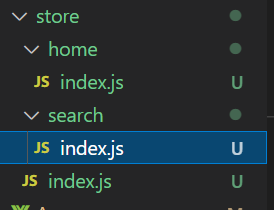

# vuex

概念：专门在Vue中**实现集中式状态（数据）管理**（**就是将一些共用数据集中式管理**）的一个Vue插件儿(Vue.use())，对vue应用中多个组件的共享状态进行集中式的管理(读/写)，也是一种组件间通信的方式，且适用于任意组件间通信。

**Actions**：一般用来进行网络请求，或者一些业务逻辑，进行操作之前的准备工作。

**Mutations**：放的是真正的操作

**State**：存储的是数据


### 什么时候使用vuex？

1. 多个组件依赖同一状态(数据)。
2. 来自不同组件的行为需要变更同一状态(数据)。

## 安装

```
安装：npm i vuex
```


## 原则(qec)

1. mutations中只进行修改操作，不要出现逻辑行为，且不能进行异步操作
2. actions中可以进行异步操作，将一些逻辑层面的内容全放到actions中
3. mutations多模块时不建议有同名的mutations函数，如果要开启命名空间来进行区分
4. getter就是当作computed属性来理解


## 关键

**vuex是和界面一起有关联的，当界面一刷新就会刷新vuex中的数据**

当有一些长时间数据保持，一般会和sessionStorage或者localStorage配合使用

## 一:搭建vuex环境

1）创建文件：src/store/index.js

```javascript
// 该文件用于创建vuex最核心的的store

//引入vue
import Vue from 'vue';
// 引入Vuex
import Vuex from 'vuex';
Vue.use(Vuex);

// 准备actions，用于响应组件中的动作
const actions = {

};

// 准备mutations，用于操作数据
const mutations = {

};

// 准备state，用于存储状态(数据)
const state = {

};

// 创建store并暴露store
export default  new Vuex.Store({
    // 同名了可以简写
    actions:actions,
    mutations:mutations,
    state:state
});


// 或者酱紫写
const store = new Vuex.Store({
  state: {
    count: 0
  },
  mutations: {
    increment (state) {
      state.count++
    }
  }
})

export default store;
```

2)`main.js`引入`store`配置项

```javascript
......
//引入store
import store from './store'
...
//创建vm
new Vue({
	el:'#app',
	render:h => h(App),
	//引入store配置项
	store
})
```


## 二:基本使用

1) 基本使用

```javascript
// 该文件用于创建vuex最核心的的store
//引入vue
import Vue from 'vue';
// 引入Vuex
import Vuex from 'vuex';
Vue.use(Vuex);

// 准备actions，用于响应组件中的动作
const actions = {
    // 这俩没啥业务逻辑，可以再组件中直接调用commit
    // jia: function(context,value) {
    //     console.log('actions的jia被调用了',context,value);
    //     context.commit('JIA',value);
    // },
    // jian: function(context,value) {
    //     console.log('actions的jian被调用了',context,value);
    //     context.commit('JIAN',value);
    // },
    
    jiaOdd: function(context,value) {
        console.log('actions的jiaOdd被调用了',context,value);
        if(context.state.sum % 2) {
            context.commit('JIA',value);
        }
    },
    jiaWait: function(context,value) {
        console.log('actions的jiaWait被调用了',context,value);
        setTimeout(() => {
            context.commit('JIA',value);
        }, 500);
    }
};

// 准备mutations，用于操作数据
const mutations = {
    //执行加操作
    JIA: function(state,value) {
        console.log('mutations中的JIA被调用了',state,value);
        state.sum += value;
      
      
      // 可以通过来触发别的mutations
      this.commit('xxx')
    },
    //执行减操作
    JIAN: function(state,value) {
        console.log('mutations中的JIA被调用了',state,value);
        state.sum -= value;
    }
};

// 准备state，用于存储状态(数据)
const state = {
    sum: 0//当前的和
};

// 创建store并暴露store
export default  new Vuex.Store({
    actions:actions,
    mutations:mutations,
    state:state
});

```

2) 组件中读取vuex中的数据:`$store.state.sum`(前面有没有this,跟位置有关)

>**当在template标签中时，不需要this，当在script标签中时，需要this**

2) 组件中修改vuex的数据:

方法一:

`$store.dispath.('action中方法名',数据)`

方法二:

`$store.commit.('mutation中方法名',数据)`

**注意**:若没有网络请求或者其他业务逻辑,组件中也可以越过actions,即不写`dispatch`,直接编写`commit`,即方法二。


## 三：getters的使用

1）概念：当`state`中的数据需要经过加工后再使用，可以使用`getters`进行加工

这个就很像计算属性`computed`,我们可以把这个想象为store的计算属性，我们需要加工一下

```javascript
...
// 用于将state中的数据进行加工
const getters = {
    bigSum(state) {
        return state.sum * 10;
    }
}
...
// 准备state，用于存储状态(数据)
const state = {
    sum: 0//当前的和
};
// 创建store并暴露store
export default  new Vuex.Store({
    // 名字一样可以简写
    actions:actions,
    mutations:mutations,
    state:state,
    //添加getters配置项
    getters:getters
});

//组件中读取数据
$store.getters.bigSum//bigSum是getters下创建的
```

3）组件中读取数据：`$store.getters.创建的属性名`


## 四：四个map方法的使用

这四个方法在使用的时候记得进行引用

```js
import {mapState,mapGetters,mapMutations,mapActions} from 'vuex';
export default {
  ...
}
```


1）**mapState**方法：用于帮助我们映射`state`中的数据为计算属性

```javascript
computed:{
    
    //这是mapState帮我们写的，从state中读取数据（对象写法） 
  	/*sum就是计算属性，直接使用*/ 
  ...mapState({sum:'sum',school:'school',subject:'subject'}),
	...mapState({
    sum: (state) => state.moudulesName.list // 这个是有modules时的写法
  })
  // 数组写法，条件是计算属性名和state中的属性名是一致的
  ...mapState(['sum','school','subject']),

}
```

2)**mapGetters**方法：用于帮我们映射`gatters`中的数据为计算属性

```javascript
computed:{
//原始自己手写法
bigSum() {
    return this.$store.getters.bigSum;
}
// 从gatters中读取数据
    
// 对象写法
...mapGetters({bigSum: 'bigSum'}),
    
// 数组写法 条件是计算属性名和state中的属性名是一致的
...mapGetters(['bigSum']),
}
```

3）**mapMutations**方法：用于帮助我们生成与`mutations`对话的方法，即：包含`$store.commit(xxx)`的函数

```javascript
methods: {
    // 借助mapMutations生成对应的方法，方法中会调用commit去练习mutations
    // 对象写法
    ...mapMutations({increment: 'JIA',decrement: 'JIAN'}),
    // 数组写法 条件函数名和mutations中一致
    ...mapMutations(['JIA','JIAN']),
      
     // 如果模块化了，第一个参数是模块名称, 后面一致
     ...mapMutations('user', ['xx'])
}
```

4）**mapActions**方法：用于帮助我们生成与`actions`对话的方法，即包含`$store.dispatch(xxx)`的函数

```javascript
methods: {
    // 借助mapActions生成对应的方法，方法中会调用dispatch去练习Actions
    // 对象写法
    ...mapActions({incrementOdd: 'jiaOdd', incrementWait: 'jiaWait'}),
    // 数组写法 条件是函数名和actions中写的一致
    ...mapActions(['jiaOdd','jiaWait']),
}
```


## 五：模块化+命名空间(重要)

1）目的：让代码更好维护，让多种数据分类更加明确。

就是有很多模块，每个模块有自己的数据，我们就把大仓库拆分成每个小仓库

一个模块对应一个小仓库。

2.）修改`store.js`

```javascript
// 拆分成 count文件
// 求和功能相关配置
const countOptions = {
    // 开启命名空间
    namespaced: true,
    actions: {...},
    mutations: {...},
    state: {
        sum: 0,//当前的和
        school: '热海大',
        subject: '前端',
    },
    getters:{
        bigSum(state) {
            return state.sum * 10;
        }
    },
}


// 拆分成 person文件
// 人员管理相关配置
const personOptions = {
    // 开启命名空间
    namespaced: true,
    actions: {...},
    mutations: {...},
    state: {
        personList: [
            {id: '001', name: '张三'},
        ]
    },
    getters:{...},
}
```

### 5.1开启命名空间后，4个map的操作

3）开启命名空间后，组件中读取state数据：

```javascript
//方式一：自己直接读取：
this.$store.state.personAbout.personList;
//方式二：借助mapState读取：
...mapState('personAbout',['personList']);
...mapState({
  personList: state => state.personAbout.personList
})
```

4）开启命名空间后，组件中读取getters数据：

```javascript
//方式一：自己直接读取
this.$store.getters['personAbout/firstPersonName'];
//方式二：利用mapGetters读取：
...magGetters('personAbout',['firstPersonName']);
```

5）开启命名空间后，组件中调用dispatch

```javascript
//方式一：自己直接读取(前面是命名空间/actions中的函数)
this.$store.dispatch('personAbout/addPersonWang',person);
//方式二：利用mapAction
...mapAction('personAbout',{incrementOdd:'jiaOdd',incrementWait:'jiaWait'});
...mapAction('personAbout',['jiaOdd','jiaWait']);
```

6）开启命名空间后，组件中调用commit

```javascript
//方式一：自己直接读取
this.$store.commit('personAbout/ADD_PERSON',person);
// 在mutations中触发别的mutations
this.commit('模块名/方法名');
//方式二：借助mapMutations
...mapMutations('personAbout',{increment:'JIA',decrement:'JIAN'});

.....mapMutations('personAbout',['JIA', 'JIAN']);
```

**注意：所有的方法二中：就是首先要开启命名空间，然后再原有map方法基础上，添加一个参数，参数是对应模块的命名空间**


>tips:
>
>就是如果使用map的简化方法，如果想要的参数名和store中的名称一致，直接使用**数组方式**，如果参数名和store中的不一致可以使用**对象写法重新命名**


## 六：拆分模块化开发

将仓库`store`拆分成每个小仓库，每个小仓库中存取自己拥有的数据。



例如图上：拆分成两个模块，一个`home`,一个`search`

他俩每人拥有一套`state,actions,mutations,getters`

```js
// search模块的小仓库
/*
  state: 仓库存储数据的地方
  mutations: 修改state的唯一手段
  actions: 处理action，可以书写自己的业务逻辑，也可以处理异步
  getters: 可以理解为state的计算属性，能够简化仓库数据，让组件获取仓库更加方便
*/
const state = {};
const mutations = {};
const actions = {};
const getters = {};

exports.default = {
	state,
	mutations,
	actions,
	getters
};
```


**然后在大模块`store`中引入小模块**

```js
import Vue from 'vue';
import Vuex from 'vuex';

// 需要使用一下
Vue.use(Vuex);

// 引入入小仓库
import home from './home';
import search from './search';


export default new Vuex.Store({
	modules: {
		home,
		search
	}
});

```

## 分装例子

home的仓库数据

```js
// 引入封装好的接口
import { reqCategoryList } from '@/api';
// search模块的小仓库
const actions = {
	// 通过API里面的接口函数调用，向服务器发送请求，获取服务器数据
	// 这里直接解构出context中的commit
	async categoryList({ commit }) {
		let result = await reqCategoryList();
		if (result.code === 200) {
			commit('CATEGORYLIST', result.data);
		}
	}
};
const mutations = {
	CATEGORYLIST(state, categoryList) {
		// 赋值操作，将数据修改进state
		state.categoryList = categoryList;
	}
};
const getters = {};
const state = {
	/* 起始值，要根据接口的返回值确定
     如果返回服务器返回数组，那起始值为空数组
     如果返回数据为对象，那起始值就空对象
  */
	categoryList: []
};
export default {
	state,
	mutations,
	actions,
	getters
};

```

组件调用数据：

```js
  // 当组件挂载完毕就可以向服务器发送请求
  mounted() {
    // 发送的home下的categoryList
    this.$store.dispatch('categoryList');
  },
  computed: {
    ...mapState({
      // 对象写法，右侧是一个函数，state参数中有想要的数据
      categoryList: state => state.home.categoryList
    })
  }

// 然后这个categoryList就可以使用啦
```


## 七：注意点（mutations如何互相调用）

注意，在vuex3中一个mutations中是不能调用另一个mutations方法的。

原则上来说，mutations只是用来修改state的方法，不要在里面书写逻辑操作。

那么如何来做呢？

我建议，**写一个actions方法（进行逻辑调用mutations）**，在actions中，可以调用mutations的方法，并且还支持异步操作，所以在actions中来顺序调用mutations方法是非常可取的。


示例：

```js
export default {
  
  mutations: {
    f1(){
      ...
    },
    f2() {
			...
    }
  },
  actions: {
    f3({commit}) {
      commit('f2');
      ...
      commit('f1');
    }
  }
}
```


## 八：自定义持久化插件

官网上是这样解释vuex插件的：

Vuex 的 store 接受 `plugins` 选项，这个选项暴露出每次 mutation 的钩子。Vuex 插件就是一个函数，它接收 store 作为唯一参数：

```js
const myPlugin = store => {
  // 当 store 初始化后调用
  store.subscribe((mutation, state) => {
    // 每次 mutation 之后调用
    // mutation 的格式为 { type, payload }
  })
}
```

然后像这样使用：

```js
const store = new Vuex.Store({
  // ...
  plugins: [myPlugin]
})
```


我们常常需要将vuex的数据保存进本地的localstorage中，我们可以自定义一个插件来帮助我们保存


第一步：封装插件

`store/presist.js`

```js
/*
  vuex插件的调用时机：
  在每次vuex刷新时，都会调用
  vuex在每次页面刷新时也会刷新
*/

export default function persistState(store) {
	/**
	 * @param {mutation} 访问mutation信息
	 * @param {state} 修改后的state
	 */
	store.subscribe((mutation, state) => {
		// store.subscribe 监听mutations触发
		window.localStorage.setItem('vuex', JSON.stringify(state));
	});

	// 状态的还原，每次插件代码执行就还原一次

	const prevState = window.localStorage.getItem('vuex');
	if (prevState) {
		// 调用store.replaceState替换所有状态
		store.replaceState(JSON.parse(prevState));
	}
}

```


第二步：到store的入口文件index.js中引入

`store/index.js`

```js
import Vue from "vue";
import Vuex from 'vuex';
// 引入
import persistState from './presist';
Vue.use(Vuex);


const store = new Vuex.Store({
  // 注册使用
  plugins: [persistState],
  state: {
    breadCrumbData: [
      // {
      //   name: 'home',
      //   query: {},
      //   params: {},
      //   meta: '首页',
      //   actived: true
      // }
    ]
  },
  actions: {
		....
  },
  mutations: {
		...
  }
})

export default store;
```

