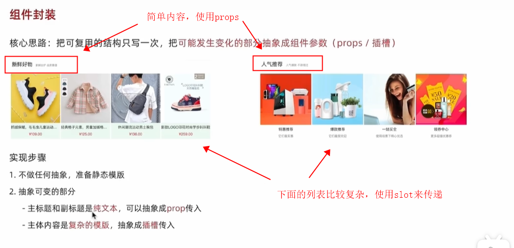
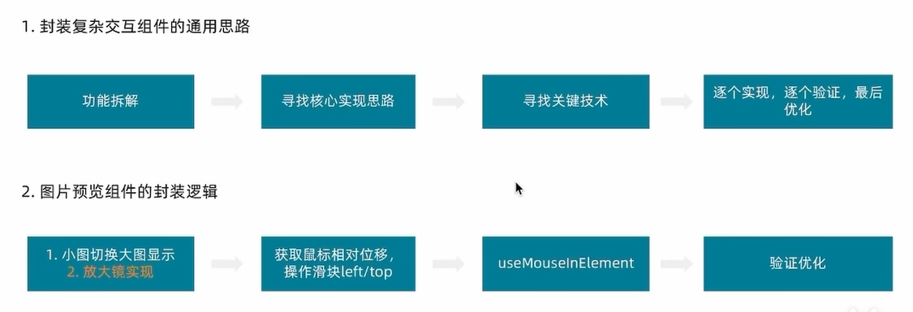
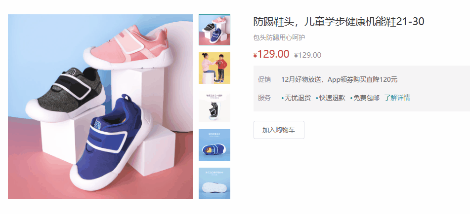

# vue组件封装的关键几点

vue组件封装的总结：


## 第一点：创建对应组件，并注册（这个就不细说了）


## 第二点：如果组件需要增强，需要更多的通过使用者来传递属性，进而修改组件样式

核心：`vue2`使用`props` + `:style`动态绑定样式，`vue3`使用props+v-bind直接绑定样式。

vue2:

```vue
<!--组件使用 -->
<my-search bgColor="#A00000" :radius="20"></my-search>

<!--组件封装-->
<template>
  <view class="my-search-container" :style="{'background-color': bgColor}">
    <view class="my-search-box" :style="{'border-radius': radius + 'px'}">
      <!-- uni自带的图标组件 -->
      <uni-icons type="search" size="17"></uni-icons>
      <text class="placeholder">搜索</text>
    </view>
  </view>
</template>

<script>
  export default {
    name:"my-search",
    props: {
      // 背景颜色
      bgColor: {
        type: String,
        default: '#C00000'
      },
      // 圆角尺寸
      radius: {
        type: Number,
        default: 18
      }
    },
    data() {
      return {
        
      };
    }
  }
</script>

<style lang="scss">
.my-search-container {
  height: 50px;
  background-color: #C00000;
  display: flex;
  align-items: center;
  padding: 0 10px;
  .my-search-box {
    display: flex;
    align-items: center;
    justify-content: center;
    width: 100%;
    height: 36px;
    background-color: #fff;
    border-radius: 18px;
    .placeholder {
      margin-left: 5px;
      font-size: 15px;
    }
  }
}
</style>
```


## **第三点：如果组件内容不确定，需要使用者传递，那么请使用`<slot>`标签。**

<slot>标签就是专门做这个工作的，具体使用内容请看组件那一章节


## 第四点：事件请从父组件传递

为了增强组件的通用性，请不要给组件单纯的绑定一个事件，这样会让组件丧失复用性，会降低组件的可用度。

**让要触发的事件通过自定义事件传递到组件中（@xxx），组件触发事件（$emit）**，这样可以提高组件的复用性


示例：

**父组件**

```vue
<template>
	<!--  这里就为子组件绑定了一个click事件， 并且这个click事件是可以随时改的 -->
	<child v-for="(item, index) in list" :key="index" @click="go(item)"></child>
</template>

<script>
  import child from '@/components/child.vue';
	export default {
    component: {
      child
    },
    data() {
      return {
        list: []
      }
    },
    methods: {
      go(item) {
        ...
      }
    }
  }
</script>
```


**子组件**

```vue
<template>
	<!-- 这样直接触发绑定的事件， 更加灵活 -->
	<div @click="$emit('click')">
    ...
  </div>
</template>

<script>
	...
</script>
```


## 第五点：细小化封装（我自己总结的）

例如有一个**列表组件list**，我们最好去分装列表组件的**每一项item**，而不是去选择封装整个列表。因为我们可以通过v-for将整个列表渲染出来，并且更容易绑定事件（**结合上面第四项**）


## 第六: 结合$attrs和$llistener

这两个东西很好用，可以去看看


## 第七点：复杂组件：props和slot结合使用

一般复杂内容通过`<slot>`来传递，简单部分使用`props`即可


示例：



**其他类似组件思路也是这样封装的**


## 第八点：纯展示组件请使用props即可

纯展示的组件，不含有其他功能组件的直接用props，不要复杂化


## 第九点：复杂交互组件的通用思路




实现效果：

