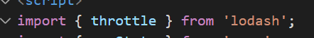
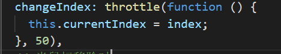

# Lodash使用

官网下载。

```
//vue中 npm 一下
npm install -s lodash
```


lodash是以`_`作为开头的，和jq的`$`一样

## 全部引入


使用时只需要：

```
_.函数名()
//节流函数
_.throttle()
```


## 按需引入



只需要引入自己需要的函数即可

使用时：



## 使用注意

## **使用`lodash`的函数时，尽量不要使用箭头函数，容易导致`this`的指向出现问题。**

