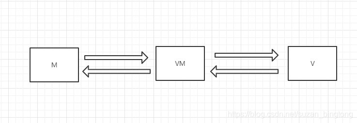
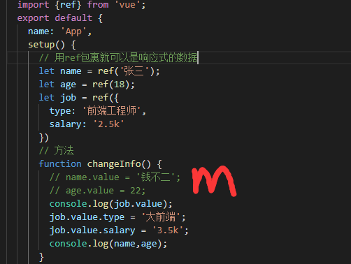
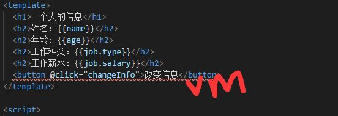
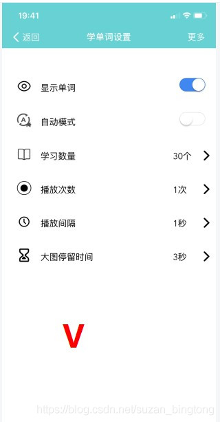

# MVVM模型

M：模型（model）=>对应data中的数据

V：视图（view）=>模板

VM：视图模型（viewModel）：vue实例对象

概念：

MVVM是Model-View-ViewModel的简写。它本质上就是MVC 的改进版。

**M是逻辑方法加上数据**

**V就是用户看到的界面**

**VM就是逻辑方法加上界面渲染的代码，例如HTML。**

如图：

## 各个部分

---

---

视图：就像在MVC和MVP模式中一样，视图是用户在屏幕上看到的结构、布局和外观（UI）。

视图模型：视图模型是暴露公共属性和命令的视图的抽象。MVVM没有MVC模式的控制器，也没有MVP模式的presenter，有的是一个绑定器。在视图模型中，绑定器在视图和数据绑定器之间进行通信。

模型：模型是指代表真实状态内容的领域模型（面向对象），或指代表内容的数据访问层（以数据为中心）。

