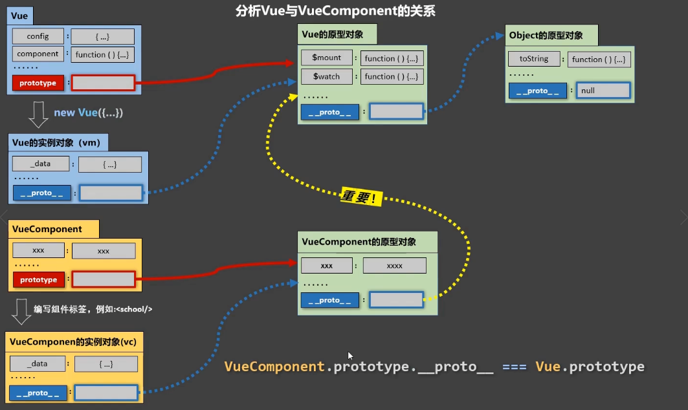
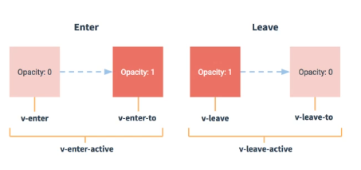
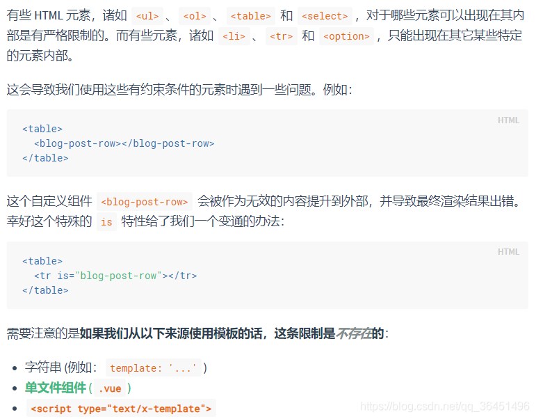

# Vue组件（重要思想）

定义：实现应用中**局部**功能**代码**和**资源**的**集合**。

作用：复用编码，简化项目编码，提高允许效率


模块化：当应用中的js都已模块来编写，那么这个应用就是模块化的应用。

组件化：当应用中的功能都是多组件的方式来编写，那么这个应用就是一个组件化应用。

## Vue使用组件的三大步骤

一、定义组件（创建组件）

二、注册组件

三、使用组件（写组件标签）

### 一：如何定义一个组件？

使用Vue.extend(options)创建，其中options和new Vue(options)时传入的那个options几乎一样，但是有一点点儿区别：

1. el不要写，为什么？----最终所有的组件都要经过一个vm的管理，由vm中的el决定服务于那个容器。
2. data必须写成函数，为什么？----避免组件被复用时，数据存在引用关系。

备注：使用template可以配置组件结构。

### 二：如何注册组件？

第一步：先引入组件

import 组件名 from './components/xxx';

第二部注册组件：

1）局部注册：考new Vue的时候写上components选项

```
components: {组件名}//局部注册组件名没有引号
```


2）全局注册：在main.js中Vue.component('组件名','组件')

### 三、编写组件标签：

<组件名></组件名>


## 关于组件名的几个注意点

1）关于组件名：

一个单词组成：

1. 第一种写法(首字母小写)：school
2. 第二种写法(首字母大写)：School

多个单词组成：

1. 第一种(kebab-case)：my-school
2. 第二种(CamelCase): MySchool(需要Vue脚手架)

备注：

（1）组件名尽可能回避HTML中已有的元素名称，例如a，h2，H2都不行

（2）可以使用name配置对象指定组件在开发者工具中呈现的名字。


2）关于组件标签：

第一种写法：<school></school>

第二种写法：<school />

备注：不使用脚手架时，<school />会导致后续组件不能渲染。


3）一个简写方式：

const school = Vue.extend(options)可以简写为：

const school = options


## 关于VueComponent

1）school组件本质是一个名为VueComponent的构造函数，且不是程序员定义的，时Vue.extend生成的。


2）我们只需要写<school />或者<school></school>，Vue解析时会帮我们创建school组件的实例对象，即帮我们执行：new VueComponent(options)


3）**特别注意**：**每次调用Vue.extend，返回的都是一个全新的VueComponent！！！**


4）关于this的指向：

（1）组件配置中：

data函数、methods中的函数、watch中的函数、computed中的函数，它们的this均是【VueComponent实例对象】

（2）new Vue(options)配置中：

data函数、methods中的函数、watch中的函数、computed中的函数，它们的this均是【Vue实例对象】


5）VueComponent的实例对象，以后简称vc（也可以称为组件实例对象），Vue的实例对象，以后成vm


## Vue与VueComponent的关系（重要）

1）一个重要关系：

```vue
VueComponent.prototype.__proto__ === Vue.prototype
```

2）为什么要有这个关系？

为了让组件实例对象(vc)能访问到Vue原型上的属性、方法。




## 传递数据

### 组件的自定义事件（子给父）

原则：**给谁帮的事件，就找谁触发**

**事件绑在子组件上，事件的回调是在父组件上，所以才能进行父子之间的数据传递**

1）一种组件间通信方式，适用于：子组件 ===>父组件。

2）使用场景：A是父组件，B是子组件，B想给A传递数据，那么就要在A中给B绑定自定义事件（事件的回调在父组件A中）

3）绑定自定义组件：

1. 第一种方式：在父组件:

   ```vue
   //Demo是子组件，things是自定义事件
   //方式一
   <Demo @things="text" />
   //方式二
   <Demo v-on:things="text" />
   ```

   ```vue
   方式三
   <Demo ref="demo" />
   ......
   mounted() {
   	this.$ref.demo.$on('things',this.test)
   }
   ```

若想要自定义事件只触发一次，可以使用`once`修饰符或者`$once`方法。


4）触发事件：在子组件中`this.$emit('things',数据)`数据可以是多个

5）解绑自定义事件：

```js
// 只能解绑1个事件
this.$off('atqianbuer');

// 解绑多个自定义事件
this.$off(['atqianbuer','demo']);

// 解绑所有自定义事件
this.$off();
```

6）让组件上也可以绑定原生DOM事件，需要使用`native`修饰符。

7）注意：通过`this.$ref.xxx.$on('things',回调)`绑定自定义事件时，回调要么配置在父元素的methods中，要么用箭头函数，否则this指向会有问题。


### ref属性（重要，拿来获取元素的）

1）被用来给元素或者子组件注册引用信息（id的替代者）

2）应用在html标签上获取的是真实DOM元素，**应用在组件标签上获取的是组件实例对象**

3）使用方式：

打标识：<h1 ref="xxx">...</h1>或者<School ref="xxx"></School>

获取：**this.$refs.xxx 获取到的是标签或者组件实例对象**


### 配置项props

功能：让组件接收外部传过来的数据

**父组件向子组件传值**

1）传递数据：

<demo name="xxx">

2）接收数据：

第一种方式（只接收）：

props:['name']

第二种方式（限制类型）：

props:{name: String}

第三种方式（限制类型、限制必要性、限制默认值）：

props: {

​	name: {

​		type: String,//类型

​		required: true,//必要性

​		default: '老王'// 默认值

​	}

}

备注：props是只读的，Vue底层会监测你对props的修改，如果进行了修改，就会发出警告，若业务需求确实需要修改，那么请赋值props的内容到data中一份，然后去修改data中的数据。


### 全局事件总线（乱传）(重要的一匹)

1）一种组件间通信方式，适用于**任意组件间通信**

2）安装全局事件总线：

```vue
new Vue({
	......
	beforeCreate() {
		//安装全局事件总线，$bus就是当前应用的vm
		Vue.prototype.$bus = this;
	}
})
```

3）使用事件总线

1. 接收数据：A组件想接收数据，则在A中定义给$bus绑定的自定义事件，**事件的回调留在A组件自身**

   ```vue
   methods() {
   	demo(data){.....}
   }
   .....
   mounted() {
   	this.$bus.$on('xxx',this.demo);
   }
   ```

2. 提供数据：`this.$bus.$emit('xxx',数据)`

4）最好在`beforeDestory`钩子中，用$off去解绑当前组件所用到的事件。

### 消息订阅与发布（pubsub）

1）一种组件间通信的方式，适用于任意组件间通信

（先安装一个消息订阅于发布的库：我用的npm i pubsub-js）

2）使用步骤：

1. 安装pubsub：`npm i pubsub-js`

2. 引入：`import pubsub from 'pubsub-js';`

3. 接收数据：A组件想接收数据，则在A中订阅消息，**订阅的回调留在A组件自身**

   ```javascript
   methods() {
   	demo(_,参数...){...}
   //因为第一个参数是消息名会传过来，所以拿_占个位置
   }
   ...
   mounted() {
   	this.pid = pubsub.subscribe('xxx',this.demo);
   // xxx是消息名
       // 回调中第一个参数必传是消息名，没啥用，在回调函数中写一个_来接收
   }
   ```

4. 提供数据：`pubsub.publish('xxx'，数据)//xxx是上面订阅的消息名`

5. 最好在beforeDestroy钩子中用

   ```vue
   beforeDestroy() {
       // 取消订阅
       pubsub.unsubscribe(this.pubId);
   }
   ```

   

## 配置项mixin（混入）

功能：可以把多个组件共用的配置提取成一个混入对象

使用方式：

第一步：定义混合

创建一个混合文件，并定义

向外暴露 {

data(){...},

methods:{...}

}

第二步：使用混入

1. 全局混入：Vue.mixin(xxx)
2. 局部混入：mixins:[xxx]（配置对象）


## 插件儿

功能：用于增强Vue

本质：包含install方法的一个对象，install的第一个参数是Vue（构造方法）,后续参数是插件使用者可以传递的数据。

定义插件：

对象.install = function (Vue, options) {

​	//1. 添加全局过滤器

​	Vue.filter(....);

​	//2.添加全局指令

​	Vue.directive(....)

​	//3.配置全局混入

​	Vue.mixin(.....)

​	//4.添加实例方法

​	Vue.prototype.$myMethod = function (){...}

}

## scoped样式

作用：让样式再局部生效，防止冲突。

写法：<style scoped></style>


## nextTick

Vue有时候会有个执行顺序的问题，Vue一般会把一整个函数或者代码段执行完毕之后，再去重新解析加载模板，有些操作必须在模板加载后才能触发，就需要nextTick方法

1）语法：`this.$nextTick(回调函数)`

```js
//有时候不需要传值，就用一个_替代了
this.$nextTick(_ => {
	this.$refs.saveTagInput.$refs.input.focus();
});
```

2）作用：在下次DOM更新结束后执行其指定的回调（就是当页面元素重新渲染之后，在调用回调）。

3）什么时候使用？当数据改变后，要基于更新后的新DOM进行某些操作时，要在nextTick所指定的回调中进行,例如获取input的焦点

## Vue封装的过渡与动画

1）作用：在插入、更新或者移动DOM元素时，在合适的时候给元素添加样式类名。

2）图示：



3）写法

（1）准备好样式

元素进入时的样式：

* v-enter：进入的起点
* v-enter-active：进入过程中
* v-enter-to：进入的终点

元素离开时的样式：

* v-leave：离开的起点
* v-leave-active：离开过程中
* v-leave-to：离开的终点

（2）使用`<transition>`包裹要过渡的元素，并配置name属性：

```html
<transition name="hello">
	<h1 v-show="isShow">你好啊！</h1>
</transition>
```

（3）备注：若有多个元素需要过渡，则需要使用：`<transition-group>`,并且每个元素都要指定`key`值


## 插槽slot

1）作用：让父组件可以向子组件指定位置插入HTML结构，也是一种组件间通信方式父组件 ===>子组件。

2）分类：默认插槽、具名插槽、作用域插槽

3）使用方式：

（1）默认插槽

```javascript
父组件中：
	<Category>
		<div>html结构</div>
	</Category>

子组件：
	<template>
		//定义插槽 上面的div结构会填到slot中
		<slot>插槽默认内容</slot>
	</template>
```

（2）具名插槽：

```javascript
父组件：
	<Category>
		<template slot="header">
			<div>html结构1</div>
		</template>

		<template slot="footer">
			<div>html结构2</div>
		</template>
	</Category>
	
子组件：
	<template>
		//定义插槽 上面的div结构会根据名称填到slot中
		
		<slot name="header">插槽默1认内容</slot>
		<slot name="footer">插槽2默认内容</slot>		
	</template>
```


（3）作用域插槽：（比较麻烦的）

1)理解：数据在组件自身，**但是根据数据生成的结构需要组件的使用者决定。**(games数据在Category组件中，但使用数据所遍历出来的结构由App决定)

2)具体编码：

```javascript
父组件：
    <Category title="游戏">
      <template scope="at">
      	//一个ul
        <ul>
            <li v-for="(item,index) in at.games" :key="index">{{item}}</li>
        </ul>
      </template>
    </Category>
    <Category title="游戏">
      <template scope="at">
      	//一个ol
        <ol>
            <li v-for="(item,index) in at.games" :key="index">{{item}}</li>
        </ol>
      </template>
    </Category>
    <Category title="游戏">
    
 
子组件：
	<template>
//:games="games"将数据传给插槽使用者
		<slot :games="games">插槽默认内容</slot>
	</template>

<script>
	export default{
	name: 'Category',
    data() {
        return {
            games:['英雄联盟','穿越火线'...]
        }
    }
}
</script>
```

2）数据在组件自身中使用：

通过slot-scope接收了当前作用域的数据。

通过scope.row获取这一行的数据

```html
//放在表格中 获取当先一行的数据
<template slot-scope="scope">
{{scope.row}}
</template>
```


## 组件的is属性

什么时候要用到`is`属性呢，

**第一种**：当解析`DOM`模板时，有一些元素内部，不能够使用自定义标签，或者自定义标签内不能放某些特殊的标签，这时就需要`is`来替代一下。

**官网原文如下**




**第二种**：动态组件的实现，在同一个标签中，希望能够切换组件

**官网介绍**


## 关于自定义组件的双向绑定v-model

比如现在有一个自定义组件`<Dialog>`

```html
<Dialog v-model="value"></Dialog>
```

在上述自定义组件中使用`v-model`后，vue会帮助我们修改为以下内容

```html
<Dialog :model-value="value" @update:model-value="value = $event"></Dialog>
// 注意这里的update:model-value是可以传递参数的，
```

具体的使用：(**vue2版本**)

父组件：

```vue
<template>
	<Dialog v-model="value"></Dialog>
</template>
<script>
	import Dialog from 'xxx',
  export default {
  	name: 'APP',
    components: {
      Dialog
    },
    data() {
      return {
        value: '123'
      }
    }
  }
</script>
```

子组件：

```vue
<template>
	<input type="text" :value="modelValue" @input="inputChange($event)"/>
</template>
<script>
export default {
  name: 'Dialog',
  props: ['modelValue'],
  emits: ['update:modelValue'],// 绑定父组件的触发方法，格式必须写成这样
  methods: {
    inputChange(e) {
      this.$emit('update:modelValue', e.target.value)
    }
  }
}
</script>
```


更优秀的写法利用计算属性

```vue
<template>
	<input v-model="modelValue" />
</template>
<script>
export default {
  name: 'Dialog',
  props: ['modelValue'],
  emits: ['update:modelValue'],// 绑定父组件的触发方法，格式必须写成这样
  computed: {
    modelValue: {
      get() {
        return this.modelValue
      },
      set(value) {
        this.$emit('update:modelValue', value)
      }
    }
  }
  }
}
</script>
```


**vue3.0加上element-plus版本**

父组件：

```vue
<template>
<Dialog v-model="dialogVisible"></Dialog>
</template>
<script setup>
  import { ref } from 'vue'
  import Dialog from './components/dialog'
  const dialogVisible = ref(false)
</script>
```


子组件

```vue
<template>
<!-- 千万要注意这里的:model-value,如果使用v-model就会报错，说不允许修改-->
  <el-dialog
    :model-value="dialogVisible"
    title="Tips"
    width="30%"
    @close="handleClose"
  >
    <span>This is a message</span>
    <template #footer>
      <span class="dialog-footer">
        <el-button @click="handleClose">Cancel</el-button>
        <el-button type="primary" @click="handleClose">Confirm</el-button>
      </span>
    </template>
  </el-dialog>
</template>

<script setup>
import { defineEmits, defineProps, computed } from 'vue'
const emits = defineEmits(['update:modelValue'])
const prop = defineProps({
  dialogVisible: Boolean
})
// 创建了一个计算属性
const dialogVisible = computed({
  // 获取时，就直接返回props中的数据
  get() {
    return prop.dialogVisible
  },
  // 修改时，我们调用父组件方法
  set(val) {
    emits('update:modelValue', false)
  }
})

// 关闭时，就直接修改值，妙啊！！(●'◡'●)
const handleClose = () => {
  dialogVisible.value = false
}
</script>

<style></style>

```

