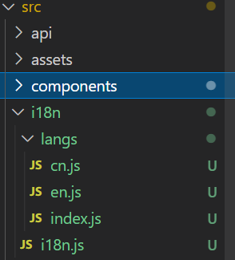

# vue多语言

实现多语言切换，这次主要使用的是vue2+elementUI+i18n国际语言切换插件


## 安装i18n

注意：**vue2.0只支持i18n@9.0以下的版本**，这里我们用的8.27.0

```
npm install vue-i18n@8.27.0
```


## 使用

### 一、目录划分

1、创建`src/i18n/langs`，在`langs`下创建`cn.js, en.js, index.js`在`i18n`目录下创建`i18n.js`



### 2、对应文件写入对应代码

`i18/langs/cn.js`：中文语言包及对应中文列表

```js
// 引入element-ui的语言包
import zhLocale from 'element-ui/lib/locale/lang/zh-CN';

// 中文列表
const cn = {
	login: {
		// 中文对应登录
		login: '登录',
		reset: '重置'
	},
	search: {
		model: '型号',
		group: '分类'
	},
	user: {
		username: '用户名'
	},
	...zhLocale
};

export default cn;

```

---

`i18/langs/en.js`：英文语言包及对应英文列表

```js
// 引入element-ui的语言包
import enLocale from 'element-ui/lib/locale/lang/en';

// 英文列表
const en = {
	login: {
		// 英文对应的登录
		login: 'login',
		reset: 'reset'
	},
	search: {
		model: 'model',
		group: 'group'
	},
	user: {
		username: 'username'
	},
	// 扩展运算符
	...enLocale
};

export default en;

```

---

`i18/langs/index.js`：统一暴露语言包

```js
// 统一暴露语言包
import en from './en';
import cn from './cn';
export default {
	en,
	cn
};
```

---


`i18/i18n.js`：i18n插件关键配置

```js
import Vue from 'vue';
import locale from 'element-ui/lib/locale';
import VueI18n from 'vue-i18n';
// 引入所有语言包
import messages from './langs/index.js';
Vue.use(VueI18n);
const i18n = new VueI18n({
	// 默认语言为中文 后面这个cn和messages中的语言包对应
	locale: localStorage.lang || 'cn',
	messages
});
// 兼容element-ui
locale.i18n((key, value) => i18n.t(key, value));

export default i18n;

```


### 3、在main.js中引入

```js
// 引入多语言
import i18n from './i18n/i18n';
new Vue({
	router,
	i18n,// 关键在这里
	render: h => h(App)
}).$mount('#app');

```


### 4、对应的使用方法

小技巧：**可以配合模板字符串**

在标签中作为正文使用

```html
<div>
  <!-- 第一个search是语言列表里的对象，第二个model是search对象下的属性 -->
  {{$t('search.model')}}
</div>

<!-- 当遇到循环时，需要改变循环遍历对应的语言，可以使用模板字符串 -->
<div v-for="(item, index) in arr" :key="index">
  {{$t(`search.${item.model}`)}}
  <!-- item.model解析出来是 model -->
</div>
```


在标签属性中使用：

```html
<input :placeholder="$t('search.model')" />
```


在vue.js中使用

```vue
export default {
	data() {
		return {
			model: $t('search.model')
		}
}
}
```


### 5、进行语言切换

绑定中英文切换函数即可：

```js
tabEn: function() {
  // 调用locale方法
  this.$i18n.locale = 'en'
},
  
tabCn: function() {
  this.$i18n.locale = 'zh'
}
```

