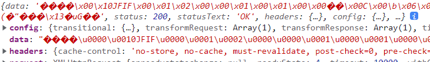
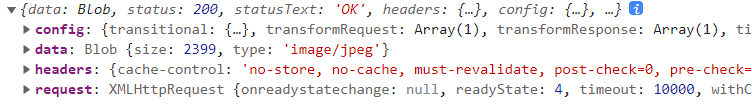
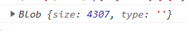
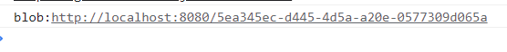

# vue接收图片处理

当请求接口时获得的不是图片名，而是一个图片文件流时，我们无论是想要下载，还是展示，都需要用到`Blob`对象和`window.URL.createObjectURL()`方法帮我们转换出可用的`URL`

## 示例

例如一个获取验证码的例子，前端请求接口获取验证码返回的数据

请求接口：

```js
// 获取登录码 这里使用了封装好的axios
    async getVerifyCode() {
      const res = await this.$http({
        url: '/verifyCode',
        method: 'get',
      })
      console.log(res);
    }
```

返回数据：（`data`是一个文件流）




可以利用`Blob`来将`data`中的数据解析出一个blob对象,或者直接设置返回类型`responseType: 'blob'`

方式一：设置返回类型`responseType: 'blob'`

```js
    async getVerifyCode() {
      const res = await this.$http({
        url: '/verifyCode',
        method: 'get',
        responseType: 'blob'
      })
      console.log(res);
    }
```

返回结果：（直接将data变成了一个`blob`对象）




方式二：（利用`Blob`构造函数）

```js
    async getVerifyCode() {
      const res = await this.$http({
        url: '/verifyCode',
        method: 'get',
      })
      const blob = new Blob([res.data]);
      console.log(blob);
    }
```

结果：(也可以变成一个blob对象)




`URL.createObjectURL(blob)`可以创建一个供`img`标签中的`src`或者`a`标签中`href`中使用的`URL`

```js
    // 获取登录码
    async getVerifyCode() {
      const res = await this.$http({
        url: '/verifyCode',
        method: 'get',
        responseType: 'blob'
      })
      const url = URL.createObjectURL(res.data)
      // 将url赋值给src使用
      this.srcurl = url;
      console.log(url);
    },
```

url的结果：




### 结合使用

调用验证码接口，将返回的图片展示出来

`vue`代码

```vue
<template>
	
</template>
<script>
export default {
  data() {
    return {
      VerifyCodeImgUrl: ''
    }
  },
  created() {
    this.getVerifyCode();
  },
  methods: {
    // 获取登录码
    async getVerifyCode() {
      const res = await this.$http({
        url: '/verifyCode',
        method: 'get',
        responseType: 'blob'
      })
      // 将返回的blob转换为url并赋值给img标签使用
      this.VerifyCodeImgUrl = URL.createObjectURL(res.data)
      console.log(url);
    },
  }
}
</script>
```


结果：

