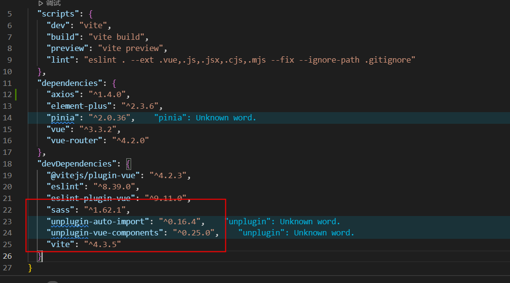

# 完整项目流程


## 零：项目创建

>vue3
>
>```
>npm init vue@latest
>```


## 一：项目目录结构

具体的项目结构如下，`vue2`的项目和`vue3`基本差不多


## 二：配置别名路径提示(`jsconfig.json`)

在更目录下创建`jsconfig.json`并写入：

```json
{
  "compilerOptions": {
    "baseUrl": "./",
    "paths": {
      "@/*": ["src/*"]
    }
  }
}
```

**后续使用`@`符号替代更路径，并且会有提示：**


注意：**这个配置只是提供了联想提示，就是输入@/会有文件夹提示，但是真正进行路径转换的配置，其实是`vite`中的配置**

在`vite.config.js`中有以下配置(如果没有请自行创建)：

```js
import { fileURLToPath, URL } from 'node:url'

import { defineConfig } from 'vite'
import vue from '@vitejs/plugin-vue'

// https://vitejs.dev/config/
export default defineConfig({
  plugins: [vue()],
  resolve: {
    alias: {
      // @ -> src
      '@': fileURLToPath(new URL('./src', import.meta.url))
    }
  }
})

```


## 三：进行项目开发

严格按照项目目录结构进行开发即可，也可以适当添加新的文件夹


# 其他配置


## eslint配置

降低组件名称校验:

```js
//.eslintrc.cjs
/* eslint-env node */
module.exports = {
	root: true,
	extends: ['plugin:vue/vue3-essential', 'eslint:recommended'],
	parserOptions: {
		ecmaVersion: 'latest'
	},
	rules: {
		'vue/multi-word-component-names': 0 // 不强制要求组件名
	}
};

```


## `vite`配置(自动导入scss文件)

有时候，一些公共的scss文件等内容，可以让vite帮助我们自动导入，不用手动的导入，例如一些scss的公共变量文件等：


>可能会要求注意一下vite及sass版本：
>
>当前使用版本：
>
>


公共scss变量文件：

```scss
// styles/var.scss
$xtxColor: #27ba9b;
$helpColor: #e26237;
$sucColor: #1dc779;
$warnColor: #ffb302;
$priceColor: #cf4444;

@debug $priceColor
```


示例：

```js
import {fileURLToPath, URL} from 'node:url';

import {defineConfig} from 'vite';
import vue from '@vitejs/plugin-vue';
import AutoImport from 'unplugin-auto-import/vite';
import Components from 'unplugin-vue-components/vite';
import {ElementPlusResolver} from 'unplugin-vue-components/resolvers';
// https://vitejs.dev/config/
export default defineConfig({
	plugins: [
		vue(),
		AutoImport({
			resolvers: [ElementPlusResolver()]
		}),
		Components({
			// 配置elementPlus采用sass样式配色系统
			resolvers: [ElementPlusResolver({importStyle: 'sass'})]
		})
	],
	resolve: {
		alias: {
			'@': fileURLToPath(new URL('./src', import.meta.url))
		}
	},
	// 自动导入定制化样式文件进行样式覆盖（下面一个时elment-ui的样式，一个是公共scss变量）
	css: {
		preprocessorOptions: {
			scss: {
				additionalData: `
        @use "@/styles/element/index.scss" as *;
        @use "@/styles/var.scss" as *;
        `
			}
		}
	}
});

```


使用：

```vue
<script setup>
// App.vue
  import {RouterView} from 'vue-router';
</script>

<template>
	<div>
		<!-- 一级路由出口组件 -->
		<RouterView></RouterView>
		<div class="test">测试样式</div>
	</div>
</template>

<style scoped lang="scss">
  // 配置好后，可以直接使用，不需要继续@import了
.test {
	color: $xtxColor;
}
</style>

```

