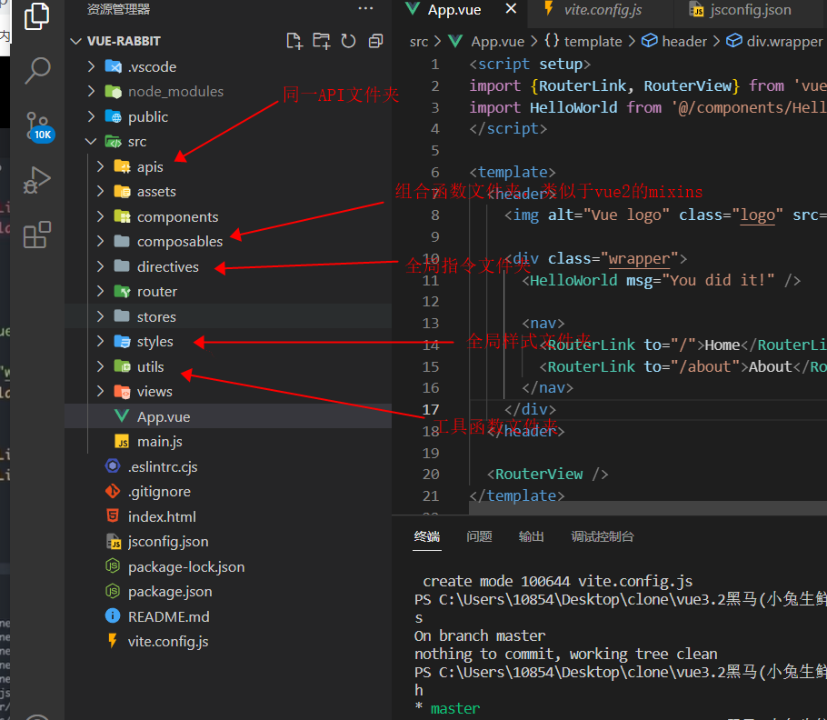

# 完整项目流程


## 零：项目创建

>vue3
>
>```
>npm init vue@latest
>```


## 一：项目目录结构

具体的项目结构如下，`vue2`的项目和`vue3`基本差不多




## 二：配置别名路径提示(`jsconfig.json`)

在更目录下创建`jsconfig.json`并写入：

```json
{
  "compilerOptions": {
    "baseUrl": "./",
    "paths": {
      "@/*": ["src/*"]
    }
  }
}
```

**后续使用`@`符号替代更路径，并且会有提示：**


注意：**这个配置只是提供了联想提示，就是输入@/会有文件夹提示，但是真正进行路径转换的配置，其实是`vite`中的配置**

在`vite.config.js`中有以下配置(如果没有请自行创建)：

```js
import { fileURLToPath, URL } from 'node:url'

import { defineConfig } from 'vite'
import vue from '@vitejs/plugin-vue'

// https://vitejs.dev/config/
export default defineConfig({
  plugins: [vue()],
  resolve: {
    alias: {
      // @ -> src
      '@': fileURLToPath(new URL('./src', import.meta.url))
    }
  }
})

```


## 三：进行项目开发

严格按照项目目录结构进行开发即可，也可以适当添加新的文件夹