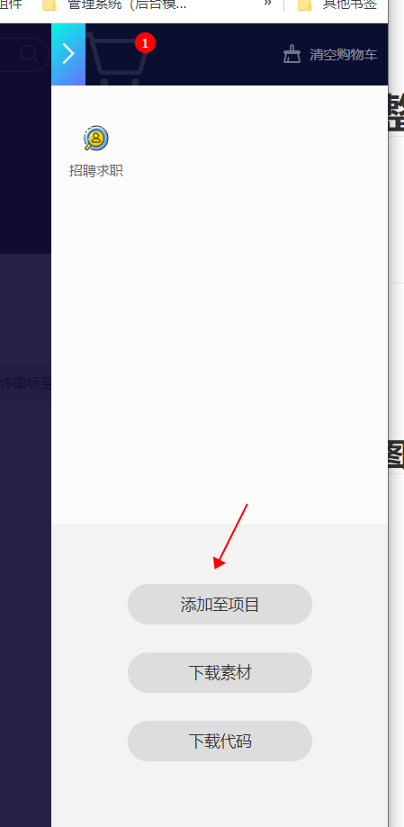
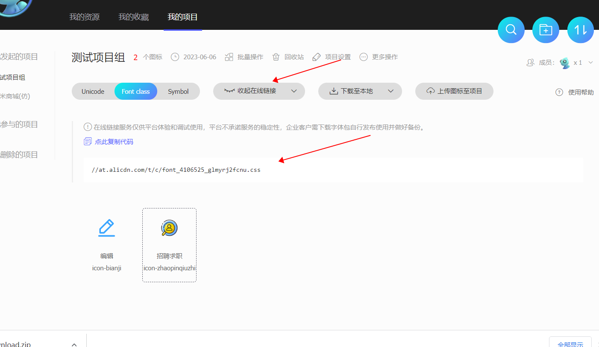
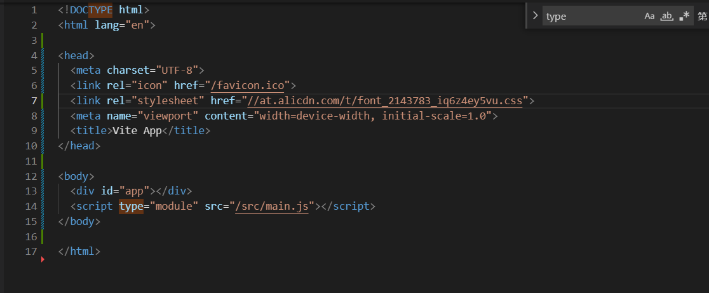

# 阿里云字体图标整体步骤

## 第一步：进入官网

官网：https://www.iconfont.cn/

## 第二步：找到想要的图标并加入项目组

先找到想要的图标，然后加到购物车，再然后加入到项目组中：

## 第三步：生成css链接

进入项目组，然后生成链接：

## 第四步：在`index.html`中引入

在`html`文件中引入即可：

注意：**这种引入方式还是会有风险的，建议下载到本地然后本地再引入**

## 第五步：使用

看官网介绍`fontclass`方式使用