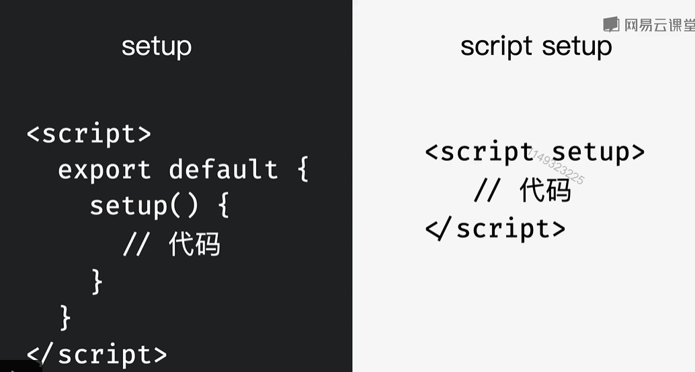
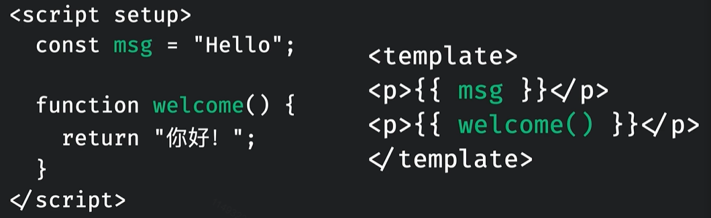
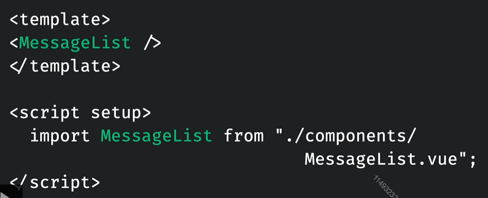
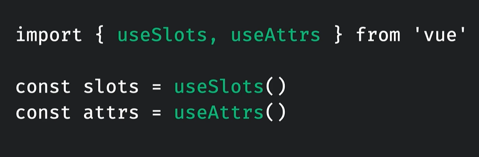
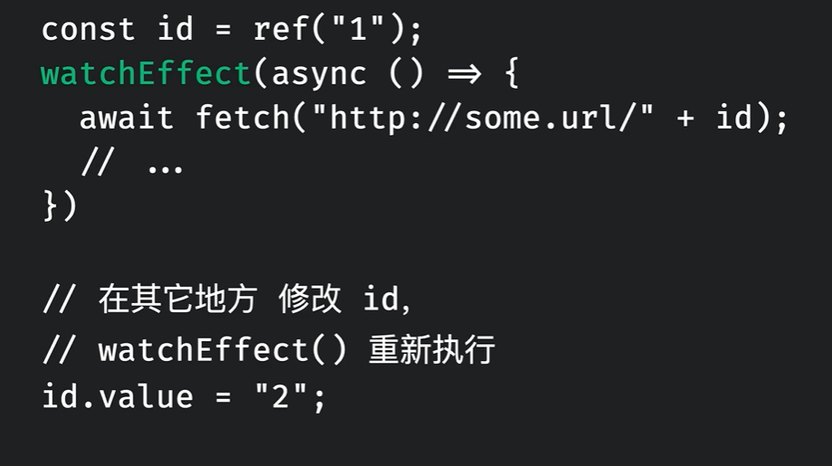
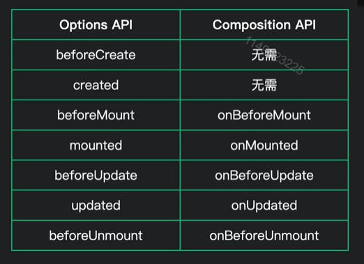

# vue3.2核心

## *最佳组件逻辑复用方式：`Composables`

其实：像下面的`ref`呀、`watch`呀都是`composables`。

无敌啊这个：直接能把逻辑抽离出来，无敌了。

替代`vue2`中的`Mixin`但是比`Mixin`强多了

* `composable`是一个普通的js函数
* setup()中的代码全部都可以在`composables`中编写
* `composables`**逻辑越独立越好**
* 能减少组件文件的代码，增强复用性

>第一步：在src下创建`composables`文件夹

>第二步：新建一个useListData.js文件
>
>注意：`composables`文件建议以use开头


>第三步：书写公用代码

`useListData.js`：创建data，并有一个删除函数

```js
import { ref } from 'vue';

function useListData(data) {
	const dataRef = ref(data);

	function removeItem(id) {
		dataRef.value = dataRef.value.filter(data => {
			return data.id !== id;
		});
	}

	return { data: dataRef, removeItem };
}

export default useListData;

```


>第四步：使用

`MessageList.vue`组件：

```vue
<template>
	<ul>
		<li v-for="item in messagesList" :key="item.id">
			{{ item.name }}
			<button @click="removeMessageItem(item.id)">Remove</button>
		</li>
	</ul>
</template>
<script>
import useListData from '../composables/useListData';
export default {
	setup() {
    // 这里调用composables并结构出来
		const { data: messagesList, removeItem: removeMessageItem } = useListData([
			{
				id: 1,
				name: '钱不二'
			},
			{
				id: 2,
				name: '钱某人'
			}
		]);
		console.log(messagesList.value);
		return { messagesList, removeMessageItem };
	}
};
</script>

```


## setup的语法糖

该语法糖：在vue3.2中才能使用



1）下面的`API`(或者叫`composables`)例如`ref`、`reactive`、`watch`、`computed`等还有生命周期钩子直接写。


2）并且模板中能直接使用<script setup>中定义的变量与函数如下图：




3）由于无法使用components配置项，引入的组件可以直接使用，无敌👍




### `<script setup>`定义props

注意：默认就有`defineProps`，不需要我们`import`

由于语法糖写法，就不能写`props`配置项了，通过`defineProps`来获取，它接收和`props`配置项一样的参数

示例：

```vue
<template>
	<!--模板中的使用方式不变-->
	<p>
    {{title}}
  </p>
</template>
<script setup>
  const props = defineProps(['title', 'name'])
  
  
  // 在setup中访问props，可以接收defineProps的值
  console.log(props.title);
</script>
```


### `<script setup>`定义emits

注意：默认就有`defineEmits`，不需要我们`import`

由于语法糖写法也不能使用emits配置项，通过

`defineEmits`api来接收`emits`。

示例：

```vue
<template>
	<!--模板中触发不变-->
	<button @click="$emit('remove')">
    点我
  </button>
</template>
<script setup>
  const emit = defineEmits(['click', 'remove']);
  
  // setup中使用,通过defineEmits的返回值
  function handleClick() {
    emit('click')
  }
</script>
```


### `<script setup>`中的slots和attrs

对于setup(props,  context)函数中的`context.slots`和`context.attrs`有以下俩api：




# 各种`composables`

## setup()

setup函数作为开始的起点。

语法：

```vue
<template>
	...
</template>
<script>
  // 注意setup中返回的结果，可以直接在template中使用
	setup() {
    return {
      xxx
    }
  }
</script>
```


## toRefs()函数

toRefs函数的作用，是将一个非响应式的对象转换成一个响应式的对象。

示例：

```vue
<script>
	setup(props) {
    // 将props对象，包装为响应式对象
    const {title} = toRefs(props);
  }
</script>
```

### toRef()函数

toRef()函数能够将一个对象中的某个值转换成响应式数据

语法：

```js
toRef(对象, 属性名)
```


示例：

```vue
<script>
	setup(props) {
    // 将props下的title属性包装成响应式的
    const title = toRef(props, 'title');
  }
</script>
```


## ref()函数

ref(参数)函数接收一个任意类型的参数，会将参数包装成响应式数据然后返回。

作用：用来替代`data`配置项

语法：

```vue
<template>
	<p>
    <!--注意：模板中不需要.value来访问-->
    {{num}}
  </p>
</template>
<script>
	import {ref} from 'vue';
  setup() {
    let str = '字符串';
		const num = ref(0);
    const s= ref( str);
    
    // 访问数据
    num.value
    
    // 注意响应式数据和原始数据不相等
    str === s.value; // false
    
    return {num}
  }
</script>
```


## reactive()函数

reactive函数和ref函数类似，但是它只接受一个对象类型的数组，也是将参数包装成响应式然后进行返回。

语法：

```vue
<template>
	<p>
    {{obj.a}}
  </p>
</template>

<script>
import {reactive} from 'vue';
setup() {
  const obj = reactive({a: 1, b: 2});
  const arr = reactive([1, 2, 3, 4]);
  
  
  return {obj}
}
</script>
```


作用：和ref相比，reactive适合在一次性定义大量数据的地方使用，例如表单数据。**而且reactive定义的数据不需要`.value`来访问**（当然我们可以直接ref一把梭一🤣）


## computed()函数

computed函数用来定义计算属性，它就是用来替代`computed`配置项的。

语法：

```vue
<template>


</template>
<script>
	import {computed} from 'vue';
  setup() {
    // computed函数接收一个没有参数的回调
    const search = computed(() => {
      return .....;
    })
    
    // 访问也需要.value
    console.log(search.value);
    
    return {search}
  }
</script>
```

注意：computed和ref定义出的数据，在访问方式上是一样的。


## watch()函数

watch函数用来替代vue2中的`watch`配置项

watch函数的使用有很多注意项，我们一点一点来看。

### 第一种：监听普通数据类型的`ref`

```vue
<script>
  import {watch} from 'vue';
	setup() {
    const searchTerm = ref("");
    
    // 1.直接监听 ref返回的值1
    watch(searchTerm, (newVal, oldVal) => {
      console.log('新值', newVal);
      console.log('旧值', oldVal);
    })
    // 这两种写法功能一样
    
    //2.监听.value 需要写成一个回调方式 
    watch(()=>searchTerm.value, (newVal, oldVal) => {
      console.log('新值', newVal);
      console.log('旧值', oldVal);
    })
  }
</script>
```


### 第二种：监听对象类型中的基本类型的`ref`

watch()函数的第一个参数需要写成回调函数写法。

示例：

```vue
<script>
  import {watch} from 'vue';
	setup() {
    const searchTerm = ref(
      {
        id: 1,
        name: '钱不二'
      }
    );
    
    
    //监听对象属性，需要写成一个回调方式 
    watch(()=>searchTerm.value.name, (newVal, oldVal) => {
      console.log('新值', newVal);
      console.log('旧值', oldVal);
    })
  }
</script>
```


### 第三种：直接监听整个对象的ref

watch()函数，需要传递第三个参数作为配置项，开启深度监视

示例：

```vue
<script>
  import {watch} from 'vue';
	setup() {
    const searchTerm = ref(
      {
        id: 1,
        name: '钱不二'
      }
    );
    
    
    //1.只单纯监听整个对象，对返回值没有要求的情况
    watch(()=>searchTerm.value, (newVal, oldVal) => {			
      // 注意这里两个值是一样的，虽然监听到了修改，但是对象的引用地址值没改变，newVal === oldVal 
      console.log('新值', newVal);
      console.log('旧值', oldVal);
    },
    {
      deep: true
    })
    
    
    // 2.如果想要获取newVal和oldVal的改变，需要将第一个参数返回的对象进行深克隆，深克隆可以使用lodash库或者自己封装
    watch(()=>JSON.parse(JSON.strigfy(searchTerm.value)), (newVal, oldVal) => {			
      // 此时，newVal和oldVal就是两个不同的值
      console.log('新值', newVal);
      console.log('旧值', oldVal);
    },
    {
      deep: true
    })
  }
</script>
```

注意:**上面方法2：watch()函数的第一个参数，是一个回调，回调的返回值，必须是深克隆的一个对象。**


### 第四种：同时监听多个数值

可以将第一个参数写成一个数组的形式。

示例：

```vue
<script>
  import {watch} from 'vue';
	setup() {
    const searchTerm = ref(
      {
        id: 1,
        name: '钱不二'
      }
    );
    
    
    //第一个参数写成一个数组形式
    watch([
      ()=>searchTerm.value.name,
      ()=>searchTerm.value.id
    ], (newVal, oldVal) => {
      console.log('新值', newVal);
      console.log('旧值', oldVal);
    })
  }
</script>
```


## watchEffect()函数

wacthEffect()跟watch()的作用基本一样，用于监听响应性数据的变化，并根据变化做出一些相应的业务逻辑，例如请求远程服务数据。

语法：

```js
import {watchEffect,ref} from 'vue'
const options = ref({
  title: '1',
  name: '2'
})

watchEffect(() => {
  // 一旦回调函数中的值有变化，该回调就会重新执行一次
  console.log(options.value.title)
  console.log(options.value.name)
})
```

注意：**watchEffect()函数在第一次渲染时会调用第一次**，随后根据回调函数中的值决定调用次数

使用场景：



像分页功能，就可以使用watchEffect()


## watchEffect和watch收尾工作

watchEffect的收尾工作：

```js
watchEffect((onInvalidate)=> {
  onInvalidate(() => {
    console.log('做一些收尾工作...');
  })
})
```

watch的收尾工作：

```js
watch(
	()=>options.value.title,
  (newVal, oldVal, onInvalidate) => {
			onInvalidate(() => {
        console.log('做一些收尾工作...');
      })
  }
)
```

注意：**onInvalidate()会在下次监听代码执行后执行**

简单来说：就是第一次监听到数据改变`onInvalidate()`不会执行，第二次监听到数据改变后执行`onInvalidate()`


## setup()中访问props

接收props的方式和之前一样通过`props:['xxx']`

而在setup()函数中通过接收props参数，而进行访问：

示例：

```js
props: ['name']
setup(props) {
  console.log(props.name);
}
```


## 将普通props数据转换为响应式的(toRefs)

我的建议是：传递的props如果使用解构赋值语法从props中取值，都要用`toRefs()`包裹一下`props`

示例：

```js
const {xx} = toRefs(props)
```


如果：在setup函数接收的`props`对象，整体是一个响应式的对象。想要监听时需要通过`props.value.xxx`来监听，如果使用了**解构赋值语法**那么就会丢失响应性，需要`toRefs`来包装。

注意：**如果使用结构赋值语法，要使用`toRefs`**

解决办法：使用`toRefs()`函数

示例：

```vue
<--!父组件-->
<Item title='标题' />

  // 子组件
<script>
	import { toRefs } from 'vue';
  props:['title']
  setup(props) {
    // 这也props就会变为响应式的了
    const {titlel} = toRefs(props);
  }
</script>
```


如果：父组件在传递数据时，**传递的是响应性数据**(用ref或reactive修饰过的)那么传递到**子组件中的props也是响应性数据。**

注意：使用解构赋值任然有响应性的（只有对象和数组类型的可以，基本类型还是要用toRefs包裹一下）


## 自定义事件(emit)

由于setup函数中没有this，所以无法通过this访问接收到的`emits:['customEvent']`，但是可以通过setup()第二个参数访问到。

示例：

```vue
<template>
	<div @click="$emit('customEvent')">
    模板中使用的方式没有改变
  </div>
</template>

<script>
	emits:['customEvent'],
  setup(props, context) {
    // 调用通过context.emit来触发
    context.emit('customEvent');
  }
</script>
```


## 生命周期钩子

和vue2中的区别，生命周期前面都加上了`on`。并且都变成了要给函数。




注意：由于`setup`函数执行的周期就是在`beforeCreate`和`created`之间，所以这两个生命周期的逻辑直接卸载`setup`函数中就行。


例如：

```js
// mounted变为
onMounted(() => {
  // 业务代码
})
```


## provide和inject的替代

provide和inject配置项，在vue2中是用来给嵌套多级的组件传递数据的。在vue3中，这俩变成了两个函数。

示例：**传递非响应式数据。**

```vue
<template>
	<!--最外层组件-->
	<Item />
</template>
<script>
	import { provide } from 'vue';
  setup() {
    const movie = {
      title: '电影'
    }
    // provide传递两个参数，第一个为参数名，第二个为实际传递的参数。
    provide(title, movie.title)
  }
</script>


<script>
  // 最内层组件
	import { inject } from 'vue';
  setup() {
    // 接收到provide传递的title
    const title = inject('title');
    return {title};
  }
</script>
```


如果想要传递响应性数据：还是有响应式数据的通病，建议使用toRef或者toRefs处理一下

示例：

```vue
<template>
	<!--最外层组件-->
	<Item />
</template>
<script>
	import { provide,ref，toRef } from 'vue';
  setup() {
    const movie = ref({
      title: '电影'
    })
    // 1.传递整个对象，那么可以是响应性的
    // provide(movie, movie.value)
    
    // 2.如果传递对象中的一个值,这也就会丢失响应性(响应式数据传递的通病)需要使用toRef
    // provide(title, movie.value.title);
    
    // 3.上面第二条的改进版,使用toRef包装一下
    provide(title, toRef(movie.value, movie.value.title));
  }
</script>


<script>
  // 最内层组件
	import { inject } from 'vue';
  setup() {
    // 接收到provide传递的title
    const title = inject('title');
    return {title};
  }
</script>
```


## 获取template中的ref

通过`ref(null)`来获取，使用的也是`ref()`函数，就是参数要传递`null`。

语法：

```js
const xx = ref(null);
// 返回的也是一个ref对象，需要.value
```


示例：

```vue
<template>
	<input type="text" ref="inputControl" />
</template>
<script>
import { onMounted, ref } from 'vue';
export default {
	setup() {
    // 获取input的dom
		const inputControl = ref(null);
		onMounted(() => {
			inputControl.value.focus();
			// console.log(inputControl);
		});

		return { inputControl };
	}
};
</script>

```


## context的solts属性

该属性和渲染函数有关，可以去官网看一看。

## context的attrs属性

context是setup函数的第二个参数。

attrs属性用于替换vue2中的this.$attrs，功能一致都是为了访问，传递但没有接收的`props`

示例：

```vue
<template>
	<!--父组件-->
	<AutoFocus name="钱不二"></AutoFocus>
</template>


// 子组件
<template>
	<input type="text" ref="inputControl" />
</template>
<script>
import { onMounted, ref } from 'vue';
export default {
	setup(props, { attrs }) {
    // 通过attrs来访问name
		console.log(attrs);
	}
};
</script>

```

注意：attrs对象本身是相应性的，但是它里面的数据不是。它也有响应式数据的通病，想要有响应式需要`toRefs`或`toRef`


## setup中的methods

在setup中函数直接定义，定义完毕直接return，然后模板就能使用