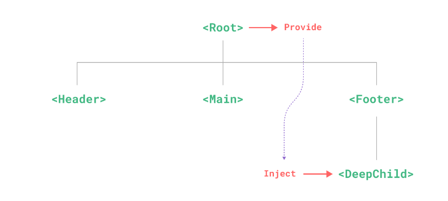

# vue3.2核心

# 结合vite快速创建项目

直接进入文件夹，cmd运行：

```
npm init vue@latest;
```


## *最佳组件逻辑复用方式：`Composables`

其实：像下面的`ref`呀、`watch`呀都是`composables`。

无敌啊这个：直接能把逻辑抽离出来，无敌了。

替代`vue2`中的`Mixin`但是比`Mixin`强多了

* `composable`是一个普通的js函数
* setup()中的代码全部都可以在`composables`中编写
* `composables`**逻辑越独立越好**
* 能减少组件文件的代码，增强复用性


>几个注意点：
>
>**1.命名**
>
>组合式函数约定用驼峰命名法命名，并以“use”作为开头。
>
>**2.输入值**
>
>尽管其响应性不依赖 ref，组合式函数仍可接收 ref 参数。如果编写的组合式函数会被其他开发者使用，**你最好在处理输入参数时兼容 ref 而不只是原始的值**。`unref()`工具函数会对此非常有帮助：
>
>```js
>import { unref } from 'vue'
>
>function useFeature(maybeRef) {
>  // 若 maybeRef 确实是一个 ref，它的 .value 会被返回
>  // 否则，maybeRef 会被原样返回
>  const value = unref(maybeRef)
>}
>```
>
>如果你的组合式函数在接收 ref 为参数时会产生响应式 effect，请确保使用 `watch()` 显式地监听此 ref，或者在 `watchEffect()` 中调用 `unref()` 来进行正确的追踪。
>
>**3.返回值**
>
>你可能已经注意到了，我们一直在组合式函数中使用 `ref()` 而不是 `reactive()`。我们推荐的约定是组合式函数始终返回一个包含多个 ref 的普通的非响应式对象，这样该对象在组件中被解构为 ref 之后仍可以保持响应性：
>
>```js
>// x 和 y 是两个 ref
>const { x, y } = useMouse()
>```
>
>从组合式函数返回一个响应式对象会导致在对象解构过程中丢失与组合式函数内状态的响应性连接。与之相反，ref 则可以维持这一响应性连接。


>第一步：在src下创建`composables`文件夹

>第二步：新建一个useListData.js文件
>
>注意：`composables`文件建议以use开头


>第三步：书写公用代码

`useListData.js`：创建data，并有一个删除函数

```js
import { ref } from 'vue';

function useListData(data) {
	const dataRef = ref(data);

	function removeItem(id) {
		dataRef.value = dataRef.value.filter(data => {
			return data.id !== id;
		});
	}

	return { data: dataRef, removeItem };
}

export default useListData;

```


>第四步：使用

`MessageList.vue`组件：

```vue
<template>
	<ul>
		<li v-for="item in messagesList" :key="item.id">
			{{ item.name }}
			<button @click="removeMessageItem(item.id)">Remove</button>
		</li>
	</ul>
</template>
<script>
import useListData from '../composables/useListData';
export default {
	setup() {
    // 这里调用composables并结构出来
		const { data: messagesList, removeItem: removeMessageItem } = useListData([
			{
				id: 1,
				name: '钱不二'
			},
			{
				id: 2,
				name: '钱某人'
			}
		]);
		console.log(messagesList.value);
		return { messagesList, removeMessageItem };
	}
};
</script>

```


### 常常和`composables`配合使用的`API`

#### `isRef()`

作用：判断一个数据是否是ref包裹的数据

示例：

```js
// fetch.js
import { ref, isRef, unref, watchEffect } from 'vue'

export function useFetch(url) {
  const data = ref(null)
  const error = ref(null)

  function doFetch() {
    // 在请求之前重设状态...
    data.value = null
    error.value = null
    // unref() 解包可能为 ref 的值
    fetch(unref(url))
      .then((res) => res.json())
      .then((json) => (data.value = json))
      .catch((err) => (error.value = err))
  }
	
  // 这里就是用isRef来判断是否为ref
  if (isRef(url)) {
    // 若输入的 URL 是一个 ref，那么启动一个响应式的请求
    watchEffect(doFetch)
  } else {
    // 否则只请求一次
    // 避免监听器的额外开销
    doFetch()
  }

  return { data, error }
}
```


#### `unref()`

作用：如果参数是 ref，则返回内部值，否则返回参数本身。

这是 `val = isRef(val) ? val.value : val` 计算的一个语法糖。

示例：

```js
function useFoo(x: number | Ref<number>) {
  const unwrapped = unref(x)
  // unwrapped 现在保证为 number 类型
}
```


## setup的语法糖

该语法糖：在vue3.2中才能使用


1）下面的`API`(或者叫`composables`)例如`ref`、`reactive`、`watch`、`computed`等还有生命周期钩子直接写。


2）并且模板中能直接使用<script setup>中定义的变量与函数如下图：


3）由于无法使用components配置项，引入的组件可以直接使用，无敌👍


### `<script setup>`定义props

注意：默认就有`defineProps`，不需要我们`import`

由于语法糖写法，就不能写`props`配置项了，通过`defineProps`来获取，**它接收和`props`配置项一样的参数**

>注意：`defineProps`接受的参数，和vue2中的props配置项是一毛一样的，具体可以去翻vue2组件的那片文章

示例：

```vue
<template>
	<!--模板中的使用方式不变-->
	<p>
    {{title}}
  </p>
</template>
<script setup>
  const props = defineProps(['title', 'name'])
  
  
  // 在setup中访问props，可以接收defineProps的值
  console.log(props.title);
</script>


<script>
// 如果你没有使用 <script setup>，1.必须要以👇方式声明一下(和vue2一致)2.需要通过setup第一个参数来访问props
export default {
  props: ['title'],
  setup(props) {
    console.log(props.title)
  }
}
</script>
```


>TIP:
>
>`defineProps()` 宏中的参数**不可以访问 `<script setup>` 中定义的其他变量**，因为在编译时整个表达式都会被移到外部的函数中。


### `<script setup>`定义emits

注意：默认就有`defineEmits`，不需要我们`import`

由于语法糖写法也不能使用emits配置项，通过`defineEmits`api来接收`emits`。

>注意：`defineEmits()` 宏**不能**在子函数中使用。如上所示，它必须直接放置在 `<script setup>` 的顶级作用域下。

示例：

```vue
<template>
	<!--模板中触发不变-->
	<button @click="$emit('remove')">
    点我
  </button>
</template>
<script setup>
  const emit = defineEmits(['click', 'remove']);
  
  // setup中使用,通过defineEmits的返回值
  function handleClick() {
    emit('click')
  }
</script>


<script>
// 如果没有使用setup语法糖，1.需要声明emits 2.需要在setup函数的第二个参数来访问emit
export default {
  emits: ['enlarge-text'],
  setup(props, ctx) {
    ctx.emit('enlarge-text')
  }
}
</script>
```


**事件校验**：

和对 props 添加类型校验的方式类似，所有触发的事件也可以使用对象形式来描述。

要为事件添加校验，那么事件可以被赋值为一个函数，接受的参数就是抛出事件时传入 `emit` 的内容，返回一个布尔值来表明事件是否合法。

示例：

```vue
<script setup>
const emit = defineEmits({
  // 没有校验
  click: null,

  // 校验 submit 事件
  submit: ({ email, password }) => {
    if (email && password) {
      return true
    } else {
      console.warn('Invalid submit event payload!')
      return false
    }
  }
})

function submitForm(email, password) {
  emit('submit', { email, password })
}
</script>
```


### `<script setup>`定义被暴露属性defineExpose

在vue2中，默认是全部暴露出去的，而vue3的setup中默认是不暴露的需要你自己去设置暴露内容

示例：

```vue
<script setup>
import { ref } from 'vue'

const a = 1
const b = ref(2)

defineExpose({
  a,
  b
})
</script>
```

当父组件通过模板引用的方式获取到当前组件的实例，获取到的实例会像这样 `{ a: number, b: number }` (ref 会和在普通实例中一样被自动解包)


### `<script setup>`中的slots和attrs

对于setup(props,  context)函数中的`context.slots`和`context.attrs`有以下俩api：


### 注册组件

在`<script setup>`中，import进来的组件，直接可以在template中使用，而不是像`vue2`中一样需要components注册一下

示例：

```vue
<script setup>
import ComponentA from './ComponentA.vue'
</script>

<template>
  <ComponentA />
</template>
```


### 自定义指令（重要）

在 `<script setup>` 中，任何以 `v` 开头的驼峰式命名的变量都可以被用作一个自定义指令。在上面的例子中，`vFocus` 即可以在模板中以 `v-focus` 的形式使用。

```vue
<script setup>
// 在模板中启用 v-focus
const vFocus = {
  mounted: (el) => el.focus()
}
</script>

<template>
  <input v-focus />
</template>
```

在没有使用 `<script setup>` 的情况下，自定义指令需要通过 `directives` 选项注册：（和vue2一致）

```js
export default {
  setup() {
    /*...*/
  },
  directives: {
    // 在模板中启用 v-focus
    focus: {
      /* ... */
    }
  }
}
```


**全局注册：**

```js
const app = createApp({})

// 使 v-focus 在所有组件中都可用
app.directive('focus', {
  /* ... */
})
```


**指令的钩子（全部可选）：**

```js
const myDirective = {
  // 在绑定元素的 attribute 前
  // 或事件监听器应用前调用
  created(el, binding, vnode, prevVnode) {
    // 下面会介绍各个参数的细节
  },
  // 在元素被插入到 DOM 前调用
  beforeMount(el, binding, vnode, prevVnode) {},
  // 在绑定元素的父组件
  // 及他自己的所有子节点都挂载完成后调用
  mounted(el, binding, vnode, prevVnode) {},
  // 绑定元素的父组件更新前调用
  beforeUpdate(el, binding, vnode, prevVnode) {},
  // 在绑定元素的父组件
  // 及他自己的所有子节点都更新后调用
  updated(el, binding, vnode, prevVnode) {},
  // 绑定元素的父组件卸载前调用
  beforeUnmount(el, binding, vnode, prevVnode) {},
  // 绑定元素的父组件卸载后调用
  unmounted(el, binding, vnode, prevVnode) {}
}

/*
指令的钩子会传递以下几种参数：

el：指令绑定到的元素。这可以用于直接操作 DOM。

binding：一个对象，包含以下属性。

value：传递给指令的值。例如在 v-my-directive="1 + 1" 中，值是 2。
oldValue：之前的值，仅在 beforeUpdate 和 updated 中可用。无论值是否更改，它都可用。
arg：传递给指令的参数 (如果有的话)。例如在 v-my-directive:foo 中，参数是 "foo"。
modifiers：一个包含修饰符的对象 (如果有的话)。例如在 v-my-directive.foo.bar 中，修饰符对象是 { foo: true, bar: true }。
instance：使用该指令的组件实例。
dir：指令的定义对象。
vnode：代表绑定元素的底层 VNode。

prevNode：之前的渲染中代表指令所绑定元素的 VNode。仅在 beforeUpdate 和 updated 钩子中可用。
*/
```


### 自定义插件(重要)

插件 (Plugins) 是一种能为 Vue 添加全局功能的工具代码。下面是如何安装一个插件的示例：

```js
import { createApp } from 'vue'

const app = createApp({})

app.use(myPlugin, {
  /* 可选的选项 */
})
```

一个插件可以是一个拥有 `install()` 方法的对象，也可以直接是一个安装函数本身。安装函数会接收到安装它的[应用实例](https://cn.vuejs.org/api/application.html)和传递给 `app.use()` 的额外选项作为参数：

```js
const myPlugin = {
  install(app, options) {
    // 配置此应用
  }
}
```


插件没有严格定义的使用范围，但是插件发挥作用的常见场景主要包括以下几种：

1. 通过 [`app.component()`](https://cn.vuejs.org/api/application.html#app-component) 和 [`app.directive()`](https://cn.vuejs.org/api/application.html#app-directive) 注册一到多个全局组件或自定义指令。
2. 通过 [`app.provide()`](https://cn.vuejs.org/api/application.html#app-provide) 使一个资源[可被注入](https://cn.vuejs.org/guide/components/provide-inject.html)进整个应用。
3. 向 [`app.config.globalProperties`](https://cn.vuejs.org/api/application.html#app-config-globalproperties) 中添加一些全局实例属性或方法
4. 一个可能上述三种都包含了的功能库 (例如 [vue-router](https://github.com/vuejs/vue-router-next))。


示例：

封装一个图片懒加载自定义指令：

```js
// directives/index.js

import {useIntersectionObserver} from '@vueuse/core';

/**
 * @description 定义懒加载插件
 */
export const lazyPlugin = {
	install(app) {
		// 编写懒加载指令逻辑
		// 定义全局指令（图片懒加载指令）
		app.directive('img-lazy', {
			mounted(el, binding) {
				// el：指令绑定的元素 (img)
				// binding: 指令绑定对象 binding.value 就是指令=后面的值 图片url
				// 监听el是否在视口区域
				const {stop} = useIntersectionObserver(el, ([{isIntersecting}]) => {
					if (isIntersecting) {
						// 如果isIntersecting为true则，在视口区域，在视口区域直接将src赋值
						el.src = binding.value;

						// 加载完毕调用stop停止useIntersectionObserver监听
						stop();
					}
				});
			}
		});
	}
};

```


在`main.js`中挂载：

```js
// main.js
// 图片懒加载自定义指令(v-img-lazy)插件
import {lazyPlugin} from '@/directives/index.js';
import {createApp} from 'vue';
import App from './App.vue';

const app = createApp(App);

// 挂载lazy图片懒加载插件
app.use(lazyPlugin);
//...

```


组件中使用：

```vue
<template>
	<div>
    <!-- 这样就可以实现图片懒加载了 -->
    
  </div>
</template>
```


# 各种`composables`

## setup()

setup函数作为开始的起点。

语法：

```vue
<template>
	...
</template>
<script>
  // 注意setup中返回的结果，可以直接在template中使用
	setup() {
    return {
      xxx
    }
  }
</script>
```


## toRefs()函数

toRefs函数的作用，是将一个非响应式的对象转换成一个响应式的对象。

示例：

```vue
<script>
	setup(props) {
    // 将props对象，包装为响应式对象
    const {title} = toRefs(props);
  }
</script>
```

### toRef()函数

toRef()函数能够将一个对象中的某个值转换成响应式数据

语法：

```js
toRef(对象, 属性名)
```


示例：

```vue
<script>
	setup(props) {
    // 将props下的title属性包装成响应式的
    const title = toRef(props, 'title');
  }
</script>
```


## ref()函数

ref(参数)函数接收一个任意类型的参数，会将参数包装成响应式数据然后返回。

作用：用来替代`data`配置项

>一般来说它是用于代替data配置项中的基础类型数据（but它也可以处理引用类型的数据）

语法：

```vue
<template>
	<p>
    <!--注意：模板中不需要.value来访问-->
    {{num}}
  </p>
</template>
<script>
	import {ref} from 'vue';
  setup() {
    let str = '字符串';
		const num = ref(0);
    const s= ref( str);
    
    // 访问数据
    num.value
    
    // 注意响应式数据和原始数据不相等
    str === s.value; // false
    
    return {num}
  }
</script>
```

注意点：

1. 在setup中ref包裹的变量都需要通过`.value`来访问
2. 在模板`template`中会被自动”解包“，可以直接进行访问而不需要`.value`
3. 跟响应式对象不同，当 ref 作为**响应式数组或像 `Map` 这种原生集合类型的元素被访问时，不会进行解包**。
4. ref解包，只会作用于顶层属性

解包问题示例：

```js
const object = { foo: ref(1) }
```

下面的表达式将不会像预期一样执行：

```js
{{ object.foo + 1 }}
```

解决办法：直接进行结构，将ref包裹的响应式数据置于顶层

```js
const { foo } = object;
{{ foo + 1 }} // 可以像预期一样工作
```


## reactive()函数

reactive函数和ref函数类似，但是它只接受一个对象类型的数组，也是将参数包装成响应式然后进行返回。

作用：也是用来替代`data`配置项的

>注意，reactive函数是用来替代data配置项中的**引用数据类型的**

>tips：和ref相比，reactive适合在一次性定义大量数据的地方使用，例如表单数据。**而且reactive定义的数据不需要`.value`来访问**（当然我们可以直接ref一把梭一🤣）

语法：

```vue
<template>
	<p>
    {{obj.a}}
  </p>
</template>

<script>
import {reactive} from 'vue';
setup() {
  const obj = reactive({a: 1, b: 2});
  const arr = reactive([1, 2, 3, 4]);
  
  
  return {obj}
}
</script>
```


注意：（来自官网）

1. 仅对对象类型有效（对象、数组和 `Map`、`Set` 这样的[集合类型](https://developer.mozilla.org/zh-CN/docs/Web/JavaScript/Reference/Global_Objects#使用键的集合对象)），而对 `string`、`number` 和 `boolean` 这样的 [原始类型](https://developer.mozilla.org/zh-CN/docs/Glossary/Primitive) 无效。

2. 因为 Vue 的响应式系统是通过属性访问进行追踪的，**因此我们必须始终保持对该响应式对象的相同引用**。这意味着我们不可以随意地“替换”一个响应式对象，因为这将导致对初始引用的响应性连接丢失：

   ```js
   let state = reactive({ count: 0 })
   
   // 上面的引用 ({ count: 0 }) 将不再被追踪（响应性连接已丢失！）
   state = reactive({ count: 1 })
   
   // 如果将响应式对象中的基础类型数据结构出来，则会导致count丢失响应性
   let { count } = state;
   count += 1; // 不会影响到state.count的值
   
   state2 = reactive({count: {a:1}});
   // 如果结构的是一个对象，则不会有问题
   let {count} = state2;
   ```

   


## computed()函数

作用：computed函数用来定义计算属性，它就是用来替代`computed`配置项的。

>computed函数返回的是一个ref对象，所以computed()返回对象的使用和注意点都是和ref一致的

语法：

```vue
<template>


</template>
<script>
	import {computed} from 'vue';
  setup() {
    // computed函数接收一个没有参数的回调
    const search = computed(() => {
      return .....;
    })
    
    // 访问也需要.value
    console.log(search.value);
    
    return {search}
  }
</script>
```

注意：

1. **computed和ref定义出的数据，在访问方式上是一样的。**

2. **computed一定要依赖一个响应式数据，否则会导致computed永远不更新的问题**

   示例：

   ```js
   const now = computed(() => Date.now())
   // 这个now就永远不会改变，应为Date.now()不是一个响应式数据
   ```


**可写计算属性**

计算属性默认是只读的。当你尝试修改一个计算属性时，你会收到一个运行时警告。只在某些特殊场景中你可能才需要用到“可写”的属性，你可以通过同时提供 getter 和 setter 来创建：

**注意，可写的计算属性我觉得是不建议使用的，究其根本其实是计算属性最好只是源数据的快照，最好不要出现副作用（有副作用的我们可以用watch）**

```vue
<script setup>
import { ref, computed } from 'vue'

const firstName = ref('John')
const lastName = ref('Doe')

const fullName = computed({
  // getter
  get() {
    return firstName.value + ' ' + lastName.value
  },
  // setter
  set(newValue) {
    // 注意：我们这里使用的是解构赋值语法
    [firstName.value, lastName.value] = newValue.split(' ')
  }
})
</script>
```


## watch()函数

作用：watch函数用来替代vue2中的`watch`配置项

watch函数的使用有很多注意项，我们一点一点来看。

### 第一种：监听普通数据类型的`ref`

```vue
<script>
  import {watch} from 'vue';
	setup() {
    const searchTerm = ref("");
    
    // 1.直接监听 ref返回的值1
    watch(searchTerm, (newVal, oldVal) => {
      console.log('新值', newVal);
      console.log('旧值', oldVal);
    })
    // 这两种写法功能一样
    
    //2.监听.value 需要写成一个回调方式 
    watch(()=>searchTerm.value, (newVal, oldVal) => {
      console.log('新值', newVal);
      console.log('旧值', oldVal);
    })
  }
</script>
```


### 第二种：监听对象类型中的基本类型的`ref`

watch()函数的第一个参数需要写成回调函数写法。

示例：

```vue
<script>
  import {watch} from 'vue';
	setup() {
    const searchTerm = ref(
      {
        id: 1,
        name: '钱不二'
      }
    );
    
    
    //监听对象属性，需要写成一个回调方式 
    watch(()=>searchTerm.value.name, (newVal, oldVal) => {
      console.log('新值', newVal);
      console.log('旧值', oldVal);
    })
  }
</script>
```


### 第三种：直接监听整个对象的ref

watch()函数，需要传递第三个参数作为配置项，开启深度监视

示例：

```vue
<script>
  import {watch} from 'vue';
	setup() {
    const searchTerm = ref(
      {
        id: 1,
        name: '钱不二'
      }
    );
    
    
    //1.只单纯监听整个对象，对返回值没有要求的情况
    watch(()=>searchTerm.value, (newVal, oldVal) => {			
      // 注意这里两个值是一样的，虽然监听到了修改，但是对象的引用地址值没改变，newVal === oldVal 
      console.log('新值', newVal);
      console.log('旧值', oldVal);
    },
    {
      deep: true
    })
    
    
    // 2.如果想要获取newVal和oldVal的改变，需要将第一个参数返回的对象进行深克隆，深克隆可以使用lodash库或者自己封装
    watch(()=>JSON.parse(JSON.strigfy(searchTerm.value)), (newVal, oldVal) => {			
      // 此时，newVal和oldVal就是两个不同的值
      console.log('新值', newVal);
      console.log('旧值', oldVal);
    },
    {
      deep: true
    })
  }
</script>
```

注意:**上面方法2：watch()函数的第一个参数，是一个回调，回调的返回值，必须是深克隆的一个对象。**


### 第四种：同时监听多个数值

可以将第一个参数写成一个数组的形式。

示例：

```vue
<script>
  import {watch} from 'vue';
	setup() {
    const searchTerm = ref(
      {
        id: 1,
        name: '钱不二'
      }
    );
    
    
    //第一个参数写成一个数组形式
    watch([
      ()=>searchTerm.value.name,
      ()=>searchTerm.value.id
    ], (newVal, oldVal) => {
      console.log('新值', newVal);
      console.log('旧值', oldVal);
    })
  }
</script>
```


### watch的配置项

在`watch(source, callback, options)`可以接受三个参数，最后一个options参数可以对watch的一些行为进行配置

watch的options常用的有三个：`immediate`、`deep`、`flush`

接下来一一进行介绍：

一：`immediate`

作用：立即让watch进行监听

原因：**`watch` 默认是懒执行的**：仅当数据源变化时，才会执行回调。但在某些场景中，我们希望在创建侦听器时，立即执行一遍回调。举例来说，我们想请求一些初始数据，然后在相关状态更改时重新请求数据。

示例：

```js
watch(source, (newValue, oldValue) => {
  // 立即执行，且当 `source` 改变时再次执行
}, { immediate: true })
```


二：`deep`

作用：开启深度监听

```js
watch(source, (newValue, oldValue) => {
  
}, { deep: true })
```

>注意：深度侦听需要遍历被侦听对象中的所有嵌套的属性，当用于大型数据结构时，开销很大。因此请只在必要时才使用它，并且要留意性能。


三：`flush`

作用：能让`watch`访问更新后的`dom`

原因：当你更改了响应式状态，它可能会同时触发`Vue` 组件更新和侦听器回调。但是默认情况下，用户创建的侦听器回调，都会在 Vue 组件更新**之前**被调用。这意味着你在侦听器回调中访问的 DOM 将是被 Vue 更新**之前**的状态。

如果想在侦听器回调中能访问被 Vue 更新**之后**的 DOM，你需要指明 `flush: 'post'` 选项：

```js
watch(source, callback, {
  flush: 'post'
})

watchEffect(callback, {
  flush: 'post'
})

// 注意后置刷新的watchEffect函数还有个专门的API交watchPostEffect()
import { watchPostEffect } from 'vue'

watchPostEffect(() => {
  /* 在 Vue 更新后执行 */
})
```


### 停止侦听器watch

正常使用情况下，watch是同步调用的，会自动绑定在组件实例身上，**随着组件实例的创建而创建，销毁而自动停止**。因此，在大多数情况下，你无需关心怎么停止一个侦听器


一个关键点是，侦听器必须用**同步**语句创建：如果用异步回调创建一个侦听器，那么它不会绑定到当前组件上，你必须手动停止它，以防内存泄漏。如下方这个例子：

```vue
<script setup>
import { watchEffect } from 'vue'

// 它会自动停止
watchEffect(() => {})

// ...这个则不会！
setTimeout(() => {
  watchEffect(() => {})
}, 100)
</script>
```


如果要停止一个侦听器，请调用watch返回的函数

```js
const unwatch = watchEffect(() => {})

// ...当该侦听器不再需要时
unwatch()
```


## `watchEffect()`函数

`wacthEffect()`跟watch()的作用基本一样，用于监听响应性数据的变化，并根据变化做出一些相应的业务逻辑，例如请求远程服务数据。

>`watchEffect`是会自动侦听函数中的响应式数据，当响应式数据改变时，就会重新调用一遍回调

语法：

```js
import {watchEffect,ref} from 'vue'
const options = ref({
  title: '1',
  name: '2'
})

watchEffect(() => {
  // 一旦回调函数中的值有变化，该回调就会重新执行一次
  console.log(options.value.title)
  console.log(options.value.name)
})
```

注意：**watchEffect()函数在第一次渲染时会调用第一次**，随后根据回调函数中的值决定调用次数

使用场景：


像分页功能，就可以使用watchEffect()


## watchEffect和watch收尾工作

watchEffect的收尾工作：

```js
watchEffect((onInvalidate)=> {
  onInvalidate(() => {
    console.log('做一些收尾工作...');
  })
})
```

watch的收尾工作：

```js
watch(
	()=>options.value.title,
  (newVal, oldVal, onInvalidate) => {
			onInvalidate(() => {
        console.log('做一些收尾工作...');
      })
  }
)
```

注意：**onInvalidate()会在下次监听代码执行后执行**

简单来说：就是第一次监听到数据改变`onInvalidate()`不会执行，第二次监听到数据改变后执行`onInvalidate()`


## 模板引用(获取`dom`引用)

为了通过组合式` API `获得该模板引用，我们需要声明一个同名的 ref

>注意：和ref()响应式数据那个同名，但是必须要传入null且与template中的ref同名

```vue
<script setup>
import { ref, onMounted } from 'vue'

// 声明一个 ref 来存放该元素的引用
// 必须和模板里的 ref 同名
const input = ref(null)

onMounted(() => {
  input.value.focus()
})
</script>

<template>
  <input ref="input" />
</template>
```


注意，你只可以**在组件挂载后**才能访问模板引用。如果你想在模板中的表达式上访问 `input`，在初次渲染时会是 `null`。这是因为在初次渲染前这个元素还不存在呢！

如果你需要侦听一个模板引用 ref 的变化，确保考虑到其值为 `null` 的情况：

```js
watchEffect(() => {
  if (input.value) {
    input.value.focus()
  } else {
    // 此时还未挂载，或此元素已经被卸载（例如通过 v-if 控制）
  }
})
```


### v-for中的模板引用

>需要 v3.2.25 及以上版本

当在 `v-for` 中使用模板引用时，对应的 ref 中包含的值是一个数组，它将在元素被挂载后包含对应整个列表的所有元素：

```vue
const list = ref([
  /* ... */
])

const itemRefs = ref([])

onMounted(() => console.log(itemRefs.value))
</script>

<template>
  <ul>
    <li v-for="item in list" ref="itemRefs">
      {{ item }}
    </li>
  </ul>
</template>
```


### 组件的ref

模板引用也可以被用在一个子组件上。这种情况下引用中获得的值是组件实例：

```vue
<script setup>
import { ref, onMounted } from 'vue'
import Child from './Child.vue'

const child = ref(null)

onMounted(() => {
  // child.value 是 <Child /> 组件的实例
})
</script>

<template>
  <Child ref="child" />
</template>
```

如果一个子组件使用的是选项式` API `或没有使用 `<script setup>`，被引用的组件实例和该子组件的 `this` 完全一致，这意味着父组件对子组件的每一个属性和方法都有完全的访问权(**注意这里必须父子组件都要是选项式`API`或没有使用 `<script setup>`**)。这使得在父组件和子组件之间创建紧密耦合的实现细节变得很容易，当然也因此，应该只在绝对需要时才使用组件引用。大多数情况下，**你应该首先使用标准的 props 和 emit 接口来实现父子组件交互**。


如果使用了 `<script setup>`，我们可以通过`defineExpose`方法来暴露指定内容给父组件

示例：

```vue
<script setup>
import { ref } from 'vue'

const a = 1
const b = ref(2)
const add = () => {
  a += 1;
}
// 像 defineExpose 这样的编译器宏不需要导入
defineExpose({
  a,
  b,
  add // 暴露一个方法
})
</script>
```


# 其他注意点

## 将普通props数据转换为响应式的(toRefs)

我的建议是：传递的props如果使用解构赋值语法从props中取值，都要用`toRefs()`包裹一下`props`

示例：

```js
const {xx} = toRefs(props)
```


如果：在setup函数接收的`props`对象，整体是一个响应式的对象。想要监听时需要通过`props.value.xxx`来监听，如果使用了**解构赋值语法**那么就会丢失响应性，需要`toRefs`来包装。

注意：**如果使用结构赋值语法，要使用`toRefs`**

解决办法：使用`toRefs()`函数

示例：

```vue
<--!父组件-->
<Item title='标题' />

  // 子组件
<script>
	import { toRefs } from 'vue';
  props:['title']
  setup(props) {
    // 这也props就会变为响应式的了
    const {titlel} = toRefs(props);
  }
</script>
```


如果：父组件在传递数据时，**传递的是响应性数据**(用ref或reactive修饰过的)那么传递到**子组件中的props也是响应性数据。**

注意：使用解构赋值任然有响应性的（只有对象和数组类型的可以，基本类型还是要用toRefs包裹一下）


## 自定义事件(emit)

由于setup函数中没有this，所以无法通过this访问接收到的`emits:['customEvent']`，但是可以通过setup()第二个参数访问到。

示例：

```vue
<template>
	<div @click="$emit('customEvent')">
    模板中使用的方式没有改变
  </div>
</template>

<script>
	emits:['customEvent'],
  setup(props, context) {
    // 调用通过context.emit来触发
    context.emit('customEvent');
  }
</script>
```


## 生命周期钩子

和vue2中的区别，生命周期前面都加上了`on`。并且都变成了要给函数。


注意：由于`setup`函数执行的周期就是在`beforeCreate`和`created`之间，所以这两个生命周期的逻辑直接写在`setup`函数中就行。


例如：

```js
// mounted变为
onMounted(() => {
  // 业务代码
})
```


## provide和inject使用

provide和inject配置项，在vue2中是用来给**嵌套多级的组件**传递数据的。在vue3中，这俩变成了两个函数。

作用示意图：




示例：**传递非响应式数据。**

```vue
<template>
	<!--最外层组件-->
	<Item />
</template>
<script>
	import { provide } from 'vue';
  setup() {
    const movie = {
      title: '电影'
    }
    // provide传递两个参数，第一个为参数名，第二个为实际传递的参数。
    provide(title, movie.title)
  }
</script>


<script>
  // 最内层组件
	import { inject } from 'vue';
  setup() {
    // 接收到provide传递的title
    const title = inject('title');
    return {title};
  }
</script>
```


**如果想要传递响应性数据**：还是有响应式数据的通病，建议使用`toRef`或者`toRefs`处理一下

> TIP:
>
> 当提供 / 注入响应式的数据时，**建议尽可能将任何对响应式状态的变更都保持在供给方组件中**。这样可以确保所提供状态的声明和变更操作都内聚在同一个组件内，使其更容易维护。


示例：

```vue
<template>
	<!--最外层组件-->
	<Item />
</template>
<script>
	import { provide,ref，toRef } from 'vue';
  setup() {
    const movie = ref({
      title: '电影'
    })
    // 1.传递整个对象，那么可以是响应性的
    // provide(movie, movie.value)
    
    // 2.如果传递对象中的一个值,这也就会丢失响应性(响应式数据传递的通病)需要使用toRef
    // provide(title, movie.value.title);
    
    // 3.上面第二条的改进版,使用toRef包装一下
    provide(title, toRef(movie.value, movie.value.title));
  }
</script>


<script>
  // 最内层组件
	import { inject } from 'vue';
  setup() {
    // 接收到provide传递的title
    const title = inject('title');
    return {title};
  }
</script>
```


有的时候，我们可能需要在**注入方组件中更改数据**。在这种情况下，我们推荐在供给方组件内声明并提供一个更改数据的方法函数：

```vue
<!-- 在供给方组件内 -->
<script setup>
import { provide, ref } from 'vue'

const location = ref('North Pole')

function updateLocation() {
  location.value = 'South Pole'
}

provide('location', {
  location,
  updateLocation // 我们在提供方，来提供一个修改函数
})
</script>
```

```vue
<!-- 在注入方组件 -->
<script setup>
import { inject } from 'vue'

// 在注入方：解构出来指+修改函数进行使用
const { location, updateLocation } = inject('location')
</script>

<template>
  <button @click="updateLocation">{{ location }}</button>
</template>
```


最后，如果你想确保提供的数据不能被注入方的组件更改，你可以使用 `readonly() `来包装提供的值。

```vue
<script setup>
import { ref, provide, readonly } from 'vue'

const count = ref(0)
provide('read-only-count', readonly(count))
</script>
```


### 使用 Symbol 作注入名

至此，我们已经了解了如何使用字符串作为注入名。但如果你正在构建大型的应用，包含非常多的依赖提供，或者你正在编写提供给其他开发者使用的组件库，建议最好使用 Symbol 来作为注入名以避免潜在的冲突。

我们通常推荐在一个单独的文件中导出这些注入名 Symbol：

```js
// keys.js
export const myInjectionKey = Symbol()
```

```vue
<script setup>
// 在供给方组件中
import { provide } from 'vue'
import { myInjectionKey } from './keys.js'

provide(myInjectionKey, { /*
  要提供的数据
*/ });
</script>
```

```vue
<script setup>
// 注入方组件
import { inject } from 'vue'
import { myInjectionKey } from './keys.js'

const injected = inject(myInjectionKey)
</script>
```


## context的solts属性

该属性和渲染函数有关，可以去官网看一看。

## context的attrs属性

context是setup函数的第二个参数。

attrs属性用于替换vue2中的this.$attrs，功能一致都是为了访问，传递但没有接收的`props`

示例：

```vue
<template>
	<!--父组件-->
	<AutoFocus name="钱不二"></AutoFocus>
</template>


// 子组件
<template>
	<input type="text" ref="inputControl" />
</template>
<script>
import { onMounted, ref } from 'vue';
export default {
	setup(props, { attrs }) {
    // 通过attrs来访问name
		console.log(attrs);
	}
};
</script>

```

注意：attrs对象本身是相应性的，但是它里面的数据不是。它也有响应式数据的通病，想要有响应式需要`toRefs`或`toRef`


## 自定义组件的v-model(`vue3.2`)

我们可以先看一下`vue2`的，默认自定义组件绑定v-model后的样子：

```vue
<CustomInput v-model="searchText" />
<!-- 默认会变成下面的样子 -->
<CustomInput :value="searchText"  @input="(val) => {searchText = val}"/>
```

子组件对应代码：

```vue
<template>
  <input
    :value="value"
    @input="$emit('input', $event.target.value)"
  />
</template>
<script>
	export default {
    props: {
      value: {}
    }
  }
</script>
```


---

`vue3.2`的自定义组件双向绑定，原理基本一致，名字改变了而已：

```vue
<CustomInput v-model="searchText" />
<!-- 默认会变成下面的样子 -->
<CustomInput
  :modelValue="searchText"
  @update:modelValue="newValue => searchText = newValue"
/>
```

子组件对应代码：

```vue
<!-- CustomInput.vue -->
<script setup>
defineProps(['modelValue'])
defineEmits(['update:modelValue'])
</script>

<template>
  <input
    :value="modelValue"
    @input="$emit('update:modelValue', $event.target.value)"
  />
</template>
```


**利用计算属性来简化上面的内容:**

```vue
<!-- CustomInput.vue -->
<script setup>
import { computed } from 'vue'
const props = defineProps(['modelValue'])
const emit = defineEmits(['update:modelValue'])
const value = computed({
  get() {
    return props.modelValue;
  },
  set(newValue) {
    return emit('update:modelValue', newValue)
  }
})
</script>

<template>
  <input
   	v-model="value"
  />
</template>
```


**v-model的参数**：

默认情况下，`v-model` 在组件上都是使用 `modelValue` 作为 prop，并以 `update:modelValue` 作为对应的事件。我们可以通过给 `v-model` 指定一个参数来更改这些名字：

```vue
<MyComponent v-model:title="bookTitle" />

<!-- MyComponent.vue -->
<script setup>
defineProps(['title'])
defineEmits(['update:title'])
</script>

<template>
  <input
    type="text"
    :value="title"
    @input="$emit('update:title', $event.target.value)"
  />
</template>
```


**自定义组件的多个v-model绑定**：

利用上面的`v-model`参数，我们可以在自定义组件身上创建多个`v-model`

示例：

```vue
<UserName
  v-model:first-name="first"
  v-model:last-name="last"
/>

<!-- UserName组件内容 -->
<script setup>
defineProps({
  firstName: String,
  lastName: String
})

defineEmits(['update:firstName', 'update:lastName'])
</script>

<template>
  <input
    type="text"
    :value="firstName"
    @input="$emit('update:firstName', $event.target.value)"
  />
  <input
    type="text"
    :value="lastName"
    @input="$emit('update:lastName', $event.target.value)"
  />
</template>
```


### 自定义组件v-model的修饰符

在学习输入绑定时，我们知道了 `v-model` 有一些[内置的修饰符](https://cn.vuejs.org/guide/essentials/forms.html#modifiers)，例如 `.trim`，`.number` 和 `.lazy`。在某些场景下，你可能想要一个自定义组件的 `v-model` 支持自定义的修饰符。

组件的 `v-model` 上所添加的修饰符，可以通过 `modelModifiers` prop 在组件内访问到。在下面的组件中，我们声明了 `modelModifiers` 这个 prop，它的默认值是一个空对象


核心：`modelModifers`配置项，可以提供一个判断条件，来根据条件进行一些副作用


```vue
<Child v-model.capitalize="value" ref="child"></Child>


<!-- 子组件 -->
<template>
	<div>
		<input type="text" :value="modelValue" @input="emitValue" />
	</div>
</template>

<script setup>
import {computed} from 'vue';
const props = defineProps({
	modelValue: String,
	modelModifiers: {
		default: () => {}
	}
});
const emit = defineEmits(['update:modelValue']);
console.log('修饰符', props.modelModifiers); //{capitalize: true}

function emitValue(e) {
	let value = e.target.value;
	if (props.modelModifiers.capitalize) {
		value = value.charAt(0).toUpperCase() + value.slice(1);
	}
	return emit('update:modelValue', value);
}
</script>

```


## 透传Attributes(重要)

这里只讲解几个重要点：具体可以去看vue.js的官网，讲的非常详细。

核心:

1. 透传attributes是`vue`的一种默认行为
2. 我们可以手动控制父组件透传进来的attributes的具体位置，通过`v-on="$attrs"`
3. 如果不想要进行透传，可以在**组件选项中**设置 `inheritAttrs: false`，如果使用的是setup语法糖，需要再写一个`<script>`标签


## 组件传送`teleport`

有时候有一些组件，本身的存在就是没有父组件，是依赖于`body`标签或什么的进行定位的，这个时候就需要`<teleport to="选择器">`了

注意：想要传送到什么位置，更具to属性内容有关

例如：消息提示框组件，就是基于`body`定位

示例：(消息提示框组件)

```vue
<template>
	<!--就直接会将个组件整个结构传送到</body>头上-->
	<Teleport to="body">
		<div v-if="show" class="alertBox">
			<div class="closeIcon" @click="show = false">x</div>
			<div class="content">
				<slot>消息提示框组件</slot>
			</div>
		</div>
	</Teleport>
</template>
<script>
export default {
	data() {
		return {
			show: true
		};
	}
};
</script>
<style scoped>
.alertBox {
	width: 350px;
	height: 80px;
	border: 1px solid hsl(280, 100%, 50%);
	border-radius: 8px;

	position: absolute;
	right: 12px;
	bottom: 12px;
}
</style>

```


### `teleport`的多次传送

注意：`<teleport>`标签支持多次传送，指的就是，可以重复的将结构多次传入到`to`指定的位置，会不断追加进结构中

示例：用`teleport`创建一个消息提示组件，并会不断消失。

>第一步，在根html中创建一个容器来存放我们的消息提示组件

index.html中追加：

```html
<body>
  <div id="app"></div>
  <div id="messages"></div>
  <script type="module" src="/src/main.js"></script>
</body>
```


>第二步，在App.vue中设置全局样式，让我们的消息提示组件排列顺序没有太大问题

App.vue：

```vue
<template>
	<div class="container">
		<AlertBox v-for="(msg, index) in msgs" :key="index">
			{{ msg }}
		</AlertBox>
		<button @click="msgs.push(`这是一段啊消息${msgs.length}`)">点我+1</button>
	</div>
</template>
<script>
import AlertBox from './components/AlertBox.vue';
export default {
	components: { AlertBox },
	data() {
		return {
			msgs: []
		};
	}
};
</script>

<style>
#messages {
	position: absolute;
	right: 12px;
	bottom: 12px;
	display: flex;
	/* 每次添加进来的标签都放到上面 */
	flex-direction: column-reverse;
	gap: 12px;
}
</style>

```


>第三步：编写消息提示组件

`AlertBox.vue`:

```vue
<template>
	<Teleport to="#messages">
		<div v-if="show" class="alertBox">
			<div class="closeIcon" @click="show = false">x</div>
			<div class="content">
				<slot>消息提示框组件</slot>
			</div>
		</div>
	</Teleport>
</template>
<script>
import { onMounted } from 'vue';

export default {
	data() {
		return {
			show: true
		};
	},

	mounted() {
    /*挂载2s自动关闭*/
		setTimeout(() => {
			this.show = false;
		}, 2000);
	}
};
</script>
<style scoped>
.alertBox {
	width: 350px;
	height: 80px;
	border: 1px solid hsl(280, 100%, 50%);
	border-radius: 8px;

	/* position: absolute; */
}
</style>

```


