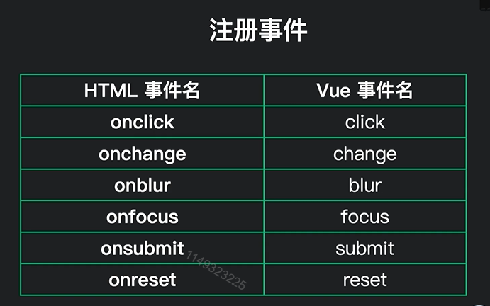
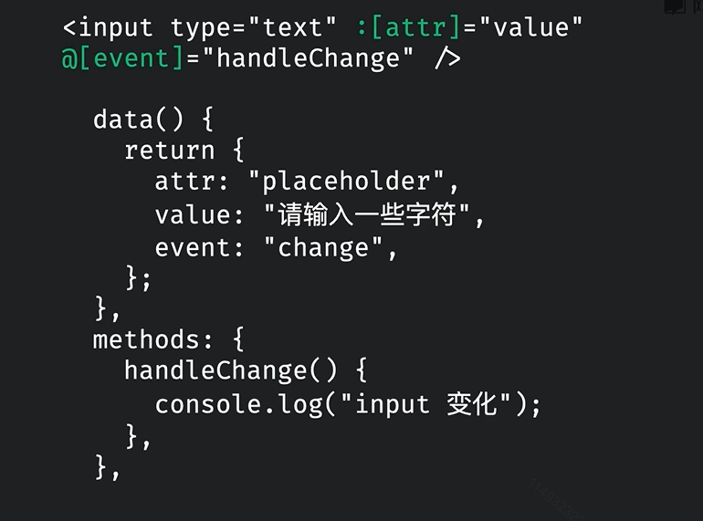

# vue的基本语法

## 插值语法

插值语法往往指定标签体内容

```vue
<div>标签体</div>
<div>{{xxx}}</div>//xxx为js表达式，可以读取到data中的所有属性
```

语法：{{表达式}}

## 指令语法

用于解析标签（包括：标签属性、标签体内容、绑定事件....）

### 1）v-bind

v-bind可以简写为：(一个冒号)

v-bind：单向的数据绑定，当标签属性想要访问data中的数据时，就需要加上`:`

```vue
<a v-bind:href="xxx">点我去百度噢</a>
//xxx同样也是js表达式

//简写版
<a :href="xxx">点我去百度噢</a>
```


### 2）v-on

v-on:事件名(参数)可以简写为@事件名(参数)



函数传参问题：

```javascript
//如果不传参数
<button v-on:click="showInfo">点我提示信息</button>

//showInfo函数会有一个自带的event参数
```

```javascript
//如果传入参数
<button v-on:click="showInfo(要传参数,$event)">点我提示信息</button>

//如果要传入参数，还想要传入event参数 必须在后面小括号中写上$event
```

v-on用来绑定事件

```javascript
<button v-on:click="showInfo">点我提示信息</button>

//简写版
<button @click="showInfo">点我提示信息</button>


const vm = new Vue({
    el: '#root',

    // 放数据
    data: {
        name: '钱不二',
    },
    // 需要绑定的事件函数需要丢到methods中
    methods: {
        showInfo(event){
            // console.log(this);//此处this是vm
            alert("同学您好");
        }
    }
})
```


#### v-on和v-bind的高级用法

v-on和v-bind可以通过`[data中变量名]`的形式来动态绑定属性名或事件名儿：



注意：**如果`[]`中括号中值返回的是null，那么该事件或者属性就会被忽略**

### 3）v-model

v-model是双向数据绑定的核心。

v-model:value="参数"可以简写为v-model="参数"

示例：

```vue
<!-- 基础的双向绑定，利用v-on和v-bind -->
<input type="text" @input="handlerInput" :value="val" />
...
data() {
	return {
		value: ''
	}
}

<!--改进版使用v-model,就是v-bind和v-on的结合 -->
<input type="text" v-model="val" />

```


### 4）v-if（v-else-if,v-else）

作用：根据条件渲染模板

当传递为false时，整个标签不渲染。

示例：

```vue
<div v-if='true'>
  我不展示
</div>

```

`v-if`、`v-else-if`、`v-else`三个必须一起**紧挨着使用**，否则不会生效。

示例：

```vue
<div v-if='books.length === 0'>书中第0位</div>
<div v-else-if='books.length === 1'>书中第1位</div>
<div v-else>书中第1位</div>
```


### 5）v-show

作用：根据条件渲染模板（html标签任然会渲染）

和v-if的功能一致，但是还是会渲染捆定的标签，相当于设置了css属性中的`display: none;`

### 6）v-html

`v-html`可以直接解析一段`html`代码输出到模板中。

语法：

```vue
<article v-html="content"></article>

<script>
	data() {
    return {
      content: '<h1>咦嘻嘻<h2>'
    }
  }
</script>
```

### 7）v-once

`v-once`只渲染一次，即使绑定了动态变量，该标签也不会重新渲染。

示例：

```vue
<!-- 即使点击按钮，被v-once标识的标签也不会重复渲染-->
<p v-once>
  list初始长度:{{list.length}}
</p>
<!-- 点击按钮，该标签会不断更新-->
<p>
  list的长度:{{list.length}}
</p>
<button @click="list.push(list.length+1)">
  点我list长度+1
</button>

...
<script>
	data() {
    return {
      list: []
    }
  }
</script>
```


### 8）v-for

v-for指令：

1. 用于展示列表数据
2. 语法：`v-for="(item,index) in xxx" :key="yyy"`

`xxx` 指遍历谁，`item`是每一项，`index`是一个索引值

`yyy`是必须加上的一个标识

3. 可遍历：数组、对象、字符串(几乎不用)、指定次数(几乎不用)

```vue
<body>
    <div id="root">
        <!-- 遍历数组(用的最多) -->
        <ul>
            <!-- v-for写法一 -->
            <li v-for="p in persons" :key="p.id">
                {{p.name}}-{{p.age}}
            </li>
            <!-- v-for写法二 -->
            <li v-for="(p,index) in persons" :key="index">
                {{p.name}}-{{p.age}}
            </li>
        </ul>

        <!-- 遍历对象(用的第二多),value是属性值，key是属性名（并且支持索引，index就是索引） -->
        <ul>
          <!--<li v-for="(value,key, index) in car" :key="key">-->
            <li v-for="(value,key) in car" :key="key">
                {{key}}--{{value}}
            </li>
        </ul>

        <!-- 遍历字符串（几乎不用） -->
        <ul>
            <li v-for="(char,index) in str" :key="index">
                {{char}}--{{index}}
            </li>
        </ul>
        
        <!-- 遍历指定次数(几乎不用)，可以用来生成序号，number从1开始 -->
        <ul>
            <li v-for="(number,index) in 5" :key="index">
                {{number}}--{{index}}
            </li>
        </ul>        
    </div>
    <script>
    Vue.config.productionTip = false; //设置为 false 以阻止 vue 在启动时生成生产提示。   
    const vm = new Vue({
        el: '#root',
        data: {
            persons: [
                {id: '001', name:'张三', age: 18},
                {id: '002', name:'李四', age: 19},
                {id: '003', name:'王五', age: 20}
            ],

            car: {
                name: '奥迪',
                price: '70万',
                color: '黑色'
            },
            
            str: '钱不二'
        }
    })
    // console.log(vm);
    </script>
</body>
```


**要避免v-for和v-if在一起使用（就是不要放在同一个标签上）**

在vue处理指令v-for有更高的优先级，所以在一起使用时，有时会造成性能上的浪费(每次渲染都是先循环，然后再进行判断的)

解决方式：

```vue
<!-- 错误格式-->
<div id="app">
    <p v-if="isShow" v-for="item in list">
        {{ item.name }}
    </p>
</div>

<!-- 转换为外面套一个标签，一般是template，应为template页面渲染不会生成dom节点 -->
<div id="app">
    <template v-if="isShow">
        <p v-for="item in list">{{item.name}}</p>
    </template>
</div>
```


## Vue循环中key的内部原理

1）虚拟DOM中key的作用：

key是虚拟DOM对象的标识，当数据发生变化时，Vue会根据【新数据】生成【新的虚拟DOM】虽有Vue进行【新虚拟DOM】与【旧虚拟DOM】的差异比较，比较规则如下：

2）对比规则：

（1）旧的虚拟DOM中找到了与新虚拟DOM相同的key：

1. 若虚拟DOM中内容没变，直接使用之前的真实DOM
2. 若DOM中内容改变，则生成新的真实DOM，随后替换掉页面之前的真实DOM

（2）旧的虚拟DOM中没找到与新虚拟DOM相同的key：

​	直接创建新的真实DOM，随后渲染到页面


3）用index作为key可能会引发的问题

1. 若对数据进行：逆序添加、逆序删除等破坏顺序的操作，则会产生没有必要的真实DOM更新，页面虽然问题，但是**降低效率**
2. 如果结构中还有输入类DOM：直接会产生错误的DOM更新 ==>页面都会有问题

4）开发中如何选择key？

1. 最好使用每一条数据的唯一标识为key，比如id、手机号、学号等等唯一标识
2. 如果不存在对数据顺序打乱的操作，仅用于页面渲染展示，也可以用index作为key

注意：**能用id等唯一标识，就不用index**

