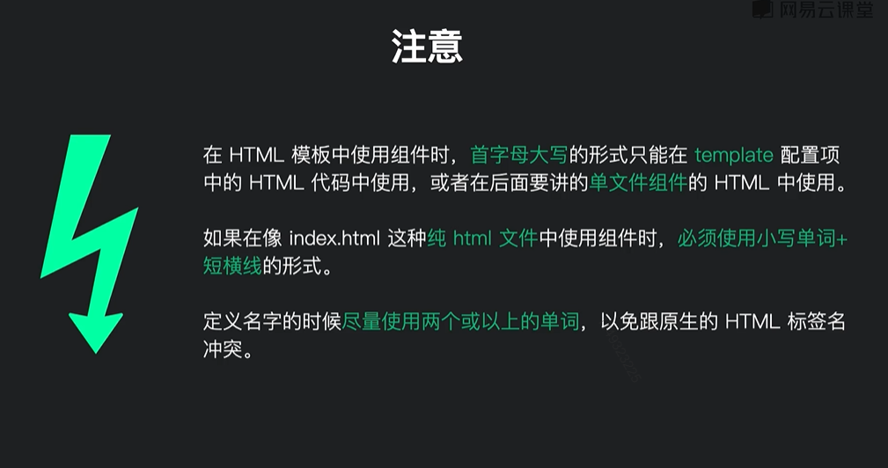

# 组件

组件命名方式：

1. 单词全部小写，用短横连接：`some-component`

2. 首字母大写：`SomeComponent`

注意：用第一种短横方式创建，使用时也只能是短横方式。

但是第二种方式创建，既可以首字母大写、也可以短横方式。




## 原生创建方式

```js
const app = Vue.createApp({});
app.component('some-component', {
  template:`<div>...</div>`,
  data(){},
  methods:{},
  watch:{}
})
```


## 注册组件

### 全局注册

全局注册，无需引入，直接使用。

上面的原生方式，就是全局注册组件的方式。


### 局部注册

局部注册，手动导入

>第一步：导入

```js
import ComponentA from './components.ComponentA.js';
```

>第二步：局部注册

```js
const app = Vue.createApp({
  components:{ComponentA}
});
```

