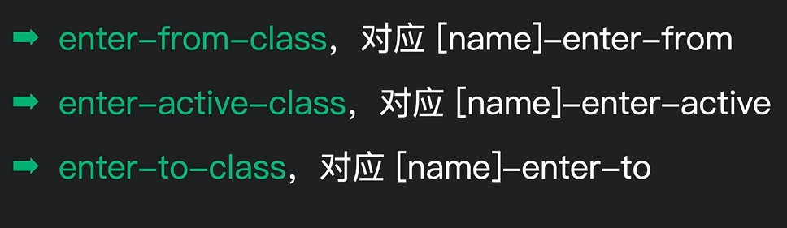
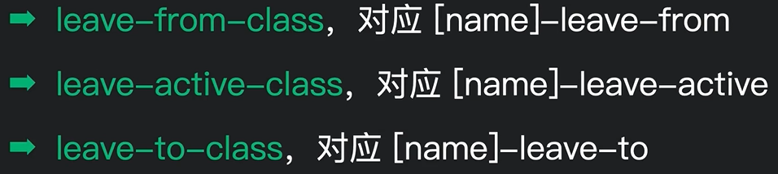

# Vue封装的过渡与动画

**前提：组件|元素务必要拥有`v-show`或`v-if`的指令，或者组件切换（因为组件切换会销毁和产生）**

1）作用：在插入、更新或者移动DOM元素时，在合适的时候给元素添加样式类名。

2）图示：


3）写法

（1）准备好样式

元素进入时的样式：

* v-enter：进入的起点
* v-enter-active：进入过程中
* v-enter-to：进入的终点

元素离开时的样式：

* v-leave：离开的起点
* v-leave-active：离开过程中
* v-leave-to：离开的终点

（2）使用`<transition>`包裹要过渡的元素，并配置name属性：

```html
<transition name="hello">
	<h1 v-show="isShow">你好啊！</h1>
</transition>
```

（3）备注：若有多个元素需要过渡，则需要使用：`<transition-group>`,并且每个元素都要指定`key`值


## 使用

情况一：如果没有给`transition`绑定`name`属性，则使用默认的v-enter...

示例

```vue
<transition>
	<h1 v-show="isShow">你好啊！</h1>
</transition>

<style>
    /* 进入时的三组*/
    .v-enter {
        opcity: 0;
    }
    .v-enter-active {
        transition: .5s;/*控制进场动画时间*/
    }
    .v-enter-to {
        opcity: 1;
    }
    /* 离开动画的三组*/
    .v-leave {
        opcity: 1;
    }
    .v-leave-active {
        transition: .5s; /*控制离场动画时间*/
    }
    .v-leave-to {
        opcity: 0;
    }
</style>
```


第二种情况：如果给`transition`标签添加了`name`属性，则需要修改以下类名

```vue
<transition name="fade">
	<h1 v-show="isShow">你好啊！</h1>
</transition>

<style>
    /* 需要修改以下v-*/
.fade-enter-active, .fade-leave-active {
  transition: opacity .5s;
}
    
.fade-enter, .fade-leave-to 
  opacity: 0;
}
</style>
```


第三种：如果使用`animation+@keyframes`可以直接设置到

`-active`类中：

```css
.v-enter-active {
  animation: scale 0.7s ease-in-out;
}
.v-leave-active {
  animation: scale 0.3s ease-in reverse;
}

@keyframes scale {
  0% {
    transform: scale(0);
  }
  33% {
    transform: scale(1.1);
  }
  66% {
    transform: scale(0.9);
  }
  100% {
    transform: scale(1);
  }
}
```


## 过渡动画小问题

在使用组件过渡动画时，在上一个组件没有完全过渡完毕时，下一个切换组件就会进入过渡动画。

这种进入和离开同时生效有时会造成卡顿问题。

原因是：多个元素有占位问题。

解决方式：

`Vue`提供了三种过渡模式（`Vue`我的超人！）

* **in-out**：新元素先进行过渡，完成之后当前元素过渡离开
* **out-in**：当前元素先进行过渡，完成之后新元素再过渡进入

使用方法：

在`transition`标签新添加一个`mode`属性即可

```vue
<transition name="fade" mode="out-in">
  <!-- ... 要被添加动画的元素 ... -->
</transition>
```


## 多个元素切换小李子

```vue
<template>
	<main>
		<div class="container">
			<Transition name="fade" mode="out-in">
				<!--<div v-if="box === 'box1'" class="box box1"></div>
				<div v-else-if="box === 'box2'" class="box box2"></div>
				<div v-else class="box box3"></div>-->
        
        <!--这里用动态类替换上面的if-else，需要绑定一个key，否则vue不会在类添加后，不会重新渲染div -->
        <div class="box" :class="box" :key="box"></div>
			</Transition>
		</div>
	</main>
</template>
<script setup>
import { computed, ref } from '@vue/runtime-core';

const boxes = ['box1', 'box2', 'box3'];
const current = ref(0);
const box = computed(() => boxes[current.value]);
setInterval(() => {
	current.value = (current.value + 1) % boxes.length;
}, 1500);
</script>
<style scoped>
.container {
	position: relative;
}

#app {
	width: 100vh;
	height: 100vh;
	max-width: 100%;
	display: grid;
	/* justify-items和align-items的简写 */
	place-items: center;
}

h1 {
	margin-bottom: 2em;
}

#messages {
	position: absolute;
	right: 12px;
	bottom: 12px;
	display: flex;
	/* 每次添加进来的标签都放到上面 */
	flex-direction: column-reverse;
	gap: 12px;
}

.box {
	width: 100px;
	height: 100px;
	padding: 0.5em 1.4em;
	border-radius: 4px;
	color: white;
}
.box1 {
	background: linear-gradient(45deg, hsl(240deg, 60%, 50%), hsl(300deg, 90%, 50%));
}
.box2 {
	background: linear-gradient(45deg, hsl(140deg, 60%, 50%), hsl(200deg, 90%, 50%));
}
.box3 {
	background: linear-gradient(45deg, hsl(0deg, 60%, 50%), hsl(50deg, 90%, 50%));
}

.fade-enter-from {
	opacity: 0;
}
.fade-enter-to {
	opacity: 1;
}

.fade-leave-from {
	opacity: 1;
}
.fade-leave-to {
	opacity: 0;
}

.fade-enter-active {
	transition: all 0.7s ease-in-out;
}

.fade-leave-active {
	transition: all 0.3s ease-in;
}
</style>

```


## 组件间切换动画

组件间切换可以通过`<Transition>`标签配合`<component>`动态组件标签一起使用，来完成组件间动画的转变。


示例：

```vue
<template>
	<Transition name='fade' mode="out-in">
  	<component :is='shape'></component>
  </Transition>
</template>
<script setup>
import {ref,computed} from 'vue';
import Rect from './components/Rect.vue';
import Circle from './components/Circle.vue';
  
const shapes =[Rect, Circle];
const index = ref(0);
const shape= computed(()=> {
  shapes[index.value];
})

// 每隔1.5s切换以下shape的值
setInterval(()=>{
  index.value = (index.value + 1) % shapes.length;
},1500)
</script>
```


## 设置列表项的动画

设置列表项的进场动画可以使用`<TransitionGroup>`标签

常用的2个属性：

* `name`：指定动画类名
* `tage`：指定替换的`HTML`元素（可以添加时不影响布局效果来替换原有标签）

通过`<TransitionGroup>`标签他会给每一渲染出的列表项添加一个动画效果，通过该动画效果实现元素切换。

示例：

```vue
			<TransitionGroup name="fade">
				<RectangleBox @click="nums.splice(index, 1)" v-for="(num, index) in nums" :key="num">{{
					num
				}}</RectangleBox>
			</TransitionGroup>
```


注意：该标签也支持那个6个类名，v-enter-from到v-leave-from

并且它还多一个：`.v-move`用来支持列表的平滑移动；

一般设置为：

```css
.v-move {
  transition: transform 0.3s ease-out;
}
```


## 第三方库集成

首先我们要知道`<Transition>`组件支持，通过props属性来设置对应的类名：具体如下

所以说：设置动画效果不仅可以通过那6个类名来设置，也可以通过这6个props来添加已经创建的类。






### 使用animate动画库

在`animate`动画库中，这4个类型`v-enter-from`、`v-enter-to`、`v-leave-from`、`v-leave-to`都是定义好的。

我们只需要修改：**`v-enter-active`、`v-leave-active`即可**

>安装：

```
yarn add animate.css
```


>引入：在App.vue或者index.js入口文件都行

```js
import "animate.css";
```


>使用:

```vue
		<div class="container">
      <!--只用设置：这两个类就行了一个进入，一个离开 -->
			<Transition
				enter-active-class="animate__animated animate__bounceIn"
				leave-active-class="animate__animated animate__bounceOut"
			>
				<RectangleBox v-if="show"></RectangleBox>
			</Transition>
			<button @click="show = !show">隐藏/显示</button>
		</div>
```

注意：类的书写格式，`animate.css`官网有要求：

`animate__animated animate__bounceIn`：可以去官网复制。https://animate.style/


## 使用JavaScript实现动画

vue中给<Transition>和<Transition Group>提供了一系列事件，用来提供使用js切入实现动画。

前置知识：el实例自带的animate方法，去mdn查一下：

https://developer.mozilla.org/zh-CN/docs/Web/API/Element/animate

主要是以下8个：

1. before-enter：在入场动画执行前做的操作，初始化一些动画参数
2. enter：执行入场动画
3. after-enter：入场动画执行完毕之后的收尾操作。
4. enter-cancelled：入场动画被取消后的操作。
5. before-leave：离场动画执行之前的操作。
6. leave：执行离场动画。
7. after-leave：离场动画执行完毕之后的操作。
8. leave-cancelled：离场动画被取消后的操作。

注意：**这些方法还能配合css一起使用**

它们都会有当前dom实例作为参数，enter和leave还多接收一个done参数：

```vue
<!--:css="false"的目的是禁用css，就不不会生产那6个css类了 -->
<!--当然也可以配合css一起使用，这里知识展示单纯用js实现-->
<Transition @leave="leave" :css="false"></Transition>
<script setup>
	function leave(el, done) {
    done()
  }
</script>
```

注意：**done函数需要在进场或离场动画执行完毕后，手动调用**


示例：

```vue
<template>
	<main>
		<div class="container">
			<button @click="show = !show">隐藏/显示</button>
			<Transition @leave="leave" @enter="enter" :css="false">
				<RectangleBox v-if="show"></RectangleBox>
			</Transition>
		</div>
	</main>
</template>
<script setup>
import { ref } from 'vue';
import RectangleBox from './components/RectangleBox.vue';
const show = ref(true);
function enter(el, done) {
	/*
    animate是dom实例自带的方法，它接收2个参数：
    参数一：相当于css中的@keyframes中的百分比
    参数二：相当于css中的animation属性
  */
	const fadeIn = el.animate([{ opacity: 0 }, { opacity: 1 }], {
		duration: 700,
		easing: 'ease-in-out'
	});

	// 调用animate返回实例的onfinish方法,该方法在动画执行完毕时调用回调。
	fadeIn.onfinish = () => {
		// done来结束
		done();
	};
}

function leave(el, done) {
	/*
    animate是dom实例自带的方法，它接收2个参数：
    参数一：相当于css中的@keyframes中的百分比
    参数二：相当于css中的animation属性
  */
	const fadeOut = el.animate([{ opacity: 1 }, { opacity: 0 }], {
		duration: 300,
		easing: 'ease-in'
	});

	// 调用animate返回实例的onfinish方法,该方法在动画执行完毕时调用回调。
	fadeOut.onfinish = () => {
		// done来结束
		done();
	};
}
</script>
```

