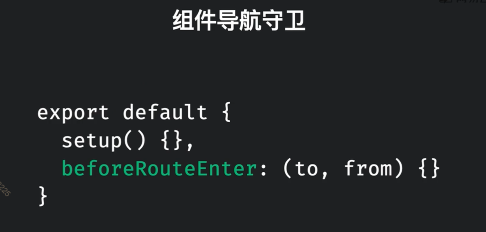
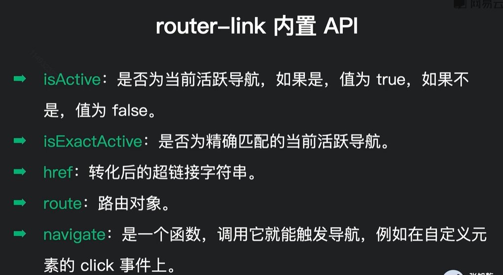
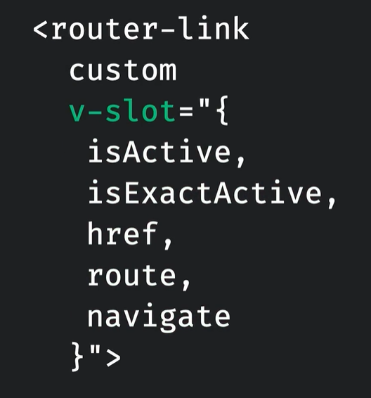
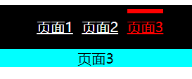
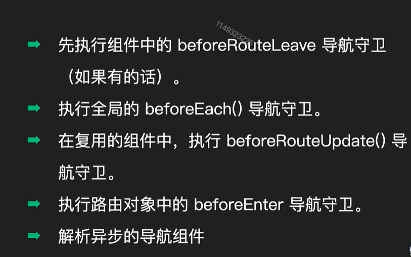
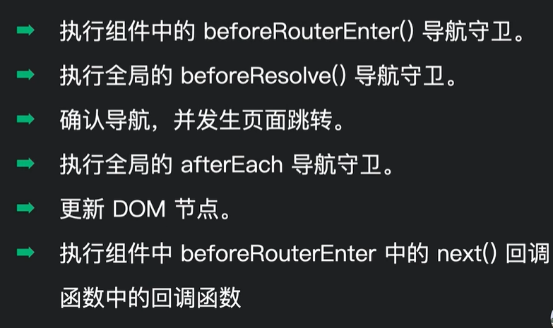
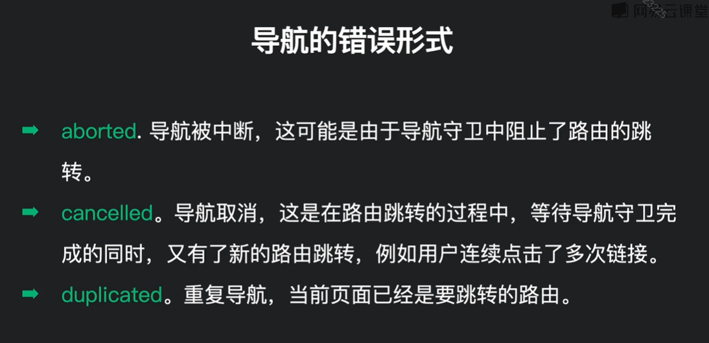
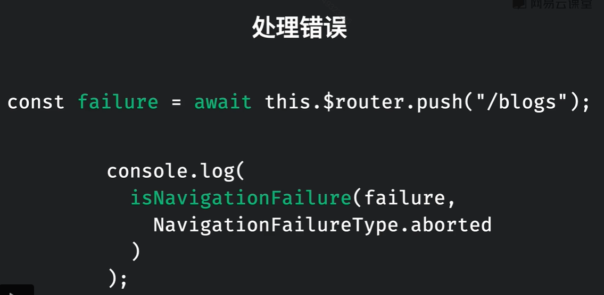

# vue路由router4

还有一些路由操作可以查看，../vue/05-Vue中的路由

>安装

```
yarn add vue-router@4
```

## 基本使用

和router3使用的区别不是特别大：

创建`routes.js`：

```js
import PageOne from './components/PageOne.vue';
import PageTwe from './components/PageTwe.vue';
import PageThree from './components/PageThree.vue';

/*
	createRouter:创建router实例对象
	createWebHistory: 创建history模式路由
*/
import { createRouter, createWebHistory } from 'vue-router';

const routes = [
	{
		path: '/',
		component: PageOne
	},
	{
		path: '/2',
		component: PageTwe
	},
	{
		path: '/3',
		component: PageThree
	}
];

// 和router3有变化的是这里
const router = createRouter({
  // 指定路由跳转模式
	history: createWebHistory(),
  
  // 静态路由表
	routes
});

export default router;

```

`main.js`中use以下：

```js
import { createApp } from 'vue';
import './style.css';
import App from './App.vue';
import router from './routes';
const app = createApp(App);
// 注意奥，这里顺序不能反了，先use最后再挂载mount
app.use(router);
app.mount('#app');

```


**使用：<router-link>和<router-view>功能是不会改变的**

注意：路由是要有出口的，出口就是`router-link`或这`router-view`标签，**每个层级对应自己的出口**

```vue
<template>
	<nav>
		<router-link to="/">页面1</router-link>
		<router-link to="/2">页面2</router-link>
		<router-link to="/3">页面3</router-link>
	</nav>
	<div class="view">
		<router-view></router-view>
	</div>
</template>
```


## 默认二级路由

直接将二级路由的path属性置空，当一级路由被访问时，默认会加载path为空的二级路由：

示例：

```js
//router/index.js
import {createRouter, createWebHistory} from 'vue-router';

import Login from '@/views/Login/index.vue';
import Layout from '@/views/Layout/index.vue';
import Home from '@/views/Home/index.vue';
import Category from '@/views/Category/index.vue';

const router = createRouter({
	history: createWebHistory(import.meta.env.BASE_URL),
	routes: [
		{ // 一级路由
			path: '/',
			component: Layout, 
			children: [ // 二级路由
				{
					path: '', // 置空的作用：当父路径被访问时(/)，直接会访问该路径
					component: Home
				},
				{
					path: 'category',
					component: Category
				}
			]
		},
		{
			path: '/login',
			component: Login
		}
	]
});

export default router;

```


## Router提供的Composition API

由于vue3.2版本使用setup函数，无法访问到this，所以像this.$route、this.$router都无法访问，这时就需要俩API来帮我们拿到这俩变量。


### 模板访问$route，$router

注意，这俩，和vue2是一样的，在模板`template`中，是可以直接访问的：

示例：
```vue
<template>
	<RouterView to="/"  :key="$route.fullPath"></RouterView>
</template>
```


### 访问route对象

通过`useRoute`来获取route对象，相当于`this.$route`

示例：

```js
import { useRoute } from 'vue-router'
const route = useRoute();
route.params.postId
```

### 访问router对象

通过`useRouter`函数来获取router对象，相当于`this.$router`

示例：

```js
import { useRouter } from 'vue-router'
const router = useRouter();
function next() {
  router.push('/${blogPost.value.id + 1}')
}
```


### 组件导航守卫

也有三个对应的函数`onBeforeRouteUpdate`、`onBeforeRouteLeave`、`beforeRouteEnter`

注意：由于`beforeRouteEnter`守卫的执行时机问题(它再setup之前执行)，它不能写在setup函数中，还是需要写到配置对象里，如图：



注意：如果需要使用语法糖setup需要这样写

```vue
<!--两个标签可以共存-->
<script>
	export default {
    beforeRouteEnter(){
      xxx
    }
  }
</script>
<script setup>
	....
</script>
```


### 对于router-link作用域下的方法

对于router-link中v-slot暴露出来的方法，通过`useLink`函数来访问。





示例：

```js
import { useLink } from 'vue-router';
export default {
	setup(props) {
    const {navigate} = useLink(props);
    return {navigate}
	}
}
```


## 路由生命周期

### `onBeforeRouteUpdate()`

作用：当路由更新时自动触发

示例：

```vue
<script setup>
import {onBeforeRouteUpdate} from 'vue-router';
onBeforeRouteUpdate(to => {
	console.log('路由改变了', to);
});
</script>
```


### `onBeforeRouteLeave()`

作用：当离开时自动触发自动触发

示例：

```vue
<script setup>
import {onBeforeRouteLeave} from 'vue-router';
onBeforeRouteLeave(() => {
	console.log('离开了当前路由页面了');
});
</script>
```


## 动态路由匹配

可以通过params参数来配置并匹配动态路由：

实例：

```js
const routes = [
  {
    path: '/',
    component: BlogListPage
  },
  {
    // 这里接收一个postId来动态的传递
    path: '/:postId',
    component: BlogPostPage
  }
]


// 路由组件中获取postId的方式,vue2方式
this.$route.params.postId
```

通过：id来跳转不同的路由，这也就可以再通过传递的不同`id`，来请求不同的页面数据进行渲染


## 路由不刷新问题(同组件跳转，路由缓存)

基本上是针对动态路由匹配。

问题：**当路由组件的数据，公用同一个组件时**，如果再组件中进行跳转，就会发现，虽然URL改变了，但是组件中的内容不会发生改变。

示例：

```js
// router.js
[
  {
    path: '/users/:id',
    name: 'users',
    component: user
  }
]
```

注意：**当用户从`/users/123456`跳转到`/users/abcde`时，就会出现路由缓存问题**


这个问题的原因是什么？

vue对这种同组件之间的路由跳转，只是数据发生改变时，不会重新销毁和再创建组件的而是直接复用组件实例。这就导致组件的声明周期会失效，生命周期中获取的数据自然也会失效。


解决方式：

一：通过watch来监听，this.$route.params的变化，当params变化我就重新获取数据

```js
watch() {
  "$route.params": {
    handler(params, oldParams) {
      // 触发声明周期中获取数据的回调
    },
    // 注意watch是懒监视，第一次不会监听，需要immediate属性
    immediate: true
  }
}

// 有时候一些特殊场景我们也可以用watchEffect()来帮助我们自动收集依赖
```


二：让组件实例不复用，强制销毁重建

可以给`router-view`标签添加`key`属性

```vue
<RouterView :key="$route.fullPath"></RouterView>
```

缺点：这样写太过于粗暴，可能会让一些接口造成浪费


原因：`key`属性常常是和v-for结合使用的，但是他还有一个作用**就是它可以用于强制替换一个元素/组件而不是复用它**

所以有些地方很有用：

* 在适当的时候触发组件的生命周期钩子
* 触发过渡


三：利用路由自身的钩子函数`onBeforeRouteUpdate`

`onBeforeRouteUpdate`钩子函数是当路由变化后会被调用：

```vue
<script setup>
import {onMounted, ref} from 'vue';
import {useRoute, onBeforeRouteUpdate} from 'vue-router';
import {getCategoryAPI} from '@/apis/category.js';
import {getBannerAPI} from '@/apis/home.js';
import GoodsItem from '../Home/components/GoodsItem.vue';

const categoryData = ref({});
const bannerList = ref([]);
const route = useRoute();

// 修改一下接受参数
const getCateGory = async (params = route.params) => {
	const {data: res} = await getCategoryAPI(params.id);
	categoryData.value = res.result;
};

// 获取banner
const getBanner = async () => {
	const {data: res} = await getBannerAPI({distributionSite: '2'});
	bannerList.value = res.result;
};

// 路由改变时，讲改变参数传如
onBeforeRouteUpdate(to => {
	getCateGory(to.params);
	console.log('路由改变了', to);
});

onMounted(() => {
	getCateGory();
	getBanner();
});
</script>
```


示例讲解：上面的利用`onBeforeRouteUpdate()`来触发获取分类数据，`banner`数据都是一致的所以不需要多次重复请求来浪费性能


## 动态参数匹配(+,?,*)

`+`号限制url片段至少出现1次

实例：

```js
path: '/:categories+'

// 它就能匹配
'/clothes'

'/clothes/t-shirt'

// 不能匹配
'/'
```


`*`号代表出现0次或者多次

示例：

```js
path: '/:categories*'

// 能匹配所有
/clothes

/clothes/t-shirt

/
```


`？`限定url片段出现0次或者1次

示例：

```js
path: '/:categories?'

// 能匹配
'/clothes'

'/'

// 不能匹配
'/clothes/t-shirt'

```

匹配404

示例：

```js
"/:notFound(.*)/*"
```

### 匹配优先级

路由中：谁的路由路径中描述的越明确，谁的优先级就越高。

例如：

```js
"/:postId"

"/about"  // 优先级更高

// 如果都是动态的,谁先定义谁优先级高
"/:postId"和"/:userId"

```

查询优先级的网站：https://paths.esm.dev/?p=AAMsIPQgYAEL9lNgQAECUgPgDIFiDgCg#


## 命名视图(很好用！)

可以给每一个<router-view>标签添加一个`name`属性，来标识每一个<router-view>是那个组件来渲染。

注意：**如果components中对应name的组件没有配置，那么`router-view`也不会被渲染。**

示例：

```vue
<template>
<!--三个router-view对应三个块儿-->
	<nav>
  	<router-view name="nav"></router-view>
  </nav>
	<main>
  	<router-view></router-view>
  </main>

	<footer>
  	<router-view name="footer"></router-view>
  </footer>
</template>
```

路由表文件：routes.js

```js
const routes = [
  {
  path: '/',
  /*
  	1.这里要设置components来展示多个router-view需要展示的组件,对象的key是name属性值，value是组件
  */
  components: {
    nav: NavBar,
    default: HomePage,
    footer: FooterView
  }
  /*
  	2.配置完毕后：访问/路径时，就会同时展示着3个组件出来
  */
  
	}
  {
  	/*
  		3.访问/about时，同时胡会展示下面3个组件
  	*/
  	path: '/about',
  	components: {
      nav: NavBar,
      default: AboutMe,
      footer: FooterView
  	}
  },
   
]
```

### 嵌套路由使用命名视图

嵌套路由就是多配置一个`children`属性，命名视图的基础配置是一样的。


示例：

页面结构：
```vue
<template>
	<main>
  	<router-view></router-view>
    <router-view name="rightSideBar"></router-view>
  </main>
</template>
```

路由表：

```js
const routes = [
  {
    path: '/blogs',
    component: BlogManageMent,
    // new 子路由
    children: [
      {
        path: 'new',
        components: {
          default: AddBlog,
          rightSideBar: RightSidebar
        }
      },
      {
        path: 'details',
        /*
        	这里只写了默认的组件，那么rightSideBar对应的router-view就不会渲染
        */
        component: BlogDetails
      }
    ]
  }
]
```


## 设置导航的高亮样式

在vue中<router-link to="xxx">当匹配到对应的URL时，会自动添加一个类叫`router-link-active`（和react-router差不多，react添加的类名叫active）

所以：我们可以直接设置这个类名给他添加一些样式就行了：

```css
.router-link-active {
	position: relative;
	color: red;
}

.router-link-active::before {
	content: '';
	position: absolute;
	bottom: calc(100% + 5px);
	width: 100%;
	height: 5px;
	background-color: red;
}
```

效果：（丑的鸭匹😓）



**第二种方式：自定义类名，添加一个linkActiveClass属性**

示例：

```vue
<template>
	<router-link ActiveClass="active"></router-link>
</template>
```


### 高亮样式的小问题

vue中设置高亮样式时，也会有一个路由匹配的小问题出现：

例如：有如下代码

```vue
<template>
	<router-link to="/home"></router-link>
	<router-link to="/home/news"></router-link>
</template>
```

这个时候点击第二个`/home/news`时，第一个`/home`的链接也会被激活（和react那个一样）

解决办法：

通过内置的精确匹配类来设置样式：(添加一个`exact`)

```css
.router-link-exact-active {
	position: relative;
	color: red;
}

.router-link-exact-active::before {
	content: '';
	position: absolute;
	bottom: calc(100% + 5px);
	width: 100%;
	height: 5px;
	background-color: red;
}
```

方法2：

通过`linkExactActiveClass`属性来添加类。

```vue
<template>
	<router-link linkExactActiveClass="active"></router-link>
</template>
```

### 全局添加样式

我们可以在路由表中的`createRouter`方法创建实例时，修改一下配置项，配置我们的高亮样式：

`routes.js`:

```js
const router = createRouter({
	history: createWebHistory(),
	routes,
  // 不精确的
  //linkActiveClass: 'xxx'
  
  // 精确的
  linkExactActiveClass: 'xxx'
});
```

## 路由守卫

1）作用：对路由进行权限控制。

2）分类：全局守卫、独享守卫、组件内守卫

### 导航守卫的参数，及返回值

每个导航守卫都接收`to`、`from`参数。`next`在router4中已经不再建议使用了，next()执行相当于return true

注意：**如果接收了`next`参数，则必须要调用，不能和return true混用。**

在守卫函数中：如果返回`return false`则阻止路由跳转，如果没有返回值或者返回true都会继续跳转

**还能够返回一个对象，来跳转到指定页面**

```js
return {
  // path: '/login'
  name: 'login'
}

// 也可以返回一个字符串
return '/login'
```


### 全局守卫：

写在路由文件中

`routes.js`:

```javascript
const router = createRouter({
	history: createWebHistory(),
	routes
});
// 全局前置路由守卫---初始化时被调用，每次路由切换之前被调用,next不支持使用了哦
router.beforeEach((to, from, next) => {
    console.log('路由被切换了',to, from);
    // 判断是否需要鉴定权限
    if(to.meta.isAuth) {
        if(localStorage.getItem('school')  === 'rehaid'){
            next();
        } else {
            alert('学校名错误，无权限查看');
        }
    } else {
        next();
    }
})

// 导航守卫执行完毕、且组件加载完毕、组件中的导航守卫执行完毕之后、且导航实际跳转前执行。适合加载全局数据，或者在beforeEach做数据权限鉴定完毕后，还有一些特定权限的可以在beforeResolve中实现
router.beforeResolve((to) => {
})

// 全局后置路由守卫---初始化时被调用，每次路由切换切实际跳转之后被调用，这时页面dome已经渲染完毕，可以修改例如：document.title = to.path;
router.afterEach((to, from) => {
    console.log('后置路由守卫',to, from);
    document.title = to.meta.title || '练习';
})


// to:中有meta，path等信息，next()是执行跳转
```

### 独享守卫：

```javascript
//独享路由是写在路由内部的，里面内容和全局前置路由一致
{
    name: 'xinwen',
    path: 'news',
    component: News,
    meta: {isAuth: true, title: '新闻'},
    // 路由跳转时，组件创建前执行,不能访问组件的实例
    beforeEnter:(to, from, next) => {
        console.log('路由被切换了',to, from);
        // 判断是否需要鉴定权限
        if(to.meta.isAuth) {
            if(localStorage.getItem('school')  === 'rehaid'){
                next();
            } else {
                alert('学校名错误，无权限查看');
            }
        } else {
            next();
        }
    }
},
```

注意：**该守卫只有从不同的url跳转进来，才会进行触发。而向动态路由`/:postId`这种的，从`/1`跳转到`/2`就不会触发**


### 组件内路由守卫：

写在组件中，可以给组件添加一些独有的判断时写入

```javascript
//通过路由规则，进入该组件时被调用，此时不能使用this
// 注意：这个回调也是如果有复用组件的情况出现，也只是调用一次，如果有需要，可以使用下面的beforeRouteUpdate路由守卫
beforeRouteEnter (to, from, next) {
  	// 如果需要强行访问vm也可以
  	/*next((vm)=> {
      ...
    })*/
  
    console.log('通过路由规则进入',to,from);
    // 判断是否需要鉴定权限
    if(to.meta.isAuth) {
        if(localStorage.getItem('school')  === 'rehaid'){
            next();
        } else {
            alert('学校名错误，无权限查看');
        }
    } else {
        next();
    }
},
// 导航跳转时，且复用组件时执行，此时组件已经初始化，可以访问组件实例例如动态参数路由,可以使用this
beforeRouteUpdate(to, from) {
  xxx
},

  
//导航跳转时，组件销毁前执行
//可以提示用户有未保存信息等操作，此时组件也可以使用this
beforeRouteLeave (to, from, next) {
    console.log('通过路由规则离开',to,from);
    next();
}
```


### 页面跳转时导航守卫的执行顺序






## 通过路由控制页面滚动行为

**通过`scrollBehavior(to, from, savedPosition)`函数来控制**

参数：to、from和路由守卫一致

`savedPosition`是上次路由界面滚动条的位置，它只有点浏览器的前进和后退时生效。


示例：（进入页面，垂直滚动条在最上面）

```js
import {createRouter,scrollBehavior} from 'vue-router';
const router = createRouter({
	history: createWebHistory(),
	routes,
	scrollBehavior(to, from, savePosition) {
    // 表示进入页面时，垂直滚动条距离顶部0px,水平滚动条距离左边0px
		return {
			top: 0,
      left: 0,
      // 表示平滑滚动到指定位置
      behavior: 'smooth'
		};
    
	}
});
```

示例2：我们设置如果用户点击的是前进和后退，那么保持上次时浏览器滚动条的位置，否则滚动到最上面

```js
import {createRouter,scrollBehavior} from 'vue-router';
const router = createRouter({
	history: createWebHistory(),
	routes,
	scrollBehavior(to, from, savePosition) {
    if(savePosition) {
      return savePosition
    }else {
      return {
        top: 0,
        left: 0
      }
    }
	}
});
```

示例3：也可以返回一个Promise来延迟滚动

```js
import {createRouter,scrollBehavior} from 'vue-router';
const router = createRouter({
	history: createWebHistory(),
	routes,
	scrollBehavior(to, from, savePosition) {
   	return new Promise((resolve, reject) => {
      // 1s后触发滚动
      setTimeout(()=>{
        resolve({
          top: 200
          // 并且还支持一个el属性，可以指定具体dom
          el: '#app'
        })
      }, 1000)
    })
	}
});
```


## 路由的props配置

**props的配置是写在路由里的奥**

```javascript
{
    name: 'xiangqing',
    path: 'detail',
    component: Detail,
    // props的第一种写法 值为对象,该对象中的所有key-value都会以props的形式传给Detail组件
   	props:{a:1, b:'hello'}

    // props的第二种写法 值为布尔值，若布尔值为真，就会把该路由组件收到的所有params参数，以props的形式传给Detail组件,注意传递的params参数都是string类型的
    props:true

    // props的第三种写法 值为函数,以props的形式传给Detail组件，
    props($route) {
        return {
            id: $route.query.id, 
            title: $route.query.title
        };
    }
}
```

第三种好用(●'◡'●)


**接收的时候和父子组件的props参数一样**

示例：

```vue
props:['id','title']

// vue3.2
defineProps(['id','title'])
```


## 分装router-link

封装的目的：

* 自定义UI样式
* 实现复杂业务逻辑

<router-link>标签内置API:


自定义的方式：

custom属性：**表示我们要自定义router-link标签，自定义时必须要写上该属性**

v-slot：暴露所有router-link标签封装好的方法


示例：我们封装一个按钮型的<router-link>

首先创建：`ButtonLink.vue`

```vue
<template>
	<!--使用v-bind绑定所有接收的props-->
	<router-link custom v-bind="$props" v-slot="{ navigate }">
		<button @click="navigate">
      <!--slot用来接收所有Button内容-->
			<slot></slot>
		</button>
	</router-link>
</template>
<script>
import { RouterLink } from 'vue-router';
//console.log(RouterLink.props);
export default {
	props: {
		// 获取router-link标签上所有的props
		...RouterLink.props
	}
};
</script>

```

第二步：在`App.vue`中引入并使用

```vue
<script setup>
import ButtonLink from './components/ButtonLink.vue';
</script>

<template>
	<nav>
		<router-link to="/">页面1</router-link>
		<router-link to="/2">页面2</router-link>
    <!--自己封装好的ButtonLink-->
		<ButtonLink to="/3">页面3</ButtonLink>
		<!-- <router-link to="/3">页面3</router-link> -->
	</nav>
	<div class="view">
		<router-view></router-view>
	</div>
</template>

<style>
nav {
	display: flex;
	justify-content: center;
	align-items: center;
	width: 100%;
	height: 50px;
	/* color: white; */
	background-color: black;
}
nav > a {
	color: white;
	margin-left: 10px;
}

.router-link-active {
	position: relative;
	color: red;
}

.router-link-active::before {
	content: '';
	position: absolute;
	bottom: calc(100% + 5px);
	width: 100%;
	height: 5px;
	background-color: red;
}
</style>

```

效果：


## 处理导航的错误

**导航的错误形式**：



注意：只有编程式的导航才能够返回错误信息。

调用`this.$router.push()`或者`this.$router.replace()`等会返回一个参数。参数中存储的错误信息。



示例：

```vue


<template>
	<nav>
		<router-link to="/">页面1</router-link>
		<router-link to="/2">页面2</router-link>
		
		<button @click="redirect">页面3</button>
	</nav>
	<div class="view">
		<router-view></router-view>
	</div>
</template>
<script>
import { isNavigationFailure, NavigationFailureType } from 'vue-router';
export default {
	methods: {
		async redirect() {
      
			const failure = await this.$router.push('/3');
			console.log(failure);
			// 判断错误类型是否为abort
			console.log(isNavigationFailure(failure, NavigationFailureType.aborted));
			// 可以查看路由的来和去
			console.log(failure.to, failure.from);
		}
	}
};
</script>
```


## 动态添加路由

通过`this.$router.addRoute(currentRoute)`方法添加路由，参数和静态路由表一致。

示例：

```js
this.$router.addRoute({
  path:'/blogs',
  name: 'blogs',
  component: BlogListPage
})
```


**动态删除路由**：

通过`this.$router.removeRoute('blogs')`删除。

参数：是配置路由的`name`属性值

如果没有name属性，则通过addRoute方法返回的回调，来删除添加的路由.

示例：

```js
const removeRoute = this.$router.addRoute();
removeRoute();

// 通过name删除
this.$router.removeRoute('blogs')
```


## 路由动态效果

### 全局效果

就是所有路由跳转都是一个效果，获取`<router-view>`具名插槽的`Component`属性，配合动态路由即可

例如：

```vue
<template>
	<!--router-view作用域下传递上来的插槽，Component是每个路由组件的名称-->
	<router-view v-slot="{Component}">
    <Transition name='fade' mode="out-in">
      <!--这里注意两个c的大小写-->
      <component :is="Component">
  	</Transition>
  </router-view>
</template>

<style>
  /*设置样式*/
  .fade-enter-to {
    xx
  }
  ....
</style>
```


### 给不同组件设置单独过渡效果

设置单独过度效果，需要使用路由`meta`属性，再配合`<Transition>`标签的`name`属性来指定不同的过度css样式，这样就可以给不同路由组件不同的样式效果。

<router-view v-slot="{Component, route}">

route：可以获取当前跳转路由的route属性

注意：要给`<component :is="Component" :key="route.path">`加上`key`属性防止**动态参数路由**跳转动画失效问题。

示例：

```vue
<template>
	<!--router-view作用域下传递上来的插槽，Component是每个路由组件的名称-->
	<router-view v-slot="{Component, route}">
    <Transition :name='route.meta.transition' mode="out-in">
      <!--注意要加上:key属性，防止动态参数路由跳转动画消失问题-->
      <component :is="Component" :key="route.path">
  	</Transition>
  </router-view>
</template>
```

路由表`routes.js`

```js
const routes = [
	{
		path: '/',
		component: PageOne,
		meta: {
      // 这个属性就是Transition标签的name
			transition: 'fade'
		}
	}
]
```

