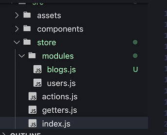
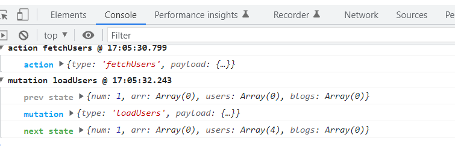
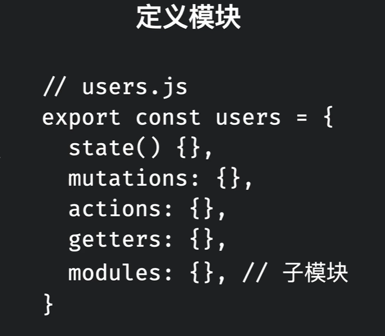
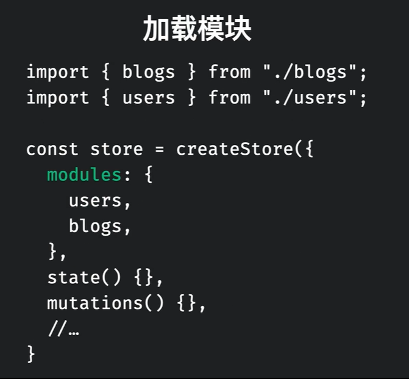
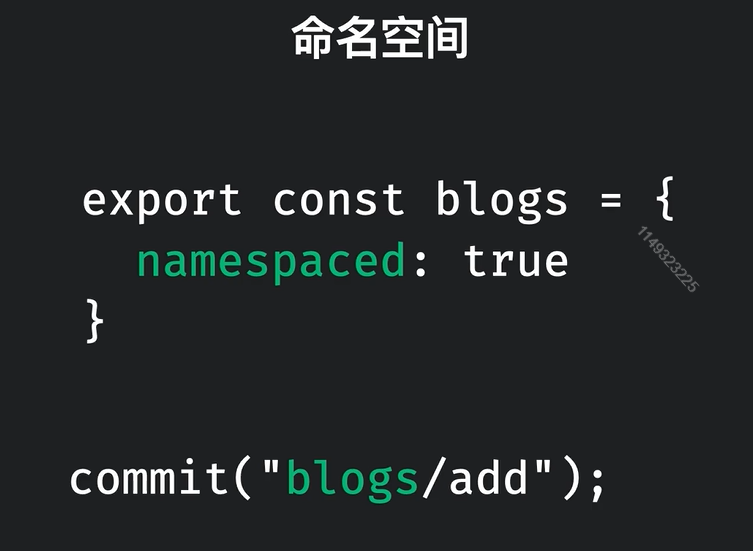

# vuex4.0

核心还是那4个：`state`、`action`、`getter`、`mutation`


## vuex应用文件结构



如果：子模块内容很多也可以及将子模块拆分成`index.js`、`mutations`、`getters`、`actions`


## vuex的compositionAPI

vuex的API就只有一个`useState`调用后返回一个store对象，相当于this.$store

**属于是返璞归真了属于是，又回到原来那样的写法了╮(╯▽╰)╭**

之后所有的state、getters、commit、dispatch都会由它来触发。

示例：

```vue
<script setup>
	import {useState, computed} from 'vuex';
  // 创建store
  const store = useState;
  // state
  const users = computed(() => {
    return store.state.users;
  })
  // getters
  const limitedUser = computed(() => {
    return store.getters.limitedUser;
  })
  // 有命名空间的getters
  const limitedBlogs = computed(() => {
    return store.getters['blogs/limitedBlogs']
  })
  
  
  // commit触发mutations
  const addBlog = (payload) => store.commit('blogs/addBlog', payload);
  
  // dispatch触发actions
  const addUserAsync = (payload) => {
    store.dispatch('addUserAsync', payload);
  }
</script>
```


## 定义state

state是vuex中存储的状态，可以供所有需要使用组件进行使用

示例：

```js
import { createStore } from 'vuex';

const store = createStore({
	state() {
		return {
			num: 1
		};
	}
});


// 也可以直接定义出来,之后写进createStore配置项
const state =() => {
 	return {
    xxx
  }
}
```

## 定义actions

actions功能其实和mutations差不多，但是actions中最特殊的一点就是，actions是支持异步的，而mutations只能同步。

注意：**actions是不能直接修改状态的，需要调用定义好的mutations，并且可以触发多个mutations**

一般的步骤：

1. actions发起异步请求获取数据
2. 调用mutations存储数据到state上

通过`this.$store.dispatch('xxx')`来触发

示例：

```js
import { createStore } from 'vuex';
const users = [
	{
		id: 1,
		name: 'John',
		age: 32
	},
	{
		id: 2,
		name: 'kko',
		age: 18
	},
	{
		id: 1,
		name: 'nik',
		age: 28
	},
	{
		id: 1,
		name: 'mike',
		age: 24
	}
];
const store = createStore({
	state() {
		return {
			users: []
		};
	},
	mutations: {
		// 修改users
		loadUsers(state, payload) {
			state.users = payload.users;
		}
	}
	actions: {
		fetchUsers(context) {
 			// 定时器假装异步一下
			setTimeout(() => {
        // 触发mutations
				context.commit('loadUsers', { users });
			}, 2000);
		}
	}
});

export default store;

```

**actions的高级用法1：**它也可以接收参数，就和mutations中的paryload一样

示例：

```js
	actions: {
		fetchUsers(context, payload) {
			// 传递一个payload.limit来裁切数组users
			setTimeout(() => {
				context.commit('loadUsers', { users: users.slice(0, payload.limit) });
			}, 2000);
		}
	}
```

使用：

```vue
<script>
import { mapState, mapMutations, mapGetters, mapActions } from 'vuex';
export default {
	created() {
		// 通过dispatch触发actions
		// this.$store.dispatch('fetchUsers');
		this.fetchUsers({ limit: 2 });
	}
};
</script>
```


**actions的高级用法2：**在actions中触发别的actions来完成更加复杂的异步逻辑。通过context.dispatch来触发actions

注意：**如果要强调执行顺序的化，需要返回Promise来使用(使用async和await就行，应为他俩就是基于Promise的)**

例如：现在有一个情景，需要加载博客和用户数据，需要先加载用户再加载博客数据

```js
import { createStore } from 'vuex';
const users = [
	{
		id: 1,
		name: 'John',
		age: 32
	},
	{
		id: 2,
		name: 'kko',
		age: 18
	},
	{
		id: 3,
		name: 'nik',
		age: 28
	},
	{
		id: 4,
		name: 'mike',
		age: 24
	}
];
const store = createStore({
	state() {
		return {
			users: [],
			blogs: []
		};
	},
	mutations: {
		// 修改users
		loadUsers(state, payload) {
			state.users = payload.users;
		},
		loadBlogs(state, payload) {
			state.blogs = payload.blogs;
		}
	}
	actions: {
		// 结构出context中的commit
		async fetchUsers({ commit }) {
			// 这个是模拟调用用户数据API
			await new Promise(resolve => setTimeout(resolve, 1000));
			commit('loadUsers', { users });
		},

		// 同时加载博客和用户数据，并且用户数据先加载
		async fetchUsersAndBlogs({ dispatch, commit }, payload) {
			// 先调用获取用户数据的actions
			await dispatch('etchUsers');
			// 再调用获取blogs的API
			await new Promise(resolve => setTimeout(resolve, 1000));
			// 最后再调用mutations存储数据到state上
			commit('loadBlogs', { blogs });
		}
	}
});

export default store;

```


## 定义mutations

mutations作为唯一能够修改state的途径，通过一个对象进行定义，里面存储各种操作state的函数

示例：

```js
import { createStore } from 'vuex';

const store = createStore({
	state() {
		return {
			num: 1,
      arr:[]
		};
	},
  // 定义mutations
	mutations: {
		addNum(state) {
			return (state.num += 1);
		},
    
    // 注意：mutations支持传递参数，一般传递一个对象，可以让我们传递多个参数。
    pushToArr(state, payload) {
      
      
      // 注意看这里，redux中就不允许这样写。
      state.arr.push(payload.ele)
    }
	}
});


// 或者像redux一样，将mutations的名称存起来，然后通过动态属性名创建
import {INCREMENT} from './mutation_types.js'
const store = createStore({
  store() {
    return {xx}
  },
  mutations: {
    // 注意这里[INCREMENT]使用的是动态属性名
    [INCREMENT](state) {
      ...
    }
  }
})
// 注意：使用的时候直接使用这个常量
...mapMutations([INCREMENT])
```

`mutation_types.js`:文件内容

```js
export const INCREMENT = 'increment';
```


## 定义getters

getters可以称作是state的计算属性，它定义的方式，和使用方式和计算属性基本一致。作用：就是用来加工一个state。


注意：getters自从vue3.2版本之后，默认都会缓存结果，但是如果getters返回函数，则不会缓存结果

基本定义：

```js
import { createStore } from 'vuex';

const store = createStore({
	state() {
		return {
			num: 1,
			arr: [],
			users: [
				{
					id: 1,
					name: 'John',
					age: 32
				},
				{
					id: 2,
					name: 'kko',
					age: 18
				},
				{
					id: 1,
					name: 'nik',
					age: 28
				},
				{
					id: 1,
					name: 'mike',
					age: 24
				}
			]
		};
	},
	mutations: {
		addNum(state) {
			return (state.num += 1);
		},
		pushToArr(state, payload) {
			state.arr.push(payload.ele);
		}
	},
	getters: {
    // 这里我们加工了一下，取users中年龄大于26岁的人
		usersOlderThan26(state) {
			return state.users.filter(user => user.age > 26);
		}
	}
});

export default store;

```

**getters高级用法1:**在getters中使用别的getters来完成更复杂的逻辑

示例：

```js
import { createStore } from 'vuex';

const store = createStore({
	state() {
		return {
			num: 1,
			arr: [],
			users: [
				{
					id: 1,
					name: 'John',
					age: 32
				},
				{
					id: 2,
					name: 'kko',
					age: 18
				},
				{
					id: 1,
					name: 'nik',
					age: 28
				},
				{
					id: 1,
					name: 'mike',
					age: 24
				}
			]
		};
	},
	mutations: {
		addNum(state) {
			return (state.num += 1);
		},
		pushToArr(state, payload) {
			state.arr.push(payload.ele);
		}
	},
	getters: {
		usersOlderThan26(state) {
			return state.users.filter(user => user.age > 26);
		},
		// 参数2：getters是所有getter组成的一个对象
		numberOfUsersOlderThan26(state, getters) {
			// 返回年龄大于26的人数
			return getters.usersOlderThan26.length;
		}
	}
});

export default store;

```


**getters高级用法2：**getters中也可以传递参数，在getters中再返回一个函数，供调用者传递参数。

示例：

```js
import { createStore } from 'vuex';

const store = createStore({
	state() {
		return {
			num: 1,
			arr: [],
			users: [
				{
					id: 1,
					name: 'John',
					age: 32
				},
				{
					id: 2,
					name: 'kko',
					age: 18
				},
				{
					id: 1,
					name: 'nik',
					age: 28
				},
				{
					id: 1,
					name: 'mike',
					age: 24
				}
			]
		};
	},
	mutations: {
		addNum(state) {
			return (state.num += 1);
		},
		pushToArr(state, payload) {
			state.arr.push(payload.ele);
		}
	},
	getters: {
		usersOlderThan26(state) {
			return state.users.filter(user => user.age > 26);
		},
    // 定义好的getters返回一函数，并接收参数，高阶函数写法
		UsersOlderThan(state) {
			return age => {
				return state.users.filter(user => user.age > age);
			};
		}
	}
});

export default store;

```

在模板中使用：

```vue
<script>
import { mapGetters } from 'vuex';
export default {
		computed: {
		...mapGetters(['usersOlderThan26', 'UsersOlderThan'])
	},
};
</script>

<template>
		<!--调用getters并传递参数-->
		<p v-for="user in UsersOlderThan(20)">user: {{ user }}</p>
	</div>
</template>
```


## 4个map方法

### mapState

将vuex中的属性`state`映射为computed：

简化：`$store.state.xxx`

```vue
<script>
import { mapState } from 'vuex';
export default {
	// 写法1数组形式：计算属性名要和state中属性名称一致
	// computed: mapState(['num'])

	computed: mapState({
		// 写法2：对象+字符串
		// num: 'num'

		// 写法3：对象+函数（适合对state还需要进行操作）
		num: state => state.num
	})
};
</script>

<script>
	export default {
    // 如果还有其他计算属性
    computed: {
      name() {
        return '自己的计算属性'
      },
      ...mapState(['num'])
    }
  }
</script>
```


### mapMutations

mapMutations能直接将vuex中定义好的mutations直接映射到methods中

简化：`$store.commit('xxx')`

示例：

```vue
<script>
import { mapState, mapMutations } from 'vuex';
export default {
	computed: mapState(['num', 'arr']),
	methods: {
    // 具体参数内容和mapState一样
		...mapMutations(['addNum', 'pushToArr'])
	}
};
</script>

<template>
	<div>num:{{ num }}</div>
	<button @click="addNum">点我+1</button>
	<hr />
	<div>arr: {{ arr }}</div>
	<button @click="pushToArr({ ele: arr.length + 1 })">点我添加arr元素</button>
	<!--type指定触发的mutations，之后会将这个对象除了type以外所有的属性传递给payload-->
	<button @click="$store.commit({ type: 'pushToArr', ele: 'commit' })">commit传递参数</button>
</template>
```

store.js中定义的mutations:

```js
import { createStore } from 'vuex';

const store = createStore({
	state() {
		return {
			num: 1,
			arr: []
		};
	},
	mutations: {
		addNum(state) {
			return (state.num += 1);
		},
    // 这里接收一个payload作为参数，一般都接受一个对象
		pushToArr(state, payload) {
			state.arr.push(payload.ele);
		}
	}
});

export default store;

```


### mapGetters

mapGetters也是快速帮助我们将getters中的属性映射到计算属性中供组件使用。

简化：`$store.getters.xxx`

```js
computed: {
  ...mapGetters(['usersOlderThan26', 'UsersOlderThan'])
},
```


### mapActions

mapActions可以帮助我们快速的将actions直接映射进methods中

简化：`this.$store.dispatch('xxx')`

示例：

```vue
<script>
import { mapActions } from 'vuex';
export default {
	created() {
		// 通过dispatch触发actions
		// this.$store.dispatch('fetchUsers');
		this.fetchUsers({ limit: 2 });
	},
	methods: {
		...mapActions(['fetchUsers'])
	}
};
</script>
```


### 开启命名空间后的4个map方法

在开启命名空间后，可以给map方法传递两个参数，第一个参数为对应模块的名字，第二个参数是对应传递的参数。

示例：

```js
...mapActions("模块名", ['fetchUsers'])


computed: {
  ...mapGetters("模块名", ['usersOlderThan26', 'UsersOlderThan'])
}


methods: {
  // 具体参数内容和mapState一样
  ...mapMutations("模块名", ['addNum', 'pushToArr'])
}


computed: {
  name() {
    return '自己的计算属性'
  },
    ...mapState("模块名", ['num'])
}
```


## vuex中使用插件

使用插件可以在vuex配置项中添加一个`plugins`配置项用来指示添加的插件儿。

### vuex日志插件

基本使用方式：

```js
import { createStore, createLogger } from 'vuex';
const store = createStore({
	plugins: [createLogger()],
  ...
})
```

之后就会在浏览器中看到输出的日志信息：




## 模块化（重点）

模块化可以让减少体积，隔离。




在主store文件中加载：（有createStore的就是顶级模块）

每个modules都是一个vuex配置对象。




### 在没有开启命名空间条件下

示例：

```js
// 访问模块下的state，要加上模块名称
const posts = computed(() => store.state.post.list);


// 访问顶级模块的state时
store.state.xxx
```

注意：在没有开启命名空间条件下**要让各个模块的方法不能重名，如果重了调用时，就会出现问题**


1）模块中的mutations的第一个参数，state接受本模块的状态

**修改本模块的state只能通过本模块的mutations**

示例：

```js
// users.js
mutations: {
  /*
  	state:为本模块users上定义的状态
  */
  addUser(state, payload) {
    state.list.push(payload.user);
  }
}
```


2）模块中的getters：

第一个参数，`state`：也是本模块的状态，

第二个参数,`getters`：**可以访问所有模块的`getters`**

第三个参数，`rootState`：**可以访问所有模块的状态**

示例：

```js
getters:{
  limitedUser(state, getters, rootState) {
    // state为本模块状态
    // getters参数可以访问所有模块getters
    // rootState可以访问所有模块状态
  }
}
```


3）模块中的actions：

1. 可以解构出`context`的`commit`属性：可以**触发所有模块的**mutations
2. 可以解构出`context`的`dispatch`属性：可以**触发所有模块**的其他`actoins`
3. 可以解构出`context`的`rootState`属性：可以**访问所有其他模块**的状态
4. 可以解构出`context`的`getters`属性：可以**访问所有其他模块**的`getters`

示例：

```js
actions: {
  /*
  	这4个属性都是从context中解构出来的
  */
  addUserAsync({commit, dispatch, rootState, getters}, payload) {
    setTimeout(()=> {
      commit('addUser', payload);
      dispatch('add...')
    },2000)
  }
}
```


### 命名空间

在不开启命名空间时，最后所有模块的内容都会进行合并，合并在顶级模块中。

这样就会出现一个问题：如果两个模块中有相同内容怎么办？触发就会同时触发两个模块的内容，难免会造成`bug`出现。

命名空间的开启：



示例：

```js
// 在暴露的子模块上添加配置对象namespaced: true
export const blogs = {
  namespaced: true
  ...
}

// 使用时开头加上对应的模块名action,mutations,getters中都需要添加前缀
commit('模块名/模块名下的方法');

// 例如给user.js模块添加命名空间
commit('user/addUsers');
```


1）开启命名空间后，模块中的getters：（**和不开启命名空间时有区别**）

第二个参数`getters`就只能访问到自己模块身上的getters了

第四个参数`rootGetters`才能访问到顶级模块和其他模块的getters

示例：

```js
// user.js user模块的getters
getters: {
  limitedUsers(state, getters, rooteState, rootGetters) {
    // rootGetters才能访问到所有getters
    
    // 例如：访问blogs模块下的getters
    rootGetters["blogs/limited..."]
  }
}
```


2）开启命名空间后，模块中的actions：

能够解构出来的那几个参数是一样的：只是如果要访问其他模块的内容时，需要添加上命名空间类似`["模块名/模块内容"]`

示例：

```js
actions: {
  addUserAsync({commit, dispatch, rootState, getters, rootGetters}) {
    // getters为本模块的getters
    // rootGetters可以访问所有模块getters需要带上命名空间
    // commit和dispatch可以访问所有，需要加上命名空间
    
    // rootState一样
  }
}
```


3）在模块actions中定义一个全局的的actions

（这个真的没必要，如果需要全局可以直接去全局定义。当然它的作用就是可以减少全局中的代码量）

示例：

```js
// 在blog模块的actions中定义了一个全局actions

actions: {
  // 注意这里就要写成对象形式，添加一个root属性
  addBlogGlobal: {
    root: true,
    handler(context, payload) {
      ...
    }
  }
}
```


## 自己编写插件

### 状态持久化与还原插件

**第一种实现方式：在页面即将刷新前，将vuex中所有的state保存进localStorage中，之后再还原出来**

优势：可以减少localStorage的写入次数，增强性能

>第一步：在store中创建presist.js

```js
/*
  vuex插件的调用时机：
  在每次vuex刷新时，都会调用
  vuex在每次页面刷新时也会刷新
*/

export default function persistState(store) {
	/**
	 * @param {beforeunload} 页面即将刷新前调用
	 */
	window.addEventListener('beforeunload', e => {
		window.localStorage.setItem('vuex', JSON.stringify(store.state));
	});

	// 状态的还原，每次插件代码执行就还原一次

	const prevState = window.localStorage.getItem('vuex');
	if (prevState) {
		// 调用store.replaceState替换所有状态
		store.replaceState(JSON.parse(prevState));
	}
}

```


>第二步：到主store文件(有createStore函数的)下导入

```js
import { createStore, createLogger } from 'vuex';
import persistState from './persist';
const store = createStore({
  // 注意persistState直接传给plugins
	plugins: [createLogger(), persistState]
})
```


**第二种实现方式：在每次调用mutations时将state写入localStorage中。**

优势：可以及时的更新vuex中的状态，数据同步比较及时和可靠

缺点：造成localStorage写入次数增加，减低性能


> 第一步：在store中创建presist.js

```js
/*
  vuex插件的调用时机：
  在每次vuex刷新时，都会调用
  vuex在每次页面刷新时也会刷新
*/

export default function persistState(store) {
	/**
	 * @param {mutation} 访问mutation信息
	 * @param {state} 修改后的state
	 */
	store.subscribe((mutation, state) => {
		// store.subscribe 监听mutations触发
		window.localStorage.setItem('vuex', JSON.stringify(state));
	});

	// 状态的还原，每次插件代码执行就还原一次

	const prevState = window.localStorage.getItem('vuex');
	if (prevState) {
		// 调用store.replaceState替换所有状态
		store.replaceState(JSON.parse(prevState));
	}
}

```

>第二步：到主store文件(有createStore函数的)下导入

```js
import { createStore, createLogger } from 'vuex';
import persistState from './persist';
const store = createStore({
  // 注意persistState直接传给plugins
	plugins: [createLogger(), persistState]
})
```


### 持久化插件的改进

该持久化插件还可以指定存储的值，还可以传递参数，等等等

示例：

```js
// options为配置项
export default function persistState(options) {
  return (store) => {
    ...
  }
    
    // 还可以使用store.mergeState来合并而不是replaceState
}
```

