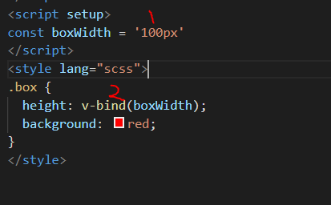

# 01css代码使用js变量

`vue3`中css代码可以利用`v-bind()`直接绑定`js`的变量，需要特殊写法。


## 使用

首先，`script`标签中我们定义变量

```js
<template>
  <div class="box"></div>
</template>
<script setup>
const boxWidth = '100px'
</script>
<style lang="scss">
.box {
  height: v-bind(boxWidth);
  background: red;
}
</style>

```

