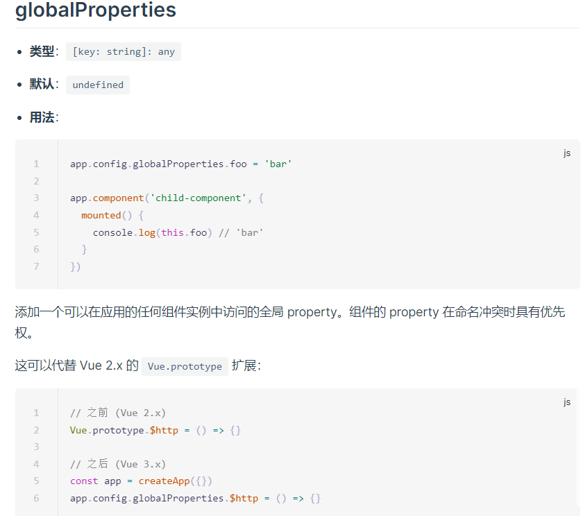

# 全局属性globalProperties

官网原封不动的介绍如下，让我们可以在全局组件中添加方法或者属性(当然一般都是添加方法)




## 例如，我们添加一个时间过滤器

> 第一步，安装Day.js，一个关于时间的插件库

```
npm install Day.js
```


> 第二步创建`src/utils/filters.js`文件

```js
const dayjs = require('dayjs')

/**
 *
 * @param {val} 必传参数 时间戳
 * @param {format } 可选参数，时间格式
 */
const filterTimes = (val, format = 'YYYY-MM-DD') => {
  if (isNull(val)) {
    return '---'
  } else {
    val = parseInt(val) * 1000
    return dayjs(val).format(format)
  }
}

// 判空函数
/**
 *
 * @param {date} 需要判空的变量
 */
export const isNull = date => {
  if (!date) return true
  if (JSON.stringify(date) === '{}') return true
  if (JSON.stringify(date) === '[]') return true
}

// 默认暴露一个添加方法的函数，到main.js中引入并调用
export default app => {
  // 将filterTimes添加到app身上
  app.config.globalProperties.$filters = {
    filterTimes
  }
}

```


>第三步，在main.js中引入

```js
// 引入filter
import filters from '@/utils/filters.js'
// 注意这个函数一定要放在 createApp下面 否则app访问不到
filters(app)
```


>最后，在`template`中直接使用

```vue
<template v-slot="{ row }" v-else-if="item.prop === 'create_time'">
  {{ $filters.filterTimes(row.create_time) }}
</template>
```

