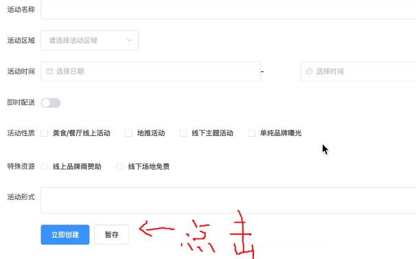

# Vue.data页面级暂存状态

如果要实现一个页面，上面点击的按钮可以暂存，刷新也不会掉状态



勾选按钮后，点击暂存下次再打开页面时，页面还是存储的状态。


## 解决方式

利用`this.$data`来获取组件上所有的数据，并保存到`LocalStorage`中，然后在丢进`data`数据中


具体代码如下：

```vue
<template>
	<div>
    <form>
      xxxx
      <button @click="stash">
        暂存
  	</button>
  </form>
  </div>
</template>
<script>
	export default {
    data() {
      // 从localstorage中取出并拷贝进返回的结果
      const stashStr = LocalStorage.getItem('stash');
      const stash = stashStr ? JSON.parse(stashStr) : {};
      return Object.assign({
        form: {
          xxx
        }
      },stash)
    },
    methods: {
      stash() {
        // 获取data所有数据并保存进localStorage
        LocalStorage.setItem('stash', JSON.stringify(this.$data));
      }
    }
  }
</script>
```


