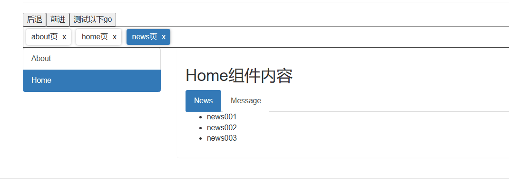

# 封装breadCrumb面包屑组件

前置条件：

我这里使用的就是element-ui的面包屑组件

具体组件代码：

```vue
<el-breadcrumb separator-class="el-icon-arrow-right">
  <el-breadcrumb-item :to="{ path: '/' }">首页</el-breadcrumb-item>
  <el-breadcrumb-item>活动管理</el-breadcrumb-item>
  <el-breadcrumb-item>活动列表</el-breadcrumb-item>
  <el-breadcrumb-item>活动详情</el-breadcrumb-item>
</el-breadcrumb>
```


## 方式一：使用$route.matched属性

具体操作方式：

1. **要按照Vue Router规范来设计多级路由表(树状的多级路由)**，meta属性中放置面包屑名称
2. 面包屑组件中通过监听$route变化，来获取$route.matched属性，该属性会返回到当前路由页面的所有路由，以数组方式返回
3. 直接渲染$route.matched属性返回的数据即可


具体效果：


### 实现代码

这里只展示些核心的封装代码


面包屑封装组件：

```vue
<template>
	<div class="col-xs-offset-2 col-xs-8" style="padding: 20px 0;">
		<el-breadcrumb separator="/">
			<el-breadcrumb-item
				v-for="(item, index) in breadcrumbData"
				:key="index"
				:to="index === breadcrumbData.length - 1 ? '' : item"
				>{{ item.meta }}</el-breadcrumb-item
			>
      <!-- 要注意以下这里的to属性，这样写的目的就是让最后一级不进行跳转-->
		</el-breadcrumb>
	</div>
</template>
<script>
export default {
	name: 'breadCrumb',
	data() {
		return {
			breadcrumbData: []
		};
	},
	watch: {
		$route: {
			handler() {
				this.breadcrumbData = this.$route.matched ? this.$route.matched : [];
				// console.log(this.$route.matched);
			},
			immediate: true
		}
	}
};
</script>

```


### 优缺点

**优点：**

1. 实现起来简单，路由表也符合设计规范，也最方便
2. 能够适应多种情景，无论是刷新页面，还是直接访问url都能保持面包屑一致
3. 能够保存路由参数，query和定义的路径参数都能够保存下来，上级跳转也非常完美


**缺点：**

1. 要求存在可以手写的路由表，自己控制meta属性，其他的一些工具可能生成的路由表不易设置meta属性
2. 路由表必须保证要有清晰的树状结构，如果路由的结构不清晰，或者不方便设置为树形，或者是网状结构九不能使用该方法


**如果是嵌套路由，该方法是面包屑的首选方式**


## 方式二：构建新路由表，反向查找

具体操作方式：

1. 要自定义一张路由表，表中的内容，要符合你自己的面包屑一致，还必须要和路由表中的name属性，和meta属性进行关联
2. 监听$route，跳转时将name属性和自定义的路由表进行比对，然后将面包屑的完整路径拼接出来即可


### 实现代码

面包屑封装组件：

```vue
<template>
	<div class="col-xs-offset-2 col-xs-8" style="padding: 20px 0;">
		<el-breadcrumb separator="/">
			<el-breadcrumb-item
				v-for="(item, index) in breadcrumbData"
				:key="index"
				:to="index === breadcrumbData.length - 1 ? '' : item"
				>{{ item.meta }}</el-breadcrumb-item
			>
		</el-breadcrumb>
	</div>
</template>
<script>
export default {
	name: 'breadCrumb',
	data() {
		return {
			temp: [],
			breadcrumbData: [],
      
      // 建立一张路由表
			breadcrumbTree: [
				{
					name: 'about',

					meta: 'about页'
				},
				{
					name: 'home',
					meta: 'home页',
					// 子路由
					children: [
						{
							meta: 'news页',
							name: 'news'
						},
						{
							name: 'message',
							meta: 'message页',
							children: [
								{
									name: 'detail',
									meta: 'detail页'
								}
							]
						}
					]
				}
			]
		};
	},
	watch: {
		$route: {
			handler() {
				// this.breadcrumbData = this.$route.matched ? this.$route.matched : [];
				// console.log(this.$route.matched);
				this.temp = [];
				this.formatBreadCrumbData(this.breadcrumbTree, this.$route.name);
			},
			immediate: true
		}
	},
	methods: {
		formatBreadCrumbData(arr, target) {
			if (!arr || !arr.length) {
				return;
			}

			for (let i = 0; i < arr.length; i++) {
				const item = arr[i];
				this.temp.push(item);
				console.log(111, this.temp);
				if (item.name === target) {
					this.breadcrumbData = JSON.parse(JSON.stringify(this.temp));
					// finalData = JSON.parse(JSON.stringify(item));
					break;
				}

				// 如果不是对应的，就向下查找
				this.formatBreadCrumbData(item.children, target);
				// 如果向下查找没找到，就将data弹出
				this.temp.pop();
			}
		}
	}
};
</script>

```


### 优缺点

**优点：**

1. 可以自己组织面包屑层级名称，即使不对应路由表的结构


**缺点：**

1. 不能传递路由参数


## 方式三：利用vuex+localstorage

目前介绍的这个是我自定义的一个面包屑组件。

效果：




核心思路：

1. 使用vuex来保存route对象，并配合持久化插件保存进localstorage中，保证刷新正常
2. 监听$route，将跳转的route对象保存进vuex中
3. 自定义面包屑组件，渲染vuex的数据即可


### 实现代码

面包屑组件封装：

`qBreadCrumb:`

```vue
<template>
  <div class="breadCrumb">
    <div
      v-for="(item, index) in breadCrumbData"
      :key="index"
      class="breadCrumb-item"
      :class="{actived: item.actived}"
      @click="change(item)"
    >
      <div class="text">{{ item.meta }}</div>
      <div @click.stop="deleteBreadCrumbItem(item)" class="icon">x</div>
    </div>
  </div>
</template>
<script>
import {mapActions, mapState} from 'vuex';
export default {
	name: 'qBreadCrumb',
	data() {
		return {};
	},
	computed: {
		...mapState(['breadCrumbData'])
	},
	watch: {
		$route: {
			handler() {
				// console.log('111', this.$route);
				this.addBreadAction(this.$route);
			},
			immediate: true
		}
	},
	methods: {
		...mapActions(['addBreadAction', 'deleteAction']),
		deleteBreadCrumbItem(route) {
			this.deleteAction(route);
			// 删除时要做一个校验（如果删除的是已经激活的，我们要跳转到末尾）
			if (route.name === this.$route.name) {
				let length = this.breadCrumbData.length;
				if (length > 0) {
					this.$router.replace({
						name: this.breadCrumbData[length - 1].name,
						query: this.breadCrumbData[length - 1].query,
						params: this.breadCrumbData[length - 1].params
					});
				}
			}

			// 直接跳转置最后一个
			// this.$router.replace(this.breadCrumbData[this.breadCrumbData.length - 1]);
			console.log('结果', this.breadCrumbData);

			// 最后再做一个校验校验面包屑里还有没有数据如果没有就跳转到home
			if (this.breadCrumbData.length == 0) {
				this.$router.replace({
					name: 'home'
				});
			}
		},
		change(item) {
			this.$router.push({
				name: item.name
			});
		}
	}
};
</script>

<style scoped>
.breadCrumb {
	height: 40px;
	border: 1px solid #333;
	display: flex;
	align-items: center;
	padding: 5px;
}

.breadCrumb-item {
	display: flex;
	align-items: center;
	box-sizing: border-box;
	padding: 5px 10px;
	padding-right: 5px;
	border-radius: 4px;
	box-shadow: 0 0 5px rgba(0, 0, 0, 0.3);
	cursor: pointer;
	transition: all 0.2s;
}
.breadCrumb-item:not(:last-child) {
	margin-right: 10px;
}

.breadCrumb-item:hover {
	transform: scale(1.05);
	box-shadow: 0 0 8px rgba(0, 0, 0, 0.4);
}

.icon {
	margin-left: 5px;
	/* border: 1px solid red; */
	width: 15px;
	height: 15px;
	display: flex;
	justify-content: center;
	align-items: center;
	border-radius: 50%;
	transition: all 0.2s;
}

.icon:hover {
	background: #eee;
}
.actived .icon:hover {
	background: #999;
}

.actived {
	background: #337ab7;
	color: #fff;
}
</style>

```


vuex代码：

`store/breadcrumb.js`

```js
import Vue from "vue";
import Vuex from 'vuex';
// 引入自定义的持久化插件
import persistState from './presist';
Vue.use(Vuex);


const store = new Vuex.Store({
  // 注册使用
  plugins: [persistState],
  state: {
    breadCrumbData: [
      // {
      //   name: 'home',
      //   query: {},
      //   params: {},
      //   meta: '首页',
      //   actived: true
      // }
    ]
  },
  actions: {
    addBreadAction({ state, commit }, route) {
      console.log('state', state);
      console.log('传入的route', route);
      if (!state.breadCrumbData) {
        return;
      }
      // 先判断state中是否拥有
      let found = state.breadCrumbData.find((item) => {
        return item.name === route.name
      })

      if (!found) {
        let breadcrumbItem = {
          name: route.name,
          query: route.query,
          params: route.params,
          meta: route.meta,
          actived: true
        }
        commit('resetActived');
        commit('add', breadcrumbItem);
      } else {
        // 如果找到了
        commit('resetActived');
        commit('change', route)
      }
    },

    deleteAction({ state, commit }, route) {
      if (!state.breadCrumbData) {
        return;
      }

      let index = state.breadCrumbData.findIndex((item) => {
        return item.name === route.name
      })

      commit('delete', index);

      return index;
    }
  },
  mutations: {
    add(state, item) {
      state.breadCrumbData.push(item);
    },
    // 重置激活状态
    resetActived(state) {

      state.breadCrumbData.forEach((item) => {
        item.actived = false
      })
    },

    // 激活状态方法
    change(state, route) {
      let found = state.breadCrumbData.find((item) => {
        return item.name === route.name
      })
      found.params = route.params;
      found.query = route.query;
      found.meta = route.meta;
      found.actived = true;
    },

    // 删除方法
    delete(state, index) {
      state.breadCrumbData.splice(index, 1);
    }
  }
})

export default store;
```


持久化插件代码:

`store/presist.js`

```js
/*
  vuex插件的调用时机：
  在每次vuex刷新时，都会调用
  vuex在每次页面刷新时也会刷新
*/

export default function persistState(store) {
  /**
   * @param {mutation} 访问mutation信息
   * @param {state} 修改后的state
   */
  store.subscribe((mutation, state) => {
    // store.subscribe 监听mutations触发
    window.localStorage.setItem('vuex', JSON.stringify(state));
  });

  // 状态的还原，每次插件代码执行就还原一次

  const prevState = window.localStorage.getItem('vuex');
  if (prevState) {
    // 调用store.replaceState替换所有状态
    store.replaceState(JSON.parse(prevState));
  }
}
```


面包屑使用：

`App.vue`

```vue
<template>
	<div>
    <qBreadCrumb></qBreadCrumb>
  </div>
</template>
```


### 优缺点

**优点：**

1. 自定义的样式，刷新也可以使用，也能够传递params和query参数


**缺点：**

1. 编写麻烦，一般作为长期通用组件使用
2. 依赖于vuex