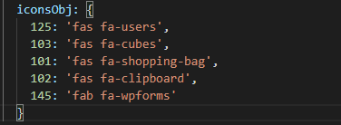
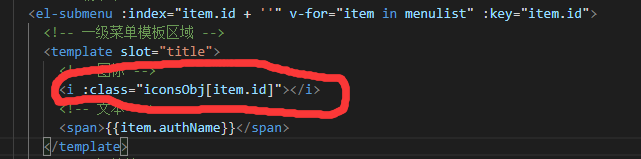

# vue电商实战项目

## 如何绑定二级菜单？

利用一个两重循环for 来实现。

第一个循环获取一层菜单，第二个循环在第一个循环基础上再获取二层菜单

## 如何在v-for中绑定图标？

利用 每次循环得到的id，

用id作为属性名创建一个小图标的类对象，然后每次用id 来获取类名即可

创建对象：



利用id引用类名：




## 折叠按钮

判断是否折叠，一般都是设置一个变量来绑定到元素上，通过点击来改变true/false。

```
// 是否折叠
isCollapse: false
```

通过这个Boolean值 还可以进行一些帅气的操作。


## 改造侧边栏

将侧边栏改造成路由模式

在el-menu 中开启router=”true“,然后每一个index属性就是一个跳转地址。，然后修改index属性即可

## 动态的侧边栏点击效果

先绑定个单击事件，将index中的值保存到sessionStorage，

然后从sessionStorage取值放到default-active="xxx"中，点击时赋值

```js
// 如果子路由需要修改状态，可以绑定一个自定义事件，然后让子路由去触发从而修改状态    
/*例如：
<router-link @saveState="aveNavState"></router-link>
然后在子路由中：this.$emit('saveState', '参数')即可

*/


// 保存激活连接
    saveNavState(activePath) {
      window.sessionStorage.setItem('activePath', activePath);
      this.activePath = activePath;
      console.log(this.activePath);
    },
    // 获取侧边栏路径
    getNavState() {
      this.activePath = window.sessionStorage.getItem('activePath');
    }
```


### element-ui中自定义校验规则的使用

先定义一个函数


## 扩展表格问题

为了防止更新完毕数据后，扩展表格自动关闭。

不用全局刷新，局部刷新（刷新扩展表格数据即可）

