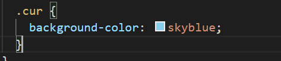

# 尚品会项目开发总结

# 路由

## 一、拆路由

路由如何拆解，一个项目在进行跳转时，有一些是不变的，一些是改变的。

那我们就可以将不会改变的部分（如尚品会头部信息、和底部信息）定义为非路由组件。

将需要跳转的部分，定义为路由组件。


## 二、开发一张页面时的步骤

1：书写静态页面（HTML+CSS）

2：拆分组件

3：获取服务器的数据动态显示

4：完成相应的动态业务逻辑


## 三、写组件时的格式

书写组件时，为组件单独创建文件夹，将组件，静态资源分开存放。

例如

```
components
|_ Header
	|_images      images存放静态资源
	|_Header.vue   这个为组件
```

## 四、路由组件与非路由组件的区别

一、路由组件一般创建一个`pages`或`views`文件来存放，非路由组件一般放置在`components`文件夹下

二、路由组件一般需要在`router`文件夹中进行注册（使用即为组件的名字），非路由组件通过引入注册完毕后，用标签来使用

三、注册完路由，路由与非路由组件身上都有$route和$router属性


$route放着路由信息。

$router放着跳转方法[push|replace|go|back|..]

## 五、路由配置

路由配置一般放置在`router`文件夹下

## 六、非路由组件的显示与隐藏

非路由组件的显示与隐藏：v-if|v-show(性能更好一点儿)

结合路由元信息：`meta`配置项

```js
/*
例如：Footer组件：
	显示：home,search路由组件中显示
	隐藏：login,register
	那我们就在这些路由组件中配置一个meta信息
*/
//router中的配置信息
    {
      path: "/home",
      component: Home,
      meta: {show: true}//添加一个show属性为true，就是显示
    },
    {
      path: "/search",
      component: Search,
      meta: {show: true}
    },
    {
      path: "/login",
      component: Login,
      meta: {show: false}//false就是隐藏
    },
    {
      path: "/register",
      component: Register,
      meta: {show: false}
    }


// 在Footer组件中判断

<Footer v-show="$route.meta.show"></Footer>
//判断meta.show即可
```


## 七、路由传参的应用场景

例如：

A路由界面经过操作（点击）跳转到B路由页面时，如果B路由需要A路由的数据，就可以使用路由传参。


A ===> B


## 八、拆分组件

在一个多个页面中都使用到的组件，可以将其做成全局组件，一次引入全局使用


## 九、axios封装

一般在项目`src`文件夹下的的`api`文件夹下封装`axios`，当然这个文件夹不是绝对的


## 十、接口统一管理

项目很小：完全可以在组件的生命周期中发送


项目大：将请求统一管理，一般配合vuex一起使用

将接口封装到一个文件中，然后在vuex中调用。

先将axios请求分装好：

```js
//axios的二次封装
import axios from 'axios';
// 引入进度条
import nprogress from 'nprogress';
// 要引入进度条的样式
import 'nprogress/nprogress.css';
/* nprogress的
  start方法：进度条开始 在请求拦截器中设置
  done方法：进度条结束  在响应拦截器中设置
*/
// 1.利用axios对象的方法create，去创建一个axios实例

const requests = axios.create({
	// 基础路径
	baseURL: '/api',
	// 请求超时时间5s
	timeout: 5000
	// 请求头
	// headers: headers
});

// 请求拦截器: 在发送请求之前，请求拦截器可以拦截到，可以在请求发送出去之前做一些操作

requests.interceptors.request.use(
	config => {
		//config：配置对象，对象里有一个属性很重要，headers请求头
		// Do something before request is sent
		// 进度条成功
		nprogress.start();
		return config;
	},
	error => {
		// Do something with request error
		return Promise.reject(error);
	}
);

// 响应拦截器：数据请求回来后可以做一些操作
requests.interceptors.response.use(
	res => {
		// 成功的回调函数
		// 进度条结束
		nprogress.done();
		return res.data;
	},
	error => {
		// 响应失败的回调
		// Do something with response error
		return Promise.reject(error);
	}
);

// 对外暴露分装好的axios对象
export default requests;

```

在封装接口api

```js
// 当前这个模块：API进行统一管理

import requests from './request.js';

// 三级联动接口
// path:/api/product/getBaseCategoryList
// method: get
// params：none

// 将获得categoryList的函数暴露出去
export const reqCategoryList = () => {
	// 发请求
	return requests({ url: '/product/getBaseCategoryList', method: 'get' });
};

```


## 十一、项目运行问题

如果运行项目卡住了并且是如下代码

```
98% after emitting CopyPlugin
```

应该是那个位置的引入没有写全例如

```js
import router from '';
//这只是一个例子，关键是from是空的
```

## 十二、Vuex的使用

并不是所有的项目都需要使用Vuex，如果项目很小则并不需要Vuex。

如果项目很大，组件很多，数据很多，数据维护起来很费劲，就可以考虑下Vuex了。


## 十三、为什么全部写出index.xxx的文件

因为这样引入时不需要写文件名，直接写文件夹即可


## 十四、级联分类的数据格式

当看到一下这种数据格式，就必须想到，这是一个级联框，循环嵌套循环来进行展示

```
[
	{
		id: 1,
		name: xx,
		child: {
			id: 2,
			age: xx,
			child: {
				id: 3,
				sex: xx,
			}
		}
	}
]
```


## 十五：动态添加标题的类名

首先我们通过v-for动态帮定了标题，从而获得了一系列`index`,每个`index`就代表着每个标题的索引，所以我们可以通过这个`index`下手


我们通过js鼠标移入事件获取每个h3的index


并将index 绑定到data中：


然后在h3标签上动态添加一个类名

```html
:class="{cur: currentIndex == index}"
//当currentIndex == index为true时，添加一个cur类名
```


**cur的css样式**




## 十六、事件委派的使用

十五、十六，接在一起的


给所有整个内容套一个父盒子，在父盒子这个div中绑定鼠标移出函数，这个效果就是，只有鼠标移出父元素下面的内容时，才会触发这个移除函数


## 十七、防抖与节流

防抖：前面的所有出发都被取消，最后一次执行在规定的事件之后才能出发，**如果用户连续的快速触发，只执行一次**

节流：在规定的时间间隔范围内不会重复触发回调，只有大于这个时间间隔才会出发回调，**把频繁触发转变为少量触发**

引入lodash库

```js
// 节流函数
_.throttle()
// 防抖函数
_.debounce()
```

