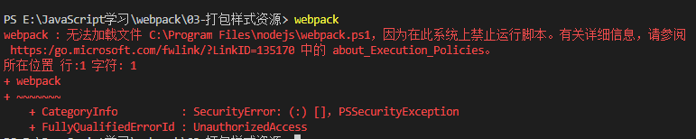

# webpack

概念：webpack时一种前端资源构建工具，一个静态模块打包器（module bundler）。在webpack看来，前端的所有资源文件(js/json/css/img/less/...)都会作为模块处理。它将根据模块的依赖关系进行静态分析，打包生成对应的静态资源(bundle)。

 ## chunk

引入的就是chunk所有需要打包的资源，根据入口文件的引入，组合再一起，就是一个chunk(也就是一个代码块)

## bundle

输出的文件就是bundle

## webpack五个核心概念

### Entry

入口（entry）指示webpack以那个文件为入口起点开始打包，分析构建内部依赖图

```js
// (1)入口起点
  entry: './src/index.js',
```

### Output

输出（output）指示webpack打包后的资源bundles输出到那里去，以及如何命名。

```js
  output: {
    filename: 'built.js',//输出文件名
    //__dirname 是nodejs的变量，代表当前文件的目录绝对路径
    //path中的resolve方法是可以拼接一个相对路径
    path: resolve(__dirname, 'build')
  }
```


### Loader

loader让webpack能够处理非Javascript文件（webpack自身只能理解JavaScript）

不同的文件 需要配置不同的匹配规则与loader

loader中有俩配置项：

test：表示匹配那些文件

use:[]：表示使用那些loader,**use数组中的loader执行顺序: 从右到左,从下到上依次执行**


### Plugins

插件（plugins）可以用于执行范围更广的任务，插件的范围包括，从打包优化和压缩，一直到重新定义环境中的变量等。

插件的使用步骤：1下载插件`npm install 插件名`

2 引入插件 `const xxx = require('插件名');`

3 在plugins配置项中使用

主要看plugins部分代码

```js
/*
  loader: 1.下载 2.使用(配置loader)
  plugins: 1.下载 2.引入 3.使用
*/
const {resolve} = require('path');
// 引入HtmlWebpackPlugin
const HtmlWebpackPlugin = require('html-webpack-plugin');

module.exports = {
  entry: './src/index.js',
  output: {
    filename: 'built.js',
    path: resolve(__dirname, 'build')
  },
  module: {
    rules: [
      //loader配置
    ]
  },
  plugins: [
    //plugins配置
    // 功能：默认会创建一个空HTML文件，引入打包输出的所有资源(js/css)
    // 需求：需要有结构的HTML文件
    new HtmlWebpackPlugin({
      // 复制./src/index.html文件,并自动引入打包输出所有的资源(js/css)
      template: './src/index.html'
    })
  ],
  mode: 'development'
}
```


### Mode

两种模式：开发模式（develoment）=>能让代码本地调试运行的环境

生产模式（production）=>能让代码优化上线运行的环境

## 开始打包

webpack4中的指令

开发环境指令：webpack ./src/index.js -o ./build/built.js --mode=development

​    webpack会以 ./src/index.js为入口文件开始打包，打包后输出到./build/built.js

​    整体打包环境，是开发环境


​    生产环境：webpack ./src/index.js -o ./build/built.js --mode=production

​    webpack会以 ./src/index.js为入口文件开始打包，打包后输出到./build/built.js

​    整体打包环境，是生产环境

## webpack配置文件webpack.config.js

### webpack打包样式资源(less,css)

```js
/*
  // webpack4中的配置文件
  webpack.config.js webpack的配置文件
    作用：指示webpack怎样打包（当运行webpack指令时，会加载里面的配置）
*/
// resolve时用来拼接绝对路径的方法
const {resolve} = require("path");
// 所有的构建工具都是基于nodejs平台运行的，nodejs默认采用commonjs引入导出
module.exports = {
  // webpack配置
  // (1)入口起点
  entry: './src/index.js',
  // (2)出口
  output: {
    filename: 'built.js',//输出文件名
    //__dirname 是nodejs的变量，代表当前文件的目录绝对路径
    //path中的resolve方法是可以拼接一个绝对路径
    path: resolve(__dirname, 'build')
  },
  // (3)loader配置
  module: {
    rules: [
    //  详细的loader配置
      {
        // 匹配那些文件
        test: /\.css$/,//以.css结尾的文件
        // 使用那些loader
        use: [
          // use数组中的loader执行顺序: 从右到左,从下到上依次执行

          // 然后 <2>创建style标签,将js中的样式资源插入进去,添加到head中生效
          'style-loader',

          // 首先 <1>将css文件变成commonjs模块加载到js中,里面内容是样式字符串
          'css-loader'
        ]
      },
      {
        test: /\.less$/,
        use: [
          'style-loader',
          'css-loader',
          'less-loader'//将less文件编译为css文件
        ]
      }
    ]
  },
  // (4) plugins配置，插件
  plugins: [
    // 详细plugins的配置
  ],
  // (5) 模式
  mode: 'development',
//   mode: 'production'
}
```


### webpack打包html文件

```js
/*
  loader: 1.下载 2.使用(配置loader)
  plugins: 1.下载 2.引入 3.使用
*/
const {resolve} = require('path');
// 引入HtmlWebpackPlugin
const HtmlWebpackPlugin = require('html-webpack-plugin');

module.exports = {
  entry: './src/index.js',
  output: {
    filename: 'built.js',
    path: resolve(__dirname, 'build')
  },
  module: {
    rules: [
      //loader配置
    ]
  },
  plugins: [
    //plugins配置
    // 功能：默认会创建一个空HTML文件，引入打包输出的所有资源(js/css)
    // 需求：需要有结构的HTML文件
    new HtmlWebpackPlugin({
      // 复制./src/index.html文件,并自动引入打包输出所有的资源(js/css)
      template: './src/index.html'
    })
  ],
  mode: 'development'
}
```


### webpack4打包图片

```js

const HtmlWebpackPlugin = require('html-webpack-plugin');
const {resolve} = require('path')
module.exports = {
  mode: 'development',
  entry: './src/index.js',
  output: {
    filename: 'built.js',
    path: resolve(__dirname, 'built')
    },
    module: {
      rules: [
        {
          test: /\.less$/,
          // 要用多个loader时用use:[]
          use: [
            'style-loader',
            'css-loader',
            'less-loader'
          ]
        },
        {
          // 有个问题：默认处理不了html中引入的img图片
          // 处理图片资源
          test: /\.(jpg|png|gif)$/,
          // 当只有一个loader时，可以不用use
          // 使用url-loader需要file-loader
          loader: 'url-loader',
          options: {
            // 限制图片大小小于8kb，就会被base64处理
            // 优点：减少请求数量(减轻服务器压力)
            // 缺点：图片体积会更大(文件请求时间变长)
            limit: 8* 1024,
            // esModule: false 配置项是关闭一个模块的es6模块化，使用commonJS去解析

            //[hash:10]取图片的hash的前10位
            //[ext]取文件本身的后缀名
            name: '[hash:10].[ext]',
            
            //outputPath可以指定(在出口目录下的子目录)目录
            outputPath: 'images'
          }
        },
        {
          //处理html文件中的img标签中的图片
          test: /\.html$/,
          loader: 'html-loader'
        }
      ]
    },
    plugins: [
      new HtmlWebpackPlugin({
        template: './src/index.html'
      })
    ]
}
```

### webpack5打包图片

```js

const path = require('path');
const HtmlWebpackPlugin = require('html-webpack-plugin');
module.exports = {
  mode: 'development',
  entry: './src/index.js',
  output: {
    filename: 'built5.js',
    path: path.resolve(__dirname, 'built')
  },
  module: {
    rules: [
      {
        test: /\.less$/,
        use: [
          'style-loader',
          'css-loader',
          'less-loader'
        ]
      },
      {
        test: /\.(jpg|png|gif)&/i,
        type: 'asset'
      },
      {
        
        test: /\.html$/i,
        loader: 'html-loader'
      }
    ]
  },
  plugins: [
    new HtmlWebpackPlugin({
      template: './src/index.html'
    })
  ]
}
```

### webpack4打包其他文件资源

```js

const path = require('path');
const HtmlWebpackPlugin = require('html-webpack-plugin');
module.exports = {
  //模式
  mode: 'development',
  //入口文件
  entry: './src/index.js',
  //出口文件
  output: {
    filename: 'built.js',
    path: path.resolve(__dirname, 'built')
  },
  module: {
    rules: [
      {
        //处理css文件
        test: /\.css$/,
        use: [ 'style-loader', 'css-loader' ]
      },
      {
        // 打包其他资源
        // 排除掉我们处理过的资源，其他都打包
        exclude: /\.(css|js|html)$/,
        loader: 'file-loader'
      }
    ]
  },
  plugins: [
    //处理html文件的
    new HtmlWebpackPlugin({
      template: './src/index.html'
    })
  ]
}
```

### webpack5打包其他文件资源

```js

const path = require('path');
const HtmlWebpackPlugin = require('html-webpack-plugin');

module.exports = {
  mode: 'development',
  entry: './src/index.js',
  output: {
    filename: 'built5.js',
    path: path.resolve(__dirname, 'built5')
  },
  module: {
    rules: [
      {
        test: /\.css$/i,
        use: [ 'style-loader', 'css-loader' ]
      },
      // {
      //   exclude: /\.(css|js|html)$/,
      //   type: 'asset/resource'
      // }
    ]
  },
  plugins: [
    new HtmlWebpackPlugin({
      template: './src/index.html'
    })
  ]
}
```


### webpack4开启devServer

运行指令：npx webpack-dev-server

需要包：webpack-dev-server

```js

const path = require('path');
const HtmlWebpackPlugin = require('html-webpack-plugin');
module.exports = {
  //模式
  mode: 'development',
  //入口文件
  entry: './src/index.js',
  //出口文件
  output: {
    filename: 'built.js',
    path: path.resolve(__dirname, 'built')
  },
  module: {
    rules: [
      {
        //处理css文件
        test: /\.css$/,
        use: [ 'style-loader', 'css-loader' ]
      },
      {
        // 打包其他资源
        // 排除掉我们处理过的资源，其他都打包
        exclude: /\.(css|js|html)$/,
        loader: 'file-loader'
      }
    ]
  },
  plugins: [
    //处理html文件的
    new HtmlWebpackPlugin({
      template: './src/index.html'
    })
  ],
  // 开发服务器 devServer：自动化（自动编译，自动打开浏览器，自动刷新浏览器）
  // 特点：只会再内存中编译打包，不会有任何输出
  // 如果要用需要下载webpack-dev-server
  // 启动devServer指令位：npx webpack-dev-server
  devServer: {
    // 项目构建后的路径
    contentBase: path.resolve(__dirname, 'built'),
    // 启动gzip压缩
    compress: true,
    // 端口号
    port: 3000,
    
    // 是否自动打开浏览器
    // open: true
  }
}
```

### webpack5开启devServer

运行指令：npm webpack serve

需要：webpack-dev-server

```js

const path = require('path');
const HtmlWebpackPlugin = require('html-webpack-plugin');

module.exports = {
  mode: 'development',
  entry: './src/index.js',
  output: {
    filename: 'built5.js',
    path: path.resolve(__dirname, 'built5')
  },
  module: {
    rules: [
      {
        test: /\.css$/i,
        use: [ 'style-loader', 'css-loader' ]
      },
      // {
      //   exclude: /\.(css|js|html)$/,
      //   type: 'asset/resource'
      // }
    ]
  },
  plugins: [
    new HtmlWebpackPlugin({
      template: './src/index.html'
    })
  ],
  // 需要添加这一项
  target: 'web',
  devServer: {
    // 打包好的项目路径和上面output的path一致
    static: {
      directory: path.resolve(__dirname, 'built5')
    },
    // 是否利用gzips压缩
    compress: true,
    // 热重载
    hot: true,
    // 端口号
    port: 9000
    // 是否默认打开浏览器
    // open: true
  }
}
```

### webpack4，5将css单独提取出来成一个文件

需要插件：MiniCssExtractPlugin

```js

const {resolve} = require('path');
const HtmlWebpackPlugin = require('html-webpack-plugin');
const MiniCssExtractPlugin = require('mini-css-extract-plugin');
module.exports = {
  mode: 'development',
  entry: './src/js/index.js',
  output: {
    filename: 'js/built.js',
    path: resolve(__dirname, 'build')
  },
  module: {
    rules: [
      {
        test: /\.css$/i,
        use: [
          // 创建一个style标签并将样式放入
          // 'style-loader',

          // 该loader替换style-loader，作用：提取js中的css成单独文件 
          MiniCssExtractPlugin.loader,
          // 将css文件整合到js文件中
          'css-loader'
        ]
      }
    ]
  },
  plugins: [
    new HtmlWebpackPlugin({
      template: './src/index.html'
    }),
    // 提取css文件的插件
    new MiniCssExtractPlugin({
      // 对输出文件进行重命名
      filename: 'css/built.css'
    })
  ]
}
```

### webpack4css兼容性处理

需要安装一个postcss-loader和一个插件postcss-preset-env

```js

const {resolve} = require('path');
const HtmlWebpackPlugin = require('html-webpack-plugin');
const MiniCssExtractPlugin = require('mini-css-extract-plugin');

// 设置nodejs环境变量为development
process.env.NODE_ENV = "development";
module.exports = {
  mode: 'development',
  entry: './src/js/index.js',
  output: {
    filename: 'js/built.js',
    path: resolve(__dirname, 'build')
  },
  module: {
    rules: [
      {
        test: /\.css$/i,
        use: [ 
          MiniCssExtractPlugin.loader,
          'css-loader',
          /*
            css兼容性处理：postcss ->postcss-loader 与postcss-preset-env
            帮postcss找到package.json中browserslist里面的配置，通过配置加载指定的css兼容性样式
            
            "browserslist": {
              // 开发环境--> 设置node环境变量：process.env.NODE_ENV = "development"
              "development": [
                "last 1 chrome version",
                "last 1 firefox version",
                "last 1 safari version"
              ],
              // 生产环境：默认是看生产环境 如果要开启开发环境添加process.env.NODE_ENV = "development"在上面
              "production": [
                ">0.2%",
                "not dead",
                "not op_mini all"
              ]
            }
          */
          // 使用loader的默认配置
          // 'postcss-loader'

          // 要修改配置用对象写法
          {
            loader: 'postcss-loader',
            options: {
              indent: 'postcss',
              plugins: () => [
                // postcss的插件
                require('postcss-preset-env')()
              ]
            }
          }
        ]
      }
    ]
  },
  plugins: [
    new HtmlWebpackPlugin({
      template: './src/index.html'
    }),
    // 提取css文件的插件
    new MiniCssExtractPlugin({
      // 对输出文件进行重命名
      filename: 'css/built.css'
    })
  ]
}
```

### webpack5css兼容性处理

```js

const {resolve} = require('path');
const HtmlWebpackPlugin = require('html-webpack-plugin');
const MiniCssExtractPlugin = require('mini-css-extract-plugin');

// 设置nodejs环境变量为development
process.env.NODE_ENV = "development";
module.exports = {
  mode: 'development',
  entry: './src/js/index.js',
  output: {
    filename: 'js/built.js',
    path: resolve(__dirname, 'build')
  },
  module: {
    rules: [
      {
        test: /\.css$/i,
        use: [ 
          MiniCssExtractPlugin.loader,
          'css-loader',
          /*
            css兼容性处理：postcss ->postcss-loader 与postcss-preset-env
            帮postcss找到package.json中browserslist里面的配置，通过配置加载指定的css兼容性样式
            
            "browserslist": {
              // 开发环境--> 设置node环境变量：process.env.NODE_ENV = "development"
              "development": [
                "last 1 chrome version",
                "last 1 firefox version",
                "last 1 safari version"
              ],
              // 生产环境：默认是看生产环境 如果要开启开发环境添加process.env.NODE_ENV = "development"在上面
              "production": [
                ">0.2%",
                "not dead",
                "not op_mini all"
              ]
            }
          */
          // webpack5中的新postcss-loader
          {
            loader: 'postcss-loader',
            options: {
              postcssOptions: {
                plugins: [
                  ['postcss-preset-env']
                ]
              }
            }
          }
        ]
      }
    ]
  },
  plugins: [
    new HtmlWebpackPlugin({
      template: './src/index.html'
    }),
    // 提取css文件的插件
    new MiniCssExtractPlugin({
      // 对输出文件进行重命名
      filename: 'css/built.css'
    })
  ]
}
```

### webpack4中压缩css的插件

安装：压缩css的插件：optimize-css-assets-webpack-plugin

```js

const {resolve} = require('path');
const HtmlWebpackPlugin = require('html-webpack-plugin');
const MiniCssExtractPlugin = require('mini-css-extract-plugin');
//压缩css文件
const OptimizeCssAssetsWebpackPlugin = require('optimize-css-assets-webpack-plugin');

// 设置nodejs环境变量为development
// process.env.NODE_ENV = "development";

// 压缩css的插件：optimize-css-assets-webpack-plugin

module.exports = {
  mode: 'development',
  entry: './src/js/index.js',
  output: {
    filename: 'js/built.js',
    path: resolve(__dirname, 'build')
  },
  module: {
    rules: [
      {
        test: /\.css$/i,
        use: [ 
          MiniCssExtractPlugin.loader,
          'css-loader',
          // 要修改配置用对象写法
          {
            loader: 'postcss-loader',
            options: {
              indent: 'postcss',
              plugins: () => [
                // postcss的插件
                require('postcss-preset-env')()
              ]
            }
          }
        ]
      }
    ]
  },
  plugins: [
    new HtmlWebpackPlugin({
      template: './src/index.html'
    }),
    // 提取css文件的插件
    new MiniCssExtractPlugin({
      // 对输出文件进行重命名
      filename: 'css/built.css'
    }),
    // 压缩css文件插件
    new OptimizeCssAssetsWebpackPlugin()
  ]
}
```

### webpack5中压缩css方式

安装：css-minimizer-webpack-plugin

```js

const {resolve} = require('path');
const HtmlWebpackPlugin = require('html-webpack-plugin');
const MiniCssExtractPlugin = require('mini-css-extract-plugin');
// 引入压缩css插件
const CssMinimizerPlugin = require("css-minimizer-webpack-plugin");
// 设置nodejs环境变量为development
process.env.NODE_ENV = "development";
module.exports = {
  mode: 'development',
  entry: './src/js/index.js',
  output: {
    filename: 'js/built.js',
    path: resolve(__dirname, 'build')
  },
  module: {
    rules: [
      {
        test: /\.css$/i,
        use: [ 
          MiniCssExtractPlugin.loader,
          'css-loader',
          // webpack5中的新postcss-loader
          {
            loader: 'postcss-loader',
            options: {
              postcssOptions: {
                plugins: [
                  ['postcss-preset-env']
                ]
              }
            }
          }
        ]
      }
    ]
  },
  // 使用压缩css文件的css-minimizer-webpack-plugin
  // 默认在生产环境下运行，配置minimize开启开发环境运行
  optimization: {
    minimizer: [
      new CssMinimizerPlugin(),
    ],
    // 开启minimize在开发环境下运行
    minimize: true
  },
  
  plugins: [
    new HtmlWebpackPlugin({
      template: './src/index.html'
    }),
    // 提取css文件的插件
    new MiniCssExtractPlugin({
      // 对输出文件进行重命名
      filename: 'css/built.css'
    })
  ]
}
```

### webpack4配置eslint语法检查

需要：eslint-loader 

airbnb语法规范需要：eslint，eslint-config-airbnb-base，eslint-plugin-import

```js
const {resolve} = require('path');
const HtmlWebpackPlugin = require('html-webpack-plugin');

module.exports = {
  mode: "development",
  entry: "./src/js/index.js",
  output: {
    filename: "js/built.js",
    path: resolve(__dirname, 'build')
  },
  module: {
    rules: [
      /*
        语法检查：eslint-loader
        需要：eslint-loader和eslint
        注意：只检查自己写的源代码，第三方库不用检查，用exclude排除
        设置检查规则：
        package.json中的eslintConfig中设置~
        airbnb语法规范需要三个库：eslint-config-airbnb-base，
        eslint，eslint-plugin-import
      */
     {
       test: /\.js$/i,
       // 排除我们引入的库的检查(重要)
       exclude: /node_modules/,
       loader: "eslint-loader",
       options: {
         // 自动修复
         fix: true
       }
     }
    ]
  },
  plugins: [
    new HtmlWebpackPlugin({
      template: "./src/index.html"
    })
  ]
}
```

### webpack5配置eslint语法规范

需要：eslint-webpack-plugin（5中需要改插件，eslint-loader已经被废除了）

airbnb语法规范：slint-config-airbnb-base，eslint，eslint-plugin-import

```js
const {resolve} = require('path');
const HtmlWebpackPlugin = require('html-webpack-plugin');
// 引入eslint-webpack-plugin插件
const ESLintPlugin = require('eslint-webpack-plugin');
module.exports = {
  mode: "development",
  entry: "./src/js/index.js",
  output: {
    filename: "js/built.js",
    path: resolve(__dirname, 'build')
  },
  module: {
    rules: []
  },
  plugins: [
    new HtmlWebpackPlugin({
      template: "./src/index.html"
    }),
    /*设置检查规则：
        package.json中的eslintConfig中设置~
        airbnb语法规范需要三个库：eslint-config-airbnb-base，
        eslint，eslint-plugin-import
        在package.json中配置：
        "eslintConfig": {
          "extends": "airbnb-base"
        }
    */
    new ESLintPlugin()
  ]
}
```

### webpack4,5中的js兼容 babel

​        js兼容性处理：babel-loader, @babel/core, @babel/preset-env

​        1.基本js兼容性处理->@babel/core, @babel/preset-env,babel-loader

​          问题：只能转换基本语法，如promise不能转换

​        2.全部js兼容性处理->@babel/polyfill

​          问题：全部兼容，体积太大，按需兼容即可

​        3.**按需加载：-->core-js**

**1加上3完美解决兼容性问题**

需要:@babel/core, @babel/preset-env,babel-loader,core-js

```js
const {resolve} = require('path');
const HtmlWebpackPlugin = require('html-webpack-plugin');

module.exports = {
  mode: "development",
  entry: "./src/js/index.js",
  output: {
    filename: "js/built.js",
    path: resolve(__dirname, 'build')
  },
  module: {
    rules: [
      /*
        js兼容性处理：babel-loader, @babel/core, @babel/preset-env
        1.基本js兼容性处理->@babel/core, @babel/preset-env,babel-loader
          问题：只能转换基本语法，如promise不能转换
        2.全部js兼容性处理->@babel/polyfill
          问题：全部兼容，体积太大，按需兼容即可
        3.按需加载：-->core-js
      */
     {
       test: /\.m?js$/,
       loader: 'babel-loader',
       // 排除node_modules防止转换我们下载的包
       exclude: /(node_modules|bower_components)/,
       options: {
        //  预设：指示babel做怎样的兼容性处理
        presets: [
          [
            '@babel/preset-env',
            {
              // 按需加载
              useBuiltIns: 'usage',
              // 指定core-js版本
              corejs: {
                version: 3
              },
              // 指定兼容到那个版本
              targets: {
                chrome: '60',
                firefox: '60',
                ie: '9',
                safari: '10',
                edge: '17'
              }
            }
          ]
        ]
       }
     }
    ]
  },
  plugins: [
    new HtmlWebpackPlugin({
      template: "./src/index.html"
    })
  ]
}
```

### webpack4,5压缩js代码方式

说明:**只需要将mode改成生产模式即可自动压缩js,webpack5还能自动压缩html**

```js
const {resolve} = require('path');
const HtmlWebpackPlugin = require('html-webpack-plugin');

module.exports = {
  // 将webpack的模式调为生产模式,打包后自动压缩js代码
  mode: "production",
  entry: "./src/js/index.js",
  output: {
    filename: "js/built.js",
    path: resolve(__dirname, 'build')
  },
  plugins: [
    new HtmlWebpackPlugin({
      template: "./src/index.html"
    })
  ]
}
```

### webpack4压缩html文件

说明:将mode改为生产这模式

```js
const {resolve} = require('path');
const HtmlWebpackPlugin = require('html-webpack-plugin');

module.exports = {
  mode: "production",
  entry: "./src/js/index.js",
  output: {
    filename: "js/built.js",
    path: resolve(__dirname, 'build')
  },
  plugins: [
    new HtmlWebpackPlugin({
      template: "./src/index.html",
      //添加配置项,压缩html文件
      minify: {
        // 移除空格
        collapseWhitespace: true,
        // 移除注释
        removeComments: true
      }
    })
  ]
}
```

### webpack5压缩html文件

说明:**将mode改为生产这模式自动压缩html文件,不需要配置minify**

## 报错解决方式

问题一：如果运行webpack出错 因为此系统上禁止运行脚本



解决方案：

以管理员身份运行 Windows PowerShell

设置：set-ExecutionPolicy RemoteSigned

设置为yes即可 输入y

