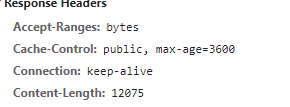

# 浏览器的强缓存和协商缓存

## 强缓存

字面意思：强制缓存呗O(∩_∩)O

到底什么是强缓存？强在哪？其实强是强制的意思。当浏览器去请求某个文件的时候，服务端就在respone header里面对该文件做了缓存配置。缓存的时间、缓存类型都由服务端控制，具体表现为：spone header 的cache-control，常见的设置是max-age public private no-cache no-store等



如果你只设置了cahe-control:max-age=31536000,public  这属于强缓存，每次用户正常打开这个页面，浏览器会判断缓存是否过期，没有过期就从缓存中读取数据；但是有一些 "聪明" 的用户会点击浏览器左上角的刷新按钮去刷新页面，这时候就算资源没有过期（1年没这么快过），浏览器也会直接去请求服务器，这就是额外的请求消耗了，这时候就相当于是走协商缓存的流程了（下面会讲到）。

### 头中的一些配置信息

1. cache-control: max-age=xxxx，public
    客户端和代理服务器都可以缓存该资源；
    客户端在xxx秒的有效期内，如果有请求该资源的需求的话就直接读取缓存,statu code:200 ，如果用户做了刷新操作，就向服务器发起http请求

2. cache-control: max-age=xxxx，private
    只让客户端可以缓存该资源；代理服务器不缓存
    客户端在xxx秒内直接读取缓存,statu code:200

3. cache-control: max-age=xxxx，immutable
    客户端在xxx秒的有效期内，如果有请求该资源的需求的话就直接读取缓存,statu code:200 ，即使用户做了刷新操作，也不向服务器发起http请求

4. cache-control: no-cache
    跳过设置强缓存，但是不妨碍设置协商缓存；一般如果你做了强缓存，只有在强缓存失效了才走协商缓存的，设置了no-cache就不会走强缓存了，每次请求都回询问服务端。

5. cache-control: no-store
    不缓存，这个会让客户端、服务器都不缓存，也就没有所谓的强缓存、协商缓存了。

## 协商缓存

上面说到的强缓存就是给资源设置个过期时间，客户端每次请求资源时都会看是否过期；只有在过期才会去询问服务器。所以，强缓存就是为了给客户端自给自足用的。而当某天，客户端请求该资源时发现其过期了，这是就会去请求服务器了，而这时候去请求服务器的这过程就可以设置协商缓存。这时候，协商缓存就是需要客户端和服务器两端进行交互的。


怎么设置协商缓存？

response header里面的设置：

```bash
etag: '5c20abbd-e2e8'
last-modified: Mon, 24 Dec 2018 09:49:49 GMT
```

etag：每个文件有一个，改动文件了就变了，就是个文件hash，每个文件唯一，就像用webpack打包的时候，每个资源都会有这个东西，如： app.js打包后变为 app.c20abbde.js，加个唯一hash，也是为了解决缓存问题。

last-modified：文件的修改时间，精确到秒

也就是说，每次请求返回来 response header 中的 etag和 last-modified，在下次请求时在 request header 就把这两个带上，服务端把你带过来的标识进行对比，然后判断资源是否更改了，如果更改就直接返回新的资源，和更新对应的response header的标识etag、last-modified。如果资源没有变，那就不变etag、last-modified，这时候对客户端来说，每次请求都是要进行协商缓存了，即：


所以协商缓存步骤总结：

请求资源时，把用户本地该资源的 etag 同时带到服务端，服务端和最新资源做对比。
 如果资源没更改，返回304，浏览器读取本地缓存。
 如果资源有更改，返回200，返回最新的资源。

补充一点，response header中的etag、last-modified在客户端重新向服务端发起请求时，会在request header中换个key名：

```csharp
// response header
etag: '5c20abbd-e2e8'
last-modified: Mon, 24 Dec 2018 09:49:49 GMT

// request header 变为
if-none-matched: '5c20abbd-e2e8'
if-modified-since: Mon, 24 Dec 2018 09:49:49 GMT
```

**为什么要有etag？**
 你可能会觉得使用last-modified已经足以让浏览器知道本地的缓存副本是否足够新，为什么还需要etag呢？HTTP1.1中etag的出现（也就是说，etag是新增的，为了解决之前只有If-Modified的缺点）主要是为了解决几个last-modified比较难解决的问题：

1. 一些文件也许会周期性的更改，但是他的内容并不改变(仅仅改变的修改时间)，这个时候我们并不希望客户端认为这个文件被修改了，而重新get；
2. 某些文件修改非常频繁，比如在秒以下的时间内进行修改，(比方说1s内修改了N次)，if-modified-since能检查到的粒度是秒级的，这种修改无法判断(或者说UNIX记录MTIME只能精确到秒)；
3. 某些服务器不能精确的得到文件的最后修改时间。


作者：_小_七_
链接：https://www.jianshu.com/p/9c95db596df5
来源：简书
著作权归作者所有。商业转载请联系作者获得授权，非商业转载请注明出处。