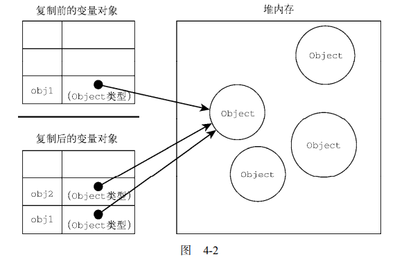

# 函数是按值传递的

首先，JavaScript中变量的赋值有两种，一种原始值，一种引用值。

原始值：undefined、null、String、number、Boolean、Symbol、Bigint

引用值：包含多中数值的Object

## 变量的复制

一、如果是原始值的复制

原始值的复制，会直接复制出两份，并且两份内容存在不同的空间中。所以复制值和原始值是完全独立存在的。

例如

```js
let num1 = 5;
let num2 = num1;

//num2 与num1完全独立互不影响
num2 = 10;

console.log(num1);//5
console.log(num2);//10
```


二、如果是引用值的复制

把一个引用值从一个变量赋值给另一个变量是，存储在变量中的值也会复制到另一个变量中，但是，这个复制过程其实复制的是一个指针。他俩都会同时指向堆内存中的位置。




## 函数的值传递

在知道上述两中值的复制之后。我们再来将函数的值传递。

首先明确观点：**函数是按值进行传递的**

这意味着函数外的值会被复制到函数内部的参数中，就像从一个变量复制到另一个变量一样。如果是原始值，那么就跟原始值变量的复制一样，如果是 引用值，那么就跟引用值变量的复制一样。

情况一、原始值

```js
function addTen(num) { 
 num += 10; 
 return num; 
} 
let count = 20; 
let result = addTen(count); 
console.log(count); // 20，没有变化
console.log(result); // 30 

//由于是按值传递，当count传递到addTen中时，是将count的值20，拷贝了一份到num中在对num进行操作，如果是按引用传递的，则外部的count也会被改变
```


情况二、引用值

```js
function setName(obj) { 
 obj.name = "Nicholas"; 
} 
let person = new Object(); 
setName(person); 
console.log(person.name); // "Nicholas" 
```

引用值进行传递时，也是拷贝，不过应为拷贝引用值时，拷贝的是"引用"，所以函数内部的obj也是指向保存在堆上的。

**所以在函数内部进行obj的修改，也会被映射到函数外面的obj**


注意： **ECMAScript 中函数的参数就是局部变量。**

