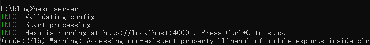
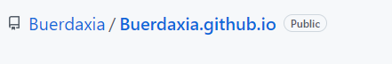
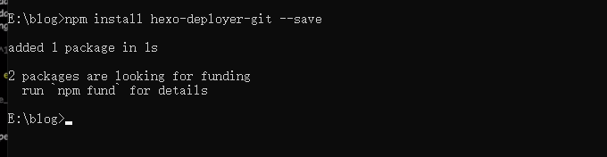
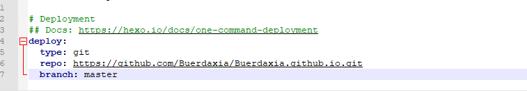
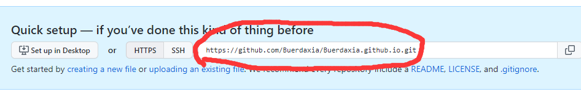
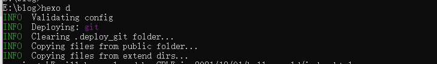
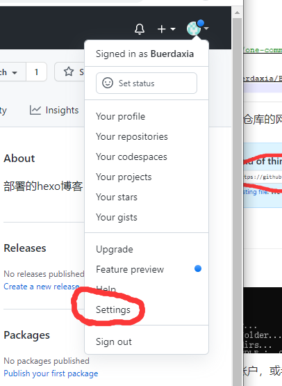
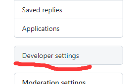
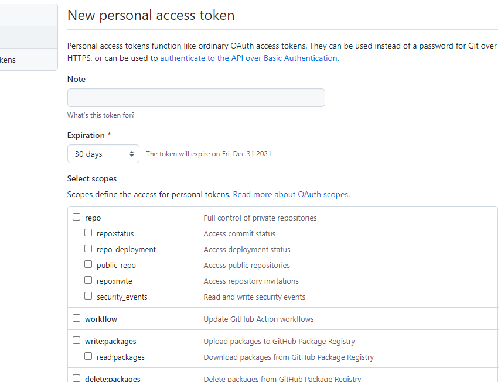
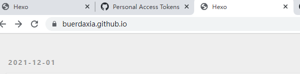

# 一个部署在github的博客网站

前置安装条件：node.js，一个github账号，git，配置好npm镜像

## 第一步、安装hexo

打开cmd执行：`npm hexo-cli -g`

说明：全局安装hexo

hexo  -v：检查是否安装成功

## 第二步、在喜欢的位置创建一个文件夹并生成hexo

切换到目录下，右键：`git bash here`

然后执行：`hexo init`

说明：初始化一个hexo博客

有可能会提示没有安装依赖：在运行一下`npm install`即可

## 第三步、运行

直接执行：`hexo server`

打开浏览器：打开指定的端口即可

如果发现打不开，可能是卡住了，在cmd里敲几下回车(●'◡'●)

## 第四步、在GitHub上创建一个仓库

创建仓库名需要和自己账户名称一致：

因为我的账号名字为Buerdaxia所以仓库名字叫Buerdaxia.github.io

## 第五步、安装一个插件

还是切换到之前创建好的文件夹

执行："npm install hexo-deployer-git --save"

## 第六步、配置一下_config.yml文件

直接用nodepad++或者记事本儿打开这个文件，滚到最底部。

修改配置:

里面的`repo`为刚刚创建的GitHub仓库的网址，其他一致

## 第七步、远端推送

执行命令:`hexo d`

之后可能会提示让你登录GitHub账户，或者直接使用token验证也可以。

### 如何生成GitHub账户的token

第一步、点开设置：

第二步、点开developer settings下的person access tokens

第三步、点击生成一个token`generate new token`

随便填一个node，然后下面的权限全勾上，点击生成就行了

## 第八步、打开博客

网址里输入自己仓库的地址即可

